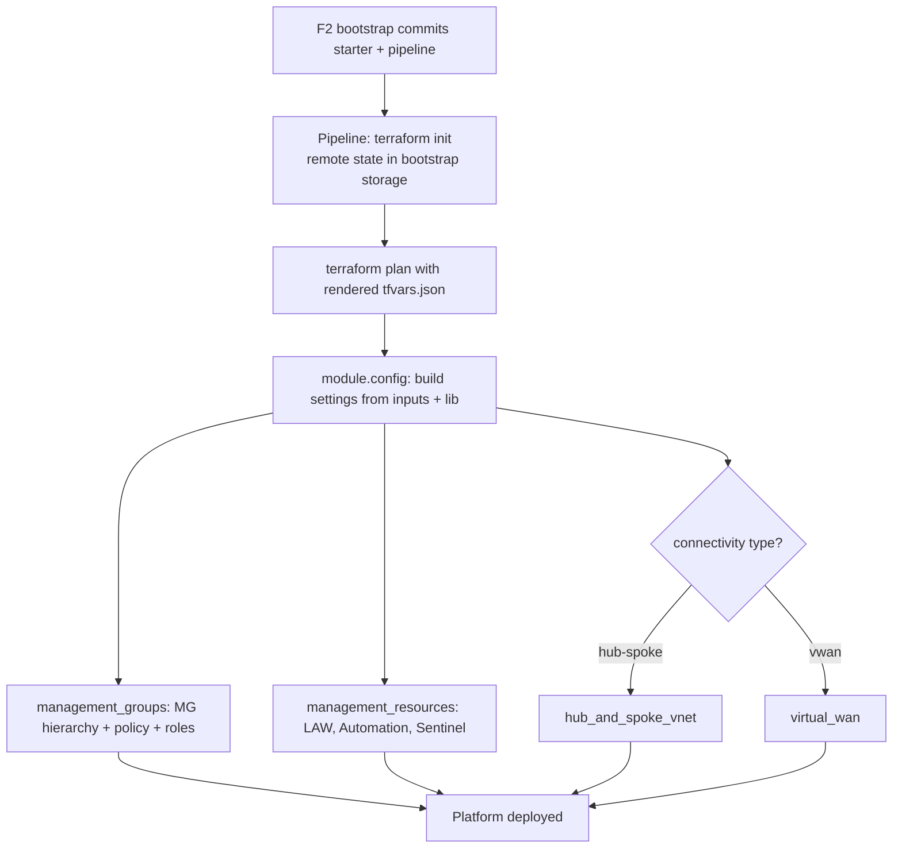
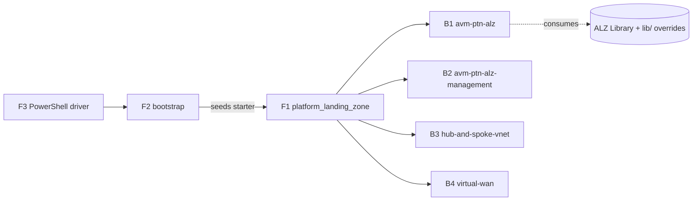

# Repository Overview: `Azure/alz-terraform-accelerator`

| Field | Value |
|-------|-------|
| Repository | `Azure/alz-terraform-accelerator` (catalog F1) |
| Flavor | Terraform + CI/CD (HCL ~99.9%) |
| Role | The Terraform **starter** seeded by the F2 bootstrap; deploys the actual ALZ **platform** |
| Entry (starter root) | `templates/platform_landing_zone/` |
| Starter config | `templates/.config/ALZ-Powershell.config.json` |
| Latest release | `v17.3.0` (158 releases) |
| Source URL | <https://github.com/Azure/alz-terraform-accelerator> |
| Mode | deep (remote analysis via GitHub) |
| Last reviewed | 2026-06-16 |

## Purpose

This repo provides the **starter modules** for the ALZ Terraform Accelerator. It is the `terraform`
starter that F2's `.config` maps to (`starter_modules.alz.terraform.url`). The F3 PowerShell module
downloads it, renders `terraform.tfvars.json` into the chosen starter, and the F2 bootstrap commits it
into the customer's repo — then a **pipeline** runs it to deploy the platform.

This is where the **IaC main line actually deploys Azure** (management groups, policy, management
resources, connectivity). It does so by orchestrating the **B-series AVM pattern modules**, not by
declaring resources directly.

- Engine boundary: F3 (driver) → F2 (bootstrap) → **F1 (starter/platform)** → AVM ptn modules (B1–B4).
- Multi-subscription: deploys across `connectivity` / `identity` / `management` / `security` subscriptions via **provider aliases**.
- Highly configurable: hub-and-spoke **or** Virtual WAN, single- or multi-region, with optional NVA, via scenario tfvars.

## Starter config (`templates/.config/ALZ-Powershell.config.json`)

Defines the selectable **starter modules** (the `starter_module_name` the F3 module resolves):

| Key | `location` | Short name | Notes |
|-----|------------|------------|-------|
| `platform_landing_zone` | `platform_landing_zone` | AVM for Platform Landing Zone (ALZ) | ★ the real multi-region platform deployment |
| `test` | `test` | Test | Test deployment — does **not** deploy a landing zone |
| `empty` | `empty` | Empty | Empty starter; manually add AVM-for-ALZ modules |

## Repository structure (relevant parts)

```text
alz-terraform-accelerator/
└── templates/
    ├── .config/
    │   └── ALZ-Powershell.config.json     # starter module catalog (consumed by F3/F2)
    ├── platform_landing_zone/             # ★ the main starter module (see module doc)
    │   ├── main.config.tf                 # central config-templating module
    │   ├── main.management.groups.tf      # → Azure/avm-ptn-alz (B1)
    │   ├── main.management.resources.tf   # → Azure/avm-ptn-alz-management (B2)
    │   ├── main.connectivity.hub.and.spoke.virtual.network.tf  # → hub-spoke-vnet (B3)
    │   ├── main.connectivity.virtual.wan.tf                    # → virtual-wan (B4)
    │   ├── main.resource.groups.tf
    │   ├── variables.*.tf / outputs*.tf / terraform.tf / locals.tf
    │   ├── lib/                           # ALZ Library customizations (archetype overrides)
    │   ├── modules/config-templating/     # the `config` module
    │   └── examples/                      # scenario tfvars (see below)
    ├── empty/                             # empty starter
    └── test/                             # test starter
```

## Scenarios (`templates/platform_landing_zone/examples/`)

These tfvars are the **scenarios** F3's `New-AcceleratorFolderStructure` copies (its
`TerraformScenarios.json` maps a scenario number → a path under this `examples/` folder — resolving the
F3 TODO):

| Scenario folder | What it deploys |
|-----------------|-----------------|
| `full-single-region` | Full platform, single region (hub-spoke or vWAN) |
| `full-multi-region` | Full platform across multiple regions |
| `full-single-region-nva` | Full single-region with a Network Virtual Appliance |
| `full-multi-region-nva` | Full multi-region with NVA |
| `management-only` | Only management group + management resources (no connectivity) |
| `smb-single-region` | Small/medium-business profile |
| `slz/lib` | Sovereign Landing Zone library overrides |
| `migration` | Migration scenario assets |
| `bootstrap` | Bootstrap input examples (`inputs-<vcs>.yaml`) consumed by F3 setup |

## Architecture: how the starter composes AVM modules

```mermaid
flowchart TD
    cfg[module.config<br/>config-templating] -->|settings outputs| mg[module.management_groups<br/>Azure/avm-ptn-alz 0.21.0]
    cfg -->|settings outputs| mr[module.management_resources<br/>Azure/avm-ptn-alz-management 0.9.0]
    cfg -->|settings outputs| hs[module.hub_and_spoke_vnet<br/>avm-ptn-alz-connectivity-hub-and-spoke-vnet 0.17.1]
    cfg -->|settings outputs| vw[module.virtual_wan<br/>avm-ptn-alz-connectivity-virtual-wan 0.15.0]

    subgraph Subs[Provider aliases = platform subscriptions]
        mr -. azurerm.management .-> msub[(Management sub)]
        hs -. azurerm.connectivity / azapi .-> csub[(Connectivity sub)]
        vw -. azurerm.connectivity .-> csub
    end

    mg --> plat[Management groups + Azure Policy + role assignments]
    mr --> platm[Log Analytics + Automation + Sentinel + DCRs]
    hs --> hub[Hub-and-spoke VNets + firewall + DNS]
    vw --> wan[Virtual WAN + virtual hubs]
```

> Each connectivity module is mutually-exclusive via `*_enabled` locals — you pick **hub-and-spoke or vWAN**.
> `management_groups_enabled` / `management_resources_enabled` toggle the management plane.

## Deployment flow (pipeline-driven)



## Relationship to the rest of ALZ

> Drill-down: B1 `avm-ptn-alz` is now documented — see
> [avm-ptn-alz/_overview.md](../avm-ptn-alz/_overview.md). It resolves the governance architecture/archetypes
> via the `alz` provider (G3) → `alzlib` (G2) → `Azure-Landing-Zones-Library` (G1).



## Notes & Gotchas

- **No direct `resource` blocks for the platform** — everything is delegated to AVM `ptn` modules pinned to exact versions (B1 0.21.0, B2 0.9.0, B3 0.17.1, B4 0.15.0 at time of review).
- **Provider aliases are the multi-sub mechanism:** `azurerm.management`, `azurerm.connectivity` (+ `azapi.connectivity`) target different platform subscriptions; the default provider handles MG-scope.
- **`module.config` is the single source of settings** — all child modules read `module.config.outputs.*`, so understanding `modules/config-templating` is key to understanding inputs.
- **`lib/` holds ALZ Library customizations** (e.g. sovereign `sovereign_l1/l2/l3` archetype overrides) layered on top of the upstream `Azure-Landing-Zones-Library` (G1).
- **`moved {}` blocks** appear throughout (e.g. flattening `module.management_groups[0].module.management_groups`) — refactors that preserve state addresses across versions.
- **The starter runs in a pipeline**, using the remote state backend created by F2 — this is the bootstrap→platform two-phase boundary.

## Open Questions

- [ ] `TODO: verify` the full `modules/config-templating` transformation logic (how raw tfvars + `lib/` become `module.config.outputs.*_settings`).
- [ ] `TODO: verify` the exact contents of each scenario tfvars (toggles, regions, NVA wiring) beyond the names captured here.
- [ ] `TODO: verify` whether `identity`/`security` subscriptions get dedicated modules or are only used for placement/role scope.
