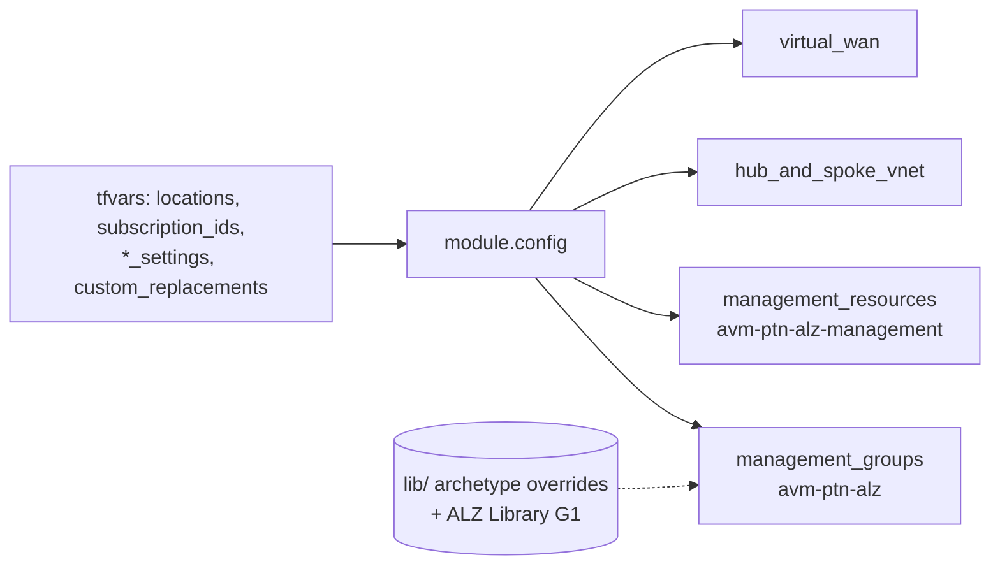
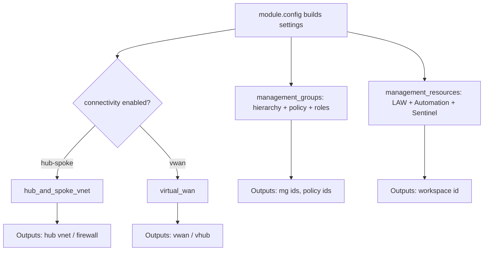

# Module: `platform_landing_zone` (starter root module)

| Field | Value |
|-------|-------|
| Repository | `Azure/alz-terraform-accelerator` |
| Flavor | Terraform (root/starter module composing AVM `ptn` modules) |
| Entry files | `templates/platform_landing_zone/main.*.tf` |
| Source URL | <https://github.com/Azure/alz-terraform-accelerator/tree/main/templates/platform_landing_zone> |
| Mode | deep |
| Last reviewed | 2026-06-16 |

## Purpose

The complete, multi-region **Platform Landing Zone** for Terraform. It deploys the ALZ platform by
orchestrating the B-series AVM pattern modules, all driven by a central `config` module that turns user
tfvars into per-module settings.

Per its README, it deploys: management group hierarchy; Azure Policy definitions + assignments; role
definitions; management resources (Log Analytics + Automation); hub-and-spoke **or** Virtual WAN across
regions; DDoS protection plan; Private DNS zones.

## Inputs (top-level variables, grouped)

Inputs arrive via the rendered `terraform.tfvars.json` (or example tfvars). Split across `variables.*.tf`:

| Group | Examples | Meaning |
|-------|----------|---------|
| Core | `starter_locations`, `starter_locations_short`, `subscription_ids` (map: connectivity/identity/management/security), `root_parent_management_group_id` | Regions + target subscriptions + MG root. |
| Customization | `custom_replacements`, `tags`, `connectivity_tags`, `enable_telemetry` | Token replacement + tagging. |
| Management groups | `management_groups_enabled`, `management_group_settings` | Toggle + settings for `avm-ptn-alz` (B1). |
| Management resources | `management_resources_enabled`, `management_resource_settings` | Toggle + settings for `avm-ptn-alz-management` (B2). |
| Connectivity (common) | `connectivity_resource_groups` | RGs for connectivity. |
| Hub-and-spoke | `hub_and_spoke_networks_settings`, `hub_virtual_networks` | Settings for B3 (when enabled). |
| Virtual WAN | `virtual_wan_settings`, `virtual_hubs` | Settings for B4 (when enabled). |

> The connectivity type is chosen by `local.connectivity_hub_and_spoke_vnet_enabled` vs
> `local.connectivity_virtual_wan_enabled` (mutually exclusive) derived from the settings provided.

## Composed modules (with pinned versions at review time)

| Local module | Source | Version | Provider(s) | Gated by | Creates |
|--------------|--------|---------|-------------|----------|---------|
| `config` | `./modules/config-templating` | (local) | — | always | Transforms inputs → `module.config.outputs.*` settings. |
| `management_groups` | `Azure/avm-ptn-alz/azurerm` | `0.21.0` | default (MG scope) | `var.management_groups_enabled` | MG hierarchy, policy definitions/assignments, role assignments, subscription placement. |
| `management_resources` | `Azure/avm-ptn-alz-management/azurerm` | `0.9.0` | `azurerm.management` | `var.management_resources_enabled` | Log Analytics workspace, Automation, Sentinel onboarding, Data Collection Rules, UAMIs. |
| `hub_and_spoke_vnet` | `Azure/avm-ptn-alz-connectivity-hub-and-spoke-vnet/azurerm` | `0.17.1` | `azurerm.connectivity`, `azapi.connectivity` | `local.connectivity_hub_and_spoke_vnet_enabled` | Hub VNets, peering, firewall, DNS (hub-spoke topology). |
| `virtual_wan` | `Azure/avm-ptn-alz-connectivity-virtual-wan/azurerm` | `0.15.0` | `azurerm.connectivity` | `local.connectivity_virtual_wan_enabled` | Virtual WAN + virtual hubs (vWAN topology). |

## Outputs

Exposed in `outputs.tf` (+ `outputs.moved.tf` for state-address continuity). Typically surface management
group IDs, management resource IDs (e.g. Log Analytics workspace ID), and connectivity IDs for downstream
consumption / verification. `TODO: verify` exact output names.

## Dependencies

**Upstream (needs):**
- `module.config` outputs (every other module reads `module.config.outputs.*`).
- Provider configuration with aliases targeting the platform subscriptions.
- The ALZ Library (G1) + local `lib/` overrides (consumed inside `avm-ptn-alz`).

**Downstream (depends on this):**
- The deployed platform is the foundation that application landing zones / subscription vending place workloads into.

**Explicit vs implicit:**
- Explicit: `providers = { ... }` wiring; `count` gating per module.
- Implicit: pervasive `module.config.outputs.*` references create an implicit dependency on `config`.

## Module Dependency Diagram

## Deployment Flow

## Notes & Gotchas

- **Everything funnels through `module.config`** — to trace any input you follow `var.* → module.config → module.config.outputs.<x>_settings → child module`.
- **Hub-spoke and vWAN are mutually exclusive** per run; choose via the connectivity settings/scenario.
- **`resource_group_creation_enabled = true`** is set for management resources; some names are `coalesce`d to defaults like `law-management-<location>` / `rg-management-<location>`.
- **`linked_automation_account_creation_enabled = false`** for management resources (Automation linkage off by default in this wiring).
- **`moved {}` blocks** preserve state when the upstream module structure changes between versions.
- New ALZ terms captured in [glossary.md](../glossary.md): provider alias (multi-subscription), config-templating module, ALZ Library customization (`lib/`), NVA, `moved` block, starter scenario.

## Open Questions

- [ ] `TODO: verify` `outputs.tf` exact names and which are consumed by verification/automation.
- [ ] `TODO: verify` how `custom_replacements` tokens are applied inside `config-templating`.
