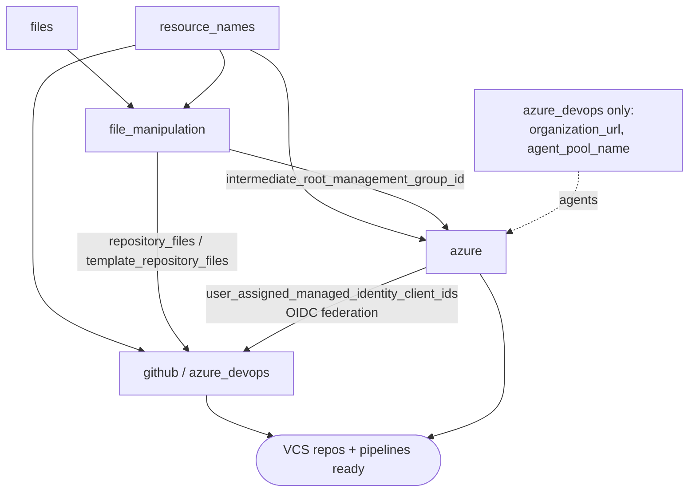
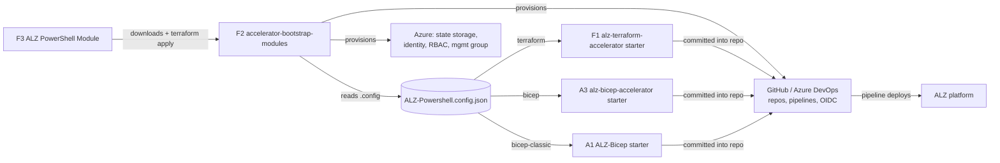
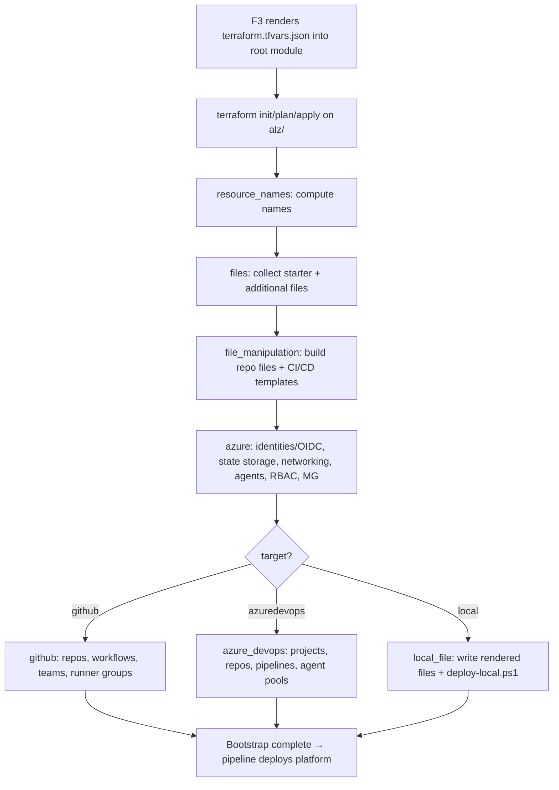

# Repository Overview: `Azure/accelerator-bootstrap-modules`

| Field | Value |
|-------|-------|
| Repository | `Azure/accelerator-bootstrap-modules` (catalog F2) |
| Flavor | Terraform (bootstrap) — HCL ~91%, PowerShell ~9% |
| Role | Shared **bootstrap** Terraform that the ALZ Accelerators run to prepare a VCS + Azure for platform deployment |
| Entry modules | `alz/azuredevops`, `alz/github`, `alz/local` (root modules) |
| Bootstrap config | `.config/ALZ-Powershell.config.json` (consumed by the F3 PowerShell module) |
| Latest release | `v7.2.1` (101 releases) |
| Source URL | <https://github.com/Azure/accelerator-bootstrap-modules> |
| Mode | deep (remote analysis via GitHub) |
| Last reviewed | 2026-06-16 |

## Purpose

This repo holds the **Terraform modules that bootstrap the environment** for an Azure Landing Zone
Accelerator run. It is the module that the F3 `ALZ` PowerShell module downloads (default
`bootstrap_module_url`) and applies during `Deploy-Accelerator` → `New-Bootstrap` → `Invoke-Terraform`.

"Bootstrap" here means: stand up the **CI/CD plumbing and Terraform state backend** in the customer's
Version Control System (GitHub or Azure DevOps) and Azure, then seed the chosen **starter module** so a
pipeline can deploy the actual ALZ platform.

- Engine / Tooling main line — focus is on module composition and data flow, not Azure IaC inputs/outputs.
- Supports three IaC targets (per README + config): `terraform`, `bicep`, `bicep-classic`.
- Supports three bootstrap targets (root modules): **GitHub**, **Azure DevOps**, **Local** (no VCS).

## Bootstrap configuration (`.config/ALZ-Powershell.config.json`)

This file is the contract between F3 (PowerShell) and F2 (Terraform). It resolves the
`TODO: verify` left in the F3 notes.

### `bootstrap_modules` — selectable via `bootstrap_module_name`

| Key | `location` (root module) | Short name | `starter_modules` |
|-----|--------------------------|------------|-------------------|
| `alz_azuredevops` | `alz/azuredevops` | Azure DevOps: Azure Landing Zones | `alz` |
| `alz_github` | `alz/github` | GitHub: Azure Landing Zones | `alz` |
| `alz_local` | `alz/local` | Local: Azure Landing Zones | `alz` |

### `starter_modules.alz` — selected by `iac_type`

| `iac_type` | Starter repo (`url`) | `release_artifact_name` | `release_artifact_config_file` |
|------------|----------------------|-------------------------|--------------------------------|
| `terraform` | `Azure/alz-terraform-accelerator` (F1) | `starter_modules.zip` | `.config/ALZ-Powershell.config.json` |
| `bicep` | `Azure/alz-bicep-accelerator` (A3) | `starter_modules.zip` | `.config/ALZ-Powershell.config.json` |
| `bicep-classic` | `Azure/ALZ-Bicep` (A1) | `accelerator.zip` | `accelerator/.config/ALZ-Powershell-Auto.config.json` |

> So `Get-BootstrapAndStarterConfig` (F3) reads this file: `bootstrap_module_name` → root module path;
> the bootstrap's `starter_modules` key (`alz`) → the matching `starter_modules.alz.<iac_type>` entry →
> starter repo URL + artifact + nested config path.

## Repository structure

```text
accelerator-bootstrap-modules/
├── .config/
│   └── ALZ-Powershell.config.json   # bootstrap + starter mapping (consumed by F3)
├── alz/                             # ★ root modules (one per VCS target)
│   ├── azuredevops/                 # bootstrap into Azure DevOps
│   ├── github/                      # bootstrap into GitHub
│   └── local/                       # bootstrap to local file system (optional Azure backend)
├── modules/                         # shared building-block modules
│   ├── resource_names/              # deterministic resource naming
│   ├── files/                       # collect starter-module + additional files
│   ├── file_manipulation/           # transform files → repo files + CI/CD pipeline templates
│   ├── azure/                       # Azure backend: identity, state storage, networking, agents, RBAC, MG
│   ├── github/                      # GitHub resources: repos, teams, runner groups, workflows, OIDC
│   └── azure_devops/                # Azure DevOps resources: projects, repos, pipelines, agent pools, OIDC
├── .github/                         # repo CI (incl. end-to-end tests)
├── Makefile
└── README.md
```

## Module composition (how the root modules wire the shared modules)

All three root modules compose the same shared modules; GitHub and Azure DevOps additionally call their
respective VCS module. The data flow between modules (implicit dependencies via outputs → inputs):



> For `alz/local` there is no `github`/`azure_devops` module: `file_manipulation` output is written to disk
> via `local_file` resources (plus a `scripts/deploy-local.ps1` for Terraform), and the `azure` module is
> optional (`count = var.create_bootstrap_resources_in_azure ? 1 : 0`).

## What the bootstrap creates

### Azure side (`modules/azure`)
- **Resource groups:** identity, state, agents, network (names from `resource_names`).
- **User-assigned managed identities + federated credentials** (OIDC) — so the VCS pipelines authenticate to Azure without secrets.
- **Storage account + container** — the Terraform **state backend** (created when `iac_type == terraform`).
- **Optional private networking:** VNet, subnets (container instances / private endpoints), private endpoints, NAT gateway, public IP.
- **Optional self-hosted agents/runners:** container registry (+ image build), container instances.
- **Custom role definitions + role assignments** (per `iac_type`).
- **Intermediate root management group** creation + optional subscription move to a target MG (skipped for `bicep-classic`).

### GitHub side (`modules/github`)
- Repositories (optional separate **template repository**), environments, **GitHub Actions workflows**, teams, **runner groups**, branch policies; wires managed-identity client IDs and the Terraform backend config.

### Azure DevOps side (`modules/azure_devops`)
- Projects, repositories, **variable groups**, **pipelines**, **agent pools**, groups, branch policies, approvers; wires managed-identity client IDs and the Terraform backend config.

### Local side (`alz/local`)
- Writes the rendered starter files to a local directory and emits `scripts/deploy-local.ps1`; Azure backend resources are optional.

## Relationship to other repos



## Deployment flow (single bootstrap apply)



## Notes & Gotchas

- **State backend only for Terraform:** `create_storage_account = var.iac_type == "terraform"` — Bicep flavors don't get a TF state account here.
- **`bicep-classic` skips MG creation / subscription move** (`intermediate_root_management_group_creation_enabled = var.iac_type != "bicep-classic"`).
- **OIDC, not secrets:** Azure managed identities + federated credentials are the auth mechanism wired into the VCS pipelines.
- **Self-hosted agents are optional** and, when enabled, are built as container images pushed to an ACR and run as container instances (with private networking).
- The `local` target is for restricted/dev scenarios — it can skip Azure resource creation entirely.
- **Platform vs application bootstrap:** this module bootstraps the **platform** landing zone's CD. The intended
  **application** LZ analogues are the AVM pattern pair
  [B7 (Azure DevOps)](../avm-ptn-alz-applz-cicd-bootstrap-azure-devops/_overview.md) /
  [B8 (GitHub)](../avm-ptn-alz-applz-cicd-bootstrap-github/_overview.md) — currently scaffold-only, not yet implemented.

## Open Questions

- [ ] `TODO: verify` exact variable lists / defaults in `alz/*/variables.tf` (root-module inputs) — captured at the module-call level here, not the full schema.
- [ ] `TODO: verify` `modules/file_manipulation` templating internals (how CI/CD YAML templates are generated per `iac_type`).
- [ ] `TODO: verify` `ALZ-Powershell-Auto.config.json` (the `bicep-classic` nested starter config in `Azure/ALZ-Bicep`).
