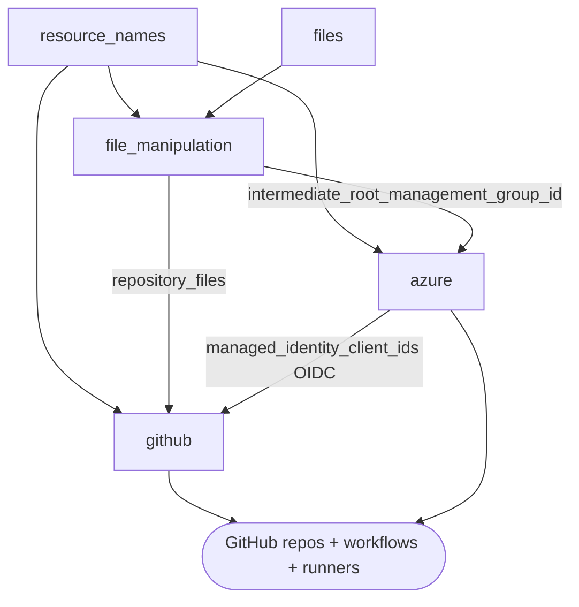
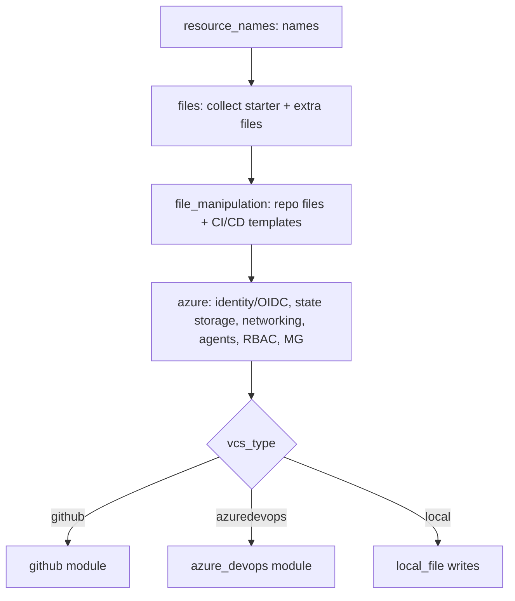

# Module: bootstrap root modules (`alz/azuredevops`, `alz/github`, `alz/local`)

| Field | Value |
|-------|-------|
| Repository | `Azure/accelerator-bootstrap-modules` |
| Flavor | Terraform (root modules) |
| Entry files | `alz/azuredevops/main.tf`, `alz/github/main.tf`, `alz/local/main.tf` |
| Source URL | <https://github.com/Azure/accelerator-bootstrap-modules/tree/main/alz> |
| Mode | deep |
| Last reviewed | 2026-06-16 |

## Purpose

The three **root modules** are the entry points Terraform actually runs (selected by
`bootstrap_module_name` → `location` in the config). Each orchestrates the shared `modules/*` building
blocks to bootstrap one target: **Azure DevOps**, **GitHub**, or **Local file system**.

- They are the Terraform that the F3 PowerShell module renders `terraform.tfvars.json` into and applies.
- All three share `resource_names` + `files` + `file_manipulation` + `azure`; the VCS ones add `github` / `azure_devops`.

## Inputs (representative root-module variables)

Inputs come from the rendered `terraform.tfvars.json`. Key groups (names observed in the module calls):

| Group | Examples | Meaning |
|-------|----------|---------|
| Identity of run | `iac_type`, `starter_module_name`, `environment_name`, `service_name`, `postfix_number` | Selects flavor, starter, and naming. |
| Naming | `resource_names`, `bootstrap_location` | Override names; Azure region for bootstrap resources. |
| Subscriptions | `subscription_ids` (map, e.g. `management`), `target_subscriptions`, `root_parent_management_group_id` | Where to place backend + MG. |
| Starter files | `configuration_file_path`, `built_in_configuration_file_names`, `additional_files`, `additional_folders_path`, `root_module_folder_relative_path`, `on_demand_folder_repository`, `on_demand_folder_artifact_name` | What to collect and commit. |
| RBAC | `role_assignments_terraform` / `_bicep` / `_bicep_classic`, custom role definition locals | Role assignments per flavor. |
| Networking | `virtual_network_address_space`, subnet prefixes, `storage_account_replication_type` | Optional private networking + storage. |
| Self-hosted agents | `use_self_hosted_agents`/`use_self_hosted_runners`, `*_container_image_*`, `container_registry_*` | Optional container-based agents/runners. |
| GitHub-specific | `github_organization_name`, `github_organization_domain_name`, `use_separate_repository_for_templates`, `github_runners_personal_access_token`, `apply_approvers`, `create_branch_policies` | GitHub org/repo/runner config. |
| Azure DevOps-specific | `azure_devops_organization_name`, `azure_devops_create_project`, `azure_devops_project_name`, `azure_devops_agents_personal_access_token`, `azure_devops_use_organisation_legacy_url` | ADO org/project/agent config. |
| Local-specific | `create_bootstrap_resources_in_azure` | Whether the local target also creates the Azure backend. |

## Module calls per root module

| Shared module | `azuredevops` | `github` | `local` |
|---------------|:-------------:|:--------:|:-------:|
| `resource_names` | ✅ | ✅ | ✅ |
| `files` | ✅ | ✅ | ✅ |
| `file_manipulation` (`vcs_type`) | `"azuredevops"` | `"github"` | `"local"` |
| `azure` | ✅ | ✅ | ✅ (optional via `count`) |
| `azure_devops` | ✅ | — | — |
| `github` | — | ✅ | — |
| `local_file` resources | — | — | ✅ (write files + `deploy-local.ps1`) |

## Outputs

Root modules primarily produce **side effects** (created VCS + Azure resources, or local files). Notable
internal outputs consumed across modules:
- `azure.user_assigned_managed_identity_client_ids` → VCS module (OIDC federation).
- `file_manipulation.repository_files` / `template_repository_files` → VCS module (files committed) or `local_file` (local).
- `file_manipulation.intermediate_root_management_group_id` / `_display_name` → `azure` (MG creation).
- `azure_devops.organization_url` / `agent_pool_name` → `azure` (agent container config) in the ADO root module.

## Resources created (by target)

| Target | Resources |
|--------|-----------|
| GitHub | Repos (+ optional template repo), environments, Actions workflows, teams, runner groups, branch policies + the Azure backend (see `azure`). |
| Azure DevOps | Projects, repos, variable groups, pipelines, agent pools, groups, branch policies + the Azure backend. |
| Local | Rendered starter files on disk + `scripts/deploy-local.ps1`; Azure backend optional. |

## Dependencies

**Upstream (needs):** rendered `terraform.tfvars.json` from F3; valid Azure auth (`ARM_SUBSCRIPTION_ID`); a PAT for the VCS (GitHub/ADO) when creating agents/runners.
**Downstream:** the seeded repo + pipeline deploys the **starter module** (F1 / A3 / A1) to build the ALZ platform.

## Module Dependency Diagram (github example)

## Deployment Flow

## Notes & Gotchas

- The `azure` module in `alz/local` is gated by `count = var.create_bootstrap_resources_in_azure ? 1 : 0`, and forces `use_self_hosted_agents = false`, `use_private_networking = false`.
- `local` adds `additional_role_assignment_principal_ids = { current_user = <current object id> }` so the running user keeps access.
- `azuredevops` reads `data.azurerm_subscription.management.display_name`; both VCS targets use `subscription_ids["management"]` as the backend subscription.
- Agent/runner wiring differs: GitHub passes `github_runners_personal_access_token` + runner group vars; ADO passes the agent PAT and gets `organization_url`/`agent_pool_name` from the `azure_devops` module.

## Open Questions

- [ ] `TODO: verify` the complete `variables.tf` for each root module (defaults, required vs optional) — only call-site usage inspected.
