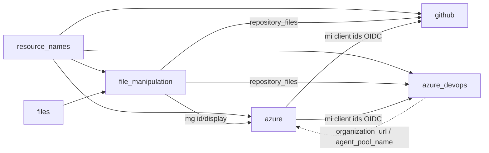

# Modules: shared building blocks (`modules/*`)

| Field | Value |
|-------|-------|
| Repository | `Azure/accelerator-bootstrap-modules` |
| Flavor | Terraform (reusable modules) |
| Entry files | `modules/{resource_names,files,file_manipulation,azure,github,azure_devops}` |
| Source URL | <https://github.com/Azure/accelerator-bootstrap-modules/tree/main/modules> |
| Mode | deep |
| Last reviewed | 2026-06-16 |

## Purpose

The six shared modules are composed by the `alz/*` root modules. They split the bootstrap into reusable
concerns: naming, file collection, file templating, Azure backend, and the two VCS providers.

| Module | Responsibility |
|--------|----------------|
| `resource_names` | Compute deterministic names for every bootstrap resource from `environment_name` / `service_name` / `postfix_number` / `azure_location` (+ overrides via `resource_names`). |
| `files` | Collect the starter-module files (from `starter_module_folder_path`) plus `additional_files` / `additional_folders_path` and the configuration file into a single `files` map. |
| `file_manipulation` | Transform the collected files for the chosen `vcs_type` + `iac_type`: produce `repository_files`, `template_repository_files`, CI/CD pipeline templates, and surface the intermediate root management group id/display name. |
| `azure` | Provision the **Azure backend**: managed identities + federated credentials (OIDC), state storage account/container, optional private networking, optional self-hosted agent containers (ACR + container instances), custom role definitions + role assignments, intermediate root management group + subscription move. |
| `github` | Provision **GitHub** resources: repositories (+ optional template repo), environments, Actions workflows, teams, runner groups, branch policies; wire managed-identity client ids + Terraform backend config. |
| `azure_devops` | Provision **Azure DevOps** resources: projects, repositories, variable groups, pipelines, agent pools, groups, branch policies, approvers; wire managed-identity client ids + Terraform backend config. |

## Key inputs / outputs (observed at call sites)

### `resource_names`
- **In:** `azure_location`, `environment_name`, `service_name`, `postfix_number`, `resource_names` (override map merged with custom role-definition name locals).
- **Out:** `local.resource_names.*` — names for resource groups (identity/state/agents/network), storage account/container, VNet/subnets, private endpoints, NAT gateway, public IP, container registry/image, managed identities, VCS repo/team/runner group/agent pool/variable group/group.

### `files`
- **In:** `starter_module_folder_path`, `additional_files`, `configuration_file_path`, `built_in_configuration_file_names`, `additional_folders_path`.
- **Out:** `files` — a map of `{ path → content }` consumed by `file_manipulation`.

### `file_manipulation`
- **In:** `vcs_type` (`github`/`azuredevops`/`local`), `files`, `resource_names`, `iac_type`, `module_folder_path`, `starter_module_name`, `root_module_folder_relative_path`, `on_demand_folder_repository`, `on_demand_folder_artifact_name`, CI/CD template names, `agent_pool_or_runner_configuration`, `terraform_architecture_file_path`, `bicep_config_file_path` / `bicep_parameters_file_path`.
- **Out:** `repository_files`, `template_repository_files`, `intermediate_root_management_group_id`, `intermediate_root_management_group_display_name`.

### `azure`
- **In (selected):** `user_assigned_managed_identities`, `federated_credentials`, resource-group names, `create_storage_account` (= `iac_type == terraform`), storage settings, `target_subscriptions`, `root_parent_management_group_id`, networking toggles + address spaces, self-hosted agent container settings, `custom_role_definitions`, `role_assignments`, `intermediate_root_management_group_*`, `move_subscriptions_to_target_management_group`.
- **Out:** `user_assigned_managed_identity_client_ids` (→ VCS OIDC), backend resource group / storage account / container names (by convention from `resource_names`).

### `github`
- **In (selected):** `organization_name`, `domain_name`, `environments`, `repository_name` (+ template repo), `repository_files` / `template_repository_files` (from `file_manipulation`), `workflows`, `managed_identity_client_ids` (from `azure`), `azure_tenant_id`, `azure_subscription_id` (= `subscription_ids["management"]`), backend storage names, `approvers`, team/runner-group settings, `create_branch_policies`, `create_storage_account_variables` (= `iac_type == terraform`).

### `azure_devops`
- **In (selected):** `organization_name`, `create_project`, `project_name`, `environments`, `managed_identity_client_ids` (from `azure`), `repository_name`, `repository_files` / `template_repository_files`, `variable_group_name`, `azure_tenant_id`, `azure_subscription_id`/`_name`, `pipelines`, backend storage names, `approvers`, `agent_pool_name`, `use_self_hosted_agents`, `create_branch_policies`, `create_variable_group` (= `iac_type == terraform`).

## Dependency graph (data flow)

## Resources created (summary)

| Module | Azure resource types (logical) |
|--------|--------------------------------|
| `azure` | Resource groups; user-assigned managed identities + federated identity credentials; storage account + blob container (TF state); VNet + subnets + private endpoints + NAT gateway + public IP (optional); container registry + container instances (optional agents); custom role definitions + role assignments; management group + subscription association. |
| `github` | GitHub repositories, repository files, environments, Actions workflows, teams, runner groups, branch protection. |
| `azure_devops` | ADO projects, repositories, repository files, variable groups, pipelines, agent pools, groups, branch policies, environment approvals. |
| `resource_names` / `files` / `file_manipulation` | No cloud resources — pure computation / `local_file` (in the `local` root module). |

## Notes & Gotchas

- **Terraform-only backend variables:** `create_storage_account_variables` (github) and `create_variable_group` (azure_devops) are both gated on `iac_type == "terraform"`, because only the Terraform starter needs a remote state backend wired into the pipeline.
- `azure` decides agents vs not via `use_self_hosted_agents`/`use_self_hosted_runners`; networking via `use_private_networking`.
- The `custom_role_definitions` / `role_assignments` inputs are selected per `iac_type` (terraform / bicep / bicep-classic) by the root module before being passed in.
- `file_manipulation` is where the **CI/CD pipeline YAML** (CI + CD templates) is generated from template files — the actual platform-deploy pipeline that runs the starter.

## Open Questions

- [ ] `TODO: verify` `modules/file_manipulation` internals — exact templating logic and how `agent_pool_or_runner_configuration` shapes the pipeline YAML.
- [ ] `TODO: verify` `modules/azure` resource set against its `main.tf`/`*.tf` (resource list here is inferred from the rich set of inputs passed by the root modules).
