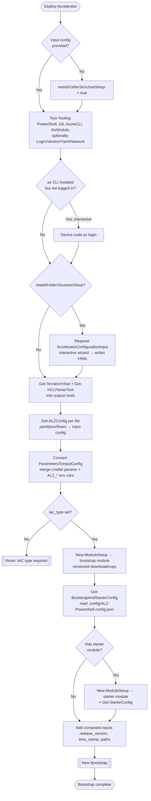
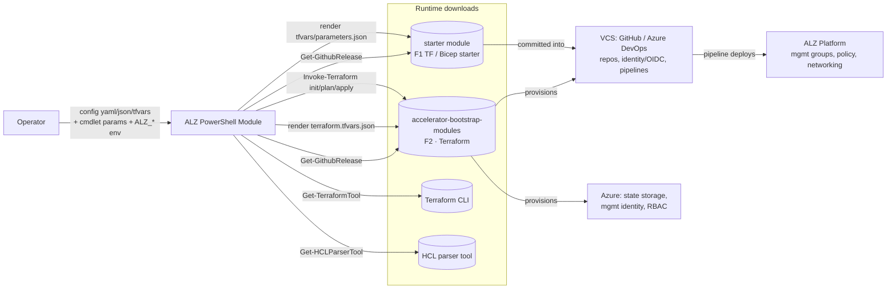

# Repository Overview: `Azure/ALZ-PowerShell-Module`

| Field | Value |
|-------|-------|
| Repository | `Azure/ALZ-PowerShell-Module` (catalog F3) |
| Flavor | PowerShell (module name: `ALZ`) |
| Role | **Driver / orchestrator** of the ALZ Accelerator |
| Entry module | `src/ALZ/ALZ.psm1` (loader) + `src/ALZ/ALZ.psd1` (manifest) |
| Min. runtime | PowerShell 7.4, PSEdition `Core` |
| Source URL | <https://github.com/Azure/ALZ-PowerShell-Module> |
| Mode | deep (analyzed locally from the open workspace) |
| Last reviewed | 2026-06-16 |

## Purpose

The `ALZ` PowerShell module is the **command-line driver of the Azure Landing Zone Accelerator**.
It does **not** itself declare Azure resources. Instead it orchestrates the "getting started" flow:
download the right modules, collect/normalize user inputs, render configuration files, then run
Terraform to bootstrap the customer's Version Control System (GitHub or Azure DevOps) and Azure, and
seed a **starter module** (the real ALZ platform IaC, in Terraform or Bicep).

- Sits in the **Engine / Tooling** main line — focus is on cmdlets, call flow, and data flow (not IaC inputs/outputs).
- Consumes two remote module sets at runtime:
  - **Bootstrap** modules — default `Azure/accelerator-bootstrap-modules` (F2).
  - **Starter** modules — e.g. `Azure/alz-terraform-accelerator` (F1) / Bicep starters, chosen via the bootstrap config.
- Key idea: **even Bicep deployments use Terraform for the one-time bootstrap phase**; Bicep then takes over for the platform.

## Module structure (`src/ALZ/`)

```text
src/ALZ/
├── ALZ.psd1                         # Manifest: exports 7 cmdlets, requires PS 7.4 Core
├── ALZ.psm1                         # Loader: dot-sources all Public/Private *.ps1, exports Public + aliases
├── Public/                          # Exported cmdlets (user-facing surface)
│   ├── Deploy-Accelerator.ps1         # ★ primary entry point / orchestrator
│   ├── Test-AcceleratorRequirement.ps1
│   ├── Grant-SubscriptionCreatorRole.ps1
│   ├── New-AcceleratorFolderStructure.ps1
│   ├── Remove-PlatformLandingZone.ps1
│   ├── Remove-GitHubAccelerator.ps1
│   └── Remove-AzureDevOpsAccelerator.ps1
└── Private/                         # Internal helpers (not exported)
    ├── Deploy-Accelerator-Helpers/  # Orchestration: download, config discovery, bootstrap, terraform
    │   ├── New-ModuleSetup.ps1          # version resolution + download decision
    │   ├── New-FolderStructure.ps1      # download/copy a module release into a versioned folder
    │   ├── Get-BootstrapAndStarterConfig.ps1  # read bootstrap config, resolve starter module
    │   ├── Get-StarterConfig.ps1        # read starter config
    │   ├── New-Bootstrap.ps1            # ★ core engine: render config → Invoke-Terraform
    │   ├── Invoke-Terraform.ps1         # terraform init → plan → apply (with retry)
    │   ├── Request-AcceleratorConfigurationInput.ps1  # interactive folder-structure/input wizard
    │   ├── Get-ModuleVersionData.ps1 / Set-ModuleVersionData.ps1  # .alz-version-data.json
    │   └── ... (AzureContext, AcceleratorResult, parameter file copy, schema)
    ├── Config-Helpers/              # Input normalization + output rendering
    │   ├── Get-ALZConfig.ps1            # parse yaml/json/tfvars → input config object
    │   ├── Convert-ParametersToInputConfig.ps1  # merge cmdlet params + ALZ_* env vars
    │   ├── Convert-HCLVariablesToInputConfig.ps1 # read TF variables (bootstrap/starter)
    │   ├── Convert-BicepConfigToInputConfig.ps1  # read Bicep starter parameters
    │   ├── Set-Config.ps1               # map input config → module parameters (precedence)
    │   ├── Set-ComputedConfiguration.ps1 / Format-TokenizedConfigurationString.ps1
    │   ├── Write-TfvarsJsonFile.ps1 / Write-JsonFile.ps1  # emit terraform.tfvars.json / parameters.json
    │   ├── Edit-ALZConfigurationFilesInPlace.ps1
    │   ├── Get-AzureRegionData.ps1 / Get-AvailabilityZonesSupport.ps1
    │   └── Remove-UnrequiredFileSet.ps1 / Remove-TerraformMetaFileSet.ps1
    ├── Shared/                      # Cross-cutting utilities
    │   ├── Get-GithubRelease.ps1 / Get-GithubReleaseTag.ps1
    │   ├── Invoke-GitHubApiRequest.ps1 / Invoke-HttpRequestWithRetry.ps1
    │   ├── Write-ToConsoleLog.ps1 / Read-MenuSelection.ps1 / Invoke-PromptForConfirmation.ps1
    │   └── Get-OsArchitecture.ps1 / Get-NormalizedPath.ps1 / Get-RandomString.ps1
    └── Tools/                       # External tool acquisition + environment checks
        ├── Get-TerraformTool.ps1        # download pinned Terraform into <output>/.tools
        ├── Get-HCLParserTool.ps1        # download HCL→JSON parser binary
        ├── Test-Tooling.ps1             # run the requirements checks
        └── Checks/                      # individual requirement checks
```

> The loader (`ALZ.psm1`) recursively dot-sources every `*.ps1` under `Public/` and `Private/`, then
> `Export-ModuleMember -Function $public.Basename -Alias *`. So the **file name = function name** for
> public cmdlets, and all aliases are exported.

## Exported cmdlets

| Cmdlet | Role |
|--------|------|
| `Deploy-Accelerator` | ★ Primary entry point. Orchestrates the full bootstrap + starter deployment. See [module-Deploy-Accelerator.md](./module-Deploy-Accelerator.md). |
| `Test-AcceleratorRequirement` | Checks the environment meets prerequisites (PowerShell, Git, Azure CLI, module version, connectivity). |
| `Grant-SubscriptionCreatorRole` | Grants the Subscription Creator role on a billing scope to a principal (for subscription vending). |
| `New-AcceleratorFolderStructure` | Scaffolds a local folder + starter config files for the accelerator. |
| `Remove-PlatformLandingZone` | Tears down a deployed platform landing zone. |
| `Remove-GitHubAccelerator` | Removes GitHub resources (repos, teams, runner groups) created by the bootstrap. |
| `Remove-AzureDevOpsAccelerator` | Removes Azure DevOps resources (projects, agent pools) created by the bootstrap. |

## End-to-end flow (`Deploy-Accelerator`)

The orchestration proceeds in two big phases inside `Deploy-Accelerator`: **(1) pre-flight + input
gathering**, then **(2) download → render → Terraform bootstrap** (delegated to `New-Bootstrap`).



### Architecture / data flow (what wires to what)



> **Key boundary:** the PowerShell module's Terraform run only deploys the **bootstrap** (CI/CD + state).
> The **starter** module is rendered and committed into the new repo; the customer's **pipeline** then
> deploys the actual ALZ platform. This is the "two-phase" bootstrap → platform boundary.

## Input config model (data shape)

Every input is normalized into a `PSCustomObject` whose properties are objects of the form:

```text
<name> = { Value = <any>; Source = <provenance>; Sensitive = <bool> }
```

`Source` provenance and precedence (built in `Deploy-Accelerator`):

1. **Config file** — `Get-ALZConfig` tags values with `yaml` / `json` / `.tfvars` (last file wins on merge).
2. **Environment variables** — `Convert-ParametersToInputConfig` overlays `ALZ_<param>`; `Set-Config` later honors `TF_VAR_<name>`.
3. **Cmdlet parameters** — added with `Source = parameter` only if not already present from a file/env.
4. **Calculated** — runtime-computed values (`release_version`, `time_stamp`, `module_folder_path`, …) tagged `calculated`.

Aliases (e.g. `c`, `inputs`, `inputConfigFilePath`) are reconciled to canonical names so file keys and
cmdlet args converge on one property.

## Notes & Gotchas

- The module is **side-effect heavy** but guards work behind `SupportsShouldProcess` (`-WhatIf`/`-Confirm`).
- Downloads are cached into **versioned folders**; `.alz-version-data.json` records the active release.
  Re-runs reuse existing versions unless `-upgrade` (or a different pinned version) is supplied.
- `-skip_internet_checks` and `*_module_override_folder_path` enable **air-gapped / local-dev** runs
  (release tag becomes `local`).
- HTTP calls go through `Invoke-HttpRequestWithRetry` with configurable retry count/interval/timeout.
- New terms captured in [glossary.md](../glossary.md): ALZ Accelerator, Bootstrap module, Starter module,
  Input config (PowerShell), Config Source, iac_type, HCL Parser Tool, Module version data, Override folder path.

## Open Questions

- [x] Resolved (see F2 notes): the `.config/ALZ-Powershell.config.json` schema lives in `Azure/accelerator-bootstrap-modules`.
  See [accelerator-bootstrap-modules/_overview.md](../accelerator-bootstrap-modules/_overview.md#bootstrap-configuration-configalz-powershellconfigjson).
- [x] Resolved: `bootstrap_module_name` values are `alz_azuredevops`, `alz_github`, `alz_local` — each maps to starter set `alz`
  (which selects `alz-terraform-accelerator` / `alz-bicep-accelerator` / `ALZ-Bicep` by `iac_type`).
