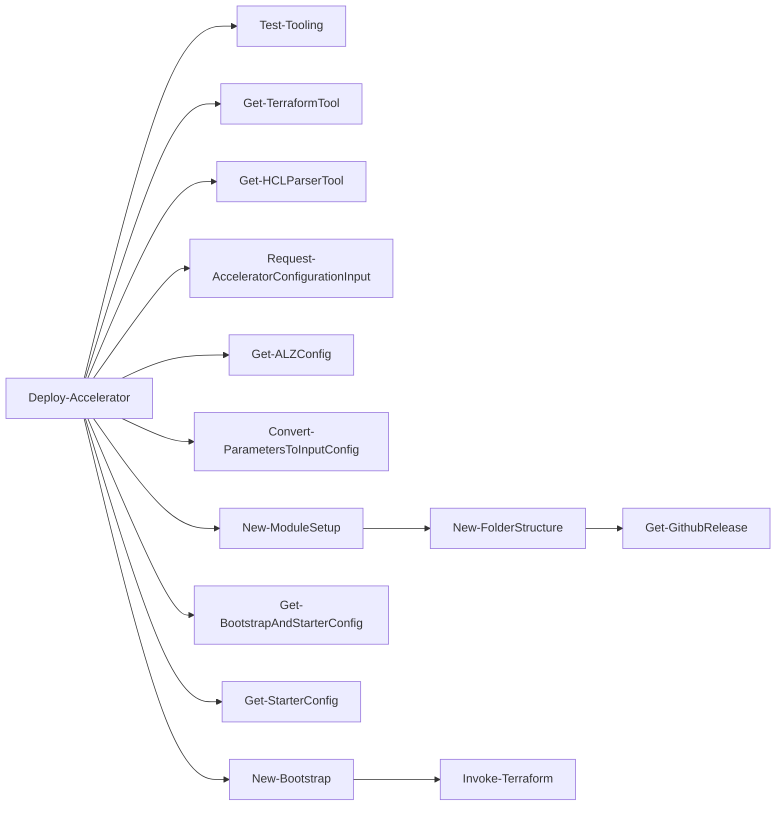
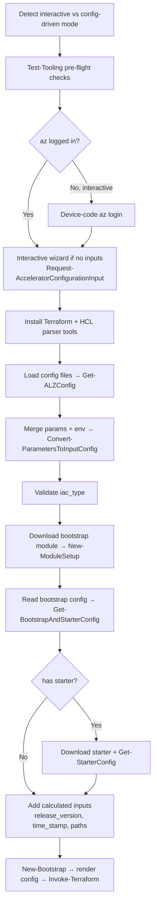

# Module: `Deploy-Accelerator`

| Field | Value |
|-------|-------|
| Repository | `Azure/ALZ-PowerShell-Module` |
| Flavor | PowerShell (cmdlet) |
| Entry file | `src/ALZ/Public/Deploy-Accelerator.ps1` |
| Source URL | <https://github.com/Azure/ALZ-PowerShell-Module/blob/main/src/ALZ/Public/Deploy-Accelerator.ps1> |
| Mode | deep |
| Last reviewed | 2026-06-16 |

## Purpose

`Deploy-Accelerator` is the **primary entry point** of the ALZ Accelerator. It runs pre-flight checks,
gathers and normalizes inputs, downloads the bootstrap and starter modules, then hands off to
`New-Bootstrap` to render configuration and run Terraform.

- Top of the **Engine / Tooling** call stack for this repo.
- Supports fully **interactive** (no inputs → wizard) and fully **non-interactive / automated** (`-auto_approve`, env vars) modes.
- Selects the IaC flavor (`terraform` / `bicep` / `bicep-classic`) and the bootstrap + starter modules.

## Inputs (cmdlet parameters)

Grouped by theme. Every parameter also has an `ALZ_<name>` environment-variable form and (mostly) a config-file key.

| Group | Name (canonical) | Type | Default | Meaning |
|-------|------------------|------|---------|---------|
| Config | `inputConfigFilePaths` (`-c`, `-inputs`) | `string[]` | `@()` | Path(s) to input config (json/yaml/tfvars). If empty → interactive wizard. |
| Output | `output_folder_path` (`-o`) | `string` | `.` | Working-set target directory. |
| Output | `output_folder_name` (`-ofn`) | `string` | `output` | Sub-folder name within the target. |
| Versions | `bootstrap_module_version` (`-bv`) | `string` | `latest` | Bootstrap release tag to download. |
| Versions | `starter_module_version` (`-sv`) | `string` | `latest` | Starter release tag to download. |
| Versions | `terraform_version` (`-tv`) | `string` | `1.14.9` | Terraform CLI version to fetch (`latest` allowed). |
| Behaviour | `auto_approve` (`-aa`) | `switch` | off | Skip plan confirmation (automation). |
| Behaviour | `destroy` (`-d`) | `switch` | off | Destroy the bootstrap (cleanup). |
| Behaviour | `upgrade` (`-u`) | `switch` | off | Allow upgrading to a newer release when version is `latest`. |
| Behaviour | `convert_tfvars_to_json` (`-tj`) | `switch` | off | Emit `*.tfvars.json` instead of copying `.tfvars`. |
| Source override | `bootstrap_module_url` (`-bu`) | `string` | `…/accelerator-bootstrap-modules` | Bootstrap repo URL. |
| Source override | `bootstrap_module_release_artifact_name` (`-ba`) | `string` | `bootstrap_modules.zip` | Bootstrap release asset. |
| Source override | `bootstrap_config_path` (`-bc`) | `string` | `.config/ALZ-Powershell.config.json` | Bootstrap config file within the module. |
| Source override | `bootstrap_source_folder` (`-bf`) | `string` | `.` | Folder containing bootstrap modules in the repo. |
| Source override | `bootstrap_module_override_folder_path` (`-bo`) | `string` | `""` | Use a local bootstrap folder instead of downloading. |
| Source override | `starter_module_override_folder_path` (`-so`) | `string` | `""` | Use a local starter folder instead of downloading. |
| Source override | `starter_additional_files` (`-saf`) | `string[]` | `@()` | Extra files/folders copied into the starter root. |
| Restricted env | `skip_internet_checks` (`-si`) | `switch` | off | Skip internet-dependent checks/downloads. |
| Restricted env | `replace_files` (`-rf`) | `switch` | off | Overwrite already-downloaded modules (dev only). |
| Checks | `skip_requirements_check` | `switch` | off | Skip all pre-flight checks (not recommended). |
| Checks | `skip_alz_module_version_requirements_check` | `switch` | off | Skip just the ALZ module version check. |
| Checks | `skip_yaml_module_install` | `switch` | off | Don't auto-install `powershell-yaml`. |
| HTTP | `http_request_max_retry_count` (`-hrmrc`) | `int` | `10` | Retries for transient HTTP errors. |
| HTTP | `http_request_retry_interval_seconds` (`-hrris`) | `int` | `3` | Wait between retries. |
| HTTP | `http_request_timeout_seconds` (`-hrts`) | `int` | (engine default) | HTTP timeout. |
| Logging/dev | `write_verbose_logs` (`-v`) | `switch` | off | Extra verbose logging. |
| Logging/dev | `clear_cache` (`-cc`) | `switch` | off | Clear cached Azure context (MGs/subs/regions). |
| Logging/dev | `cleanBootstrapFolder` | `switch` | off | Clean Terraform meta files from the bootstrap (dev). |

> Note: these parameters become an **input config object** (`{Value,Source,Sensitive}` per key) via
> `Convert-ParametersToInputConfig`, merged after any config files are loaded. Several values used later
> (e.g. `iac_type`, `bootstrap_module_name`, `starter_module_name`) come **from the config file**, not parameters.

## Outputs

Returns nothing meaningful (`return` at the end). All effects are **side effects**:

- Downloaded modules under `<output>/bootstrap/<ver>/` and `<output>/starter/<ver>/`.
- Tools under `<output>/.tools/`.
- Rendered `terraform.tfvars.json` / `parameters.json` / `template-parameters.json`.
- A Terraform-bootstrapped VCS + Azure environment (via `New-Bootstrap` → `Invoke-Terraform`).

## Key downstream calls (what it creates / invokes)

| Call | Purpose |
|------|---------|
| `Test-Tooling` | Run the selected requirement checks before doing work. |
| `Get-TerraformTool` / `Get-HCLParserTool` | Fetch pinned CLI + HCL parser into `.tools`. |
| `Request-AcceleratorConfigurationInput` | Interactive wizard when no input config is supplied. |
| `Get-ALZConfig` | Parse each config file (yaml/json/tfvars) into the input config object. |
| `Convert-ParametersToInputConfig` | Merge cmdlet params + `ALZ_*` env vars (with alias reconciliation). |
| `New-ModuleSetup` | Resolve version + download/copy bootstrap, then starter modules. |
| `Get-BootstrapAndStarterConfig` | Read the bootstrap config; resolve the starter module URL/paths. |
| `Get-StarterConfig` | Read the starter module's config. |
| `New-Bootstrap` | ★ Render configuration files and run Terraform. See [module-New-Bootstrap.md](./module-New-Bootstrap.md). |

## Dependencies

**Upstream (this cmdlet needs):**
- User-supplied **config file** and/or env vars (`ALZ_*`, `TF_VAR_*`) — provides `iac_type`, `bootstrap_module_name`, `starter_module_name`, subscription IDs, etc.
- Network access to GitHub releases (unless overridden / skipped).
- Azure CLI login (when not in the pure folder-setup path).

**Downstream (depends on this cmdlet):**
- `New-Bootstrap` consumes the assembled `inputConfig`, `bootstrapDetails`, `starterConfig`, and resolved paths.

**Explicit vs implicit:**
- Explicit: direct function calls listed above.
- Implicit: data flow through the shared `inputConfig` object (each step adds `calculated` members consumed later).

## Module Dependency Diagram

## Deployment Flow (ordered)

## Notes & Gotchas

- **Bicep warning:** when `iac_type` starts with `bicep`, the cmdlet warns that the bootstrap still uses
  Terraform; Bicep only takes over after the bootstrap.
- **Pre-flight check selection is conditional:** `AzureLogin` is only required when *not* in the
  folder-setup-only path; `YamlModule`/`YamlModuleAutoInstall` are added only when YAML files are involved;
  `NetworkConnectivity` is skipped with `-skip_internet_checks`.
- **`~/` expansion** is handled for output and override paths.
- Throws early (with a console error) when `iac_type` or `bootstrap_module_name` is missing.

## Open Questions

- [ ] `TODO: verify` the precise contents/behaviour of `Request-AcceleratorConfigurationInput` (interactive wizard) — only its role is captured here.
