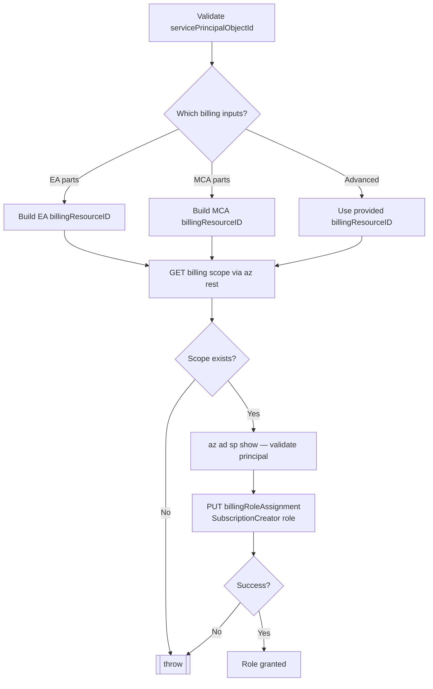

# Module: `Grant-SubscriptionCreatorRole`

| Field | Value |
|-------|-------|
| Repository | `Azure/ALZ-PowerShell-Module` |
| Flavor | PowerShell (cmdlet) |
| Entry file | `src/ALZ/Public/Grant-SubscriptionCreatorRole.ps1` |
| Source URL | <https://github.com/Azure/ALZ-PowerShell-Module/blob/main/src/ALZ/Public/Grant-SubscriptionCreatorRole.ps1> |
| Mode | deep |
| Last reviewed | 2026-06-16 |

## Purpose

Grants the **`SubscriptionCreator`** billing role to a service principal / managed identity so it can
create subscriptions in a given billing account — a prerequisite for **subscription vending**.

- Supports both **Enterprise Agreement (EA)** and **Microsoft Customer Agreement (MCA)** billing shapes.
- Works directly against the Azure Billing REST API via `az rest` (no Terraform/Bicep involved).
- Role definition ID is fixed: `a0bcee42-bf30-4d1b-926a-48d21664ef71` (`SubscriptionCreator`).

## Inputs (cmdlet parameters)

Two parameter sets: **Default** (build the billing resource ID from parts) and **Advanced** (`billingResourceID` directly).

| Name | Set | Required | Meaning |
|------|-----|:--------:|---------|
| `servicePrincipalObjectId` | Default | yes | Object ID of the SPN / managed identity to grant the role to. |
| `billingAccountID` | Default | no | EA or MCA billing account ID. |
| `enrollmentAccountID` | Default | no | EA enrollment account ID. |
| `billingProfileID` | Default | no | MCA billing profile ID. |
| `invoiceSectionID` | Default | no | MCA invoice section ID. |
| `billingResourceID` | Advanced | no | Full billing scope resource ID (bypasses the part-based build). |
| `managementApiPrefix` | Default | no | Azure management API base. Default `https://management.azure.com`. |

**Billing resource ID shapes built internally:**
- EA: `/providers/Microsoft.Billing/billingAccounts/<acct>/enrollmentAccounts/<enroll>`
- MCA: `/providers/Microsoft.Billing/billingAccounts/<acct>/billingProfiles/<profile>/invoiceSections/<section>`

## Outputs

None (`return`). Side effect: a **billing role assignment** PUT at
`<billingResourceID>/billingRoleAssignments/<new-guid>` (API `2024-04-01`).

## Resources Created

| Resource | Key configuration |
|----------|-------------------|
| Billing role assignment | `principalId` = SPN object ID; `roleDefinitionId` = `<billingResourceID>/billingRoleDefinitions/a0bcee42-…`; `principalTenantId` = current tenant. |

## Dependencies

**Upstream (needs):** logged-in Azure CLI as the **billing Account Owner**; an existing SPN/MI; a valid billing scope.
**Downstream:** enables the bootstrap/vending identity to create subscriptions (consumed conceptually by `lz-vending` / sub-vending patterns).

## Deployment Flow

## Notes & Gotchas

- The caller must be the **billing Account Owner**; otherwise the GET on the billing scope returns nothing and the cmdlet throws.
- A precedence quirk: if both MCA and EA parameter combinations are supplied, the **EA build runs last and wins** (it overwrites `billingResourceID`).
- Uses `New-Guid` for the role assignment name (idempotency is not guaranteed across re-runs).

## Open Questions

- [ ] `TODO: verify` API version stability (`2024-04-01`) across cloud environments (e.g. sovereign clouds).
