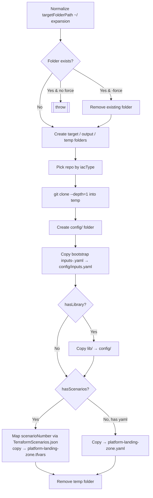

# Module: `New-AcceleratorFolderStructure`

| Field | Value |
|-------|-------|
| Repository | `Azure/ALZ-PowerShell-Module` |
| Flavor | PowerShell (cmdlet) |
| Entry file | `src/ALZ/Public/New-AcceleratorFolderStructure.ps1` |
| Source URL | <https://github.com/Azure/ALZ-PowerShell-Module/blob/main/src/ALZ/Public/New-AcceleratorFolderStructure.ps1> |
| Mode | deep |
| Last reviewed | 2026-06-16 |

## Purpose

Scaffolds a **local working folder** for the Accelerator and seeds it with starter **config files**
(bootstrap `inputs.yaml` + a platform-landing-zone config) pulled from the relevant accelerator repo,
so the user can edit inputs before running `Deploy-Accelerator`.

- Bridges the "getting started" docs to a ready-to-edit `config/` folder.
- Selects the source repo and layout by `iacType` (terraform / bicep / bicep-classic).
- Creates `output/` and a throwaway `temp/` clone folder.

## Inputs (cmdlet parameters)

| Name | Type | Default | Meaning |
|------|------|---------|---------|
| `iacType` | `string` | `terraform` | IaC flavor → chooses source repo + layout. |
| `versionControl` | `string` | `github` | Selects which `inputs-<vcs>.yaml` bootstrap example to copy. |
| `scenarioNumber` | `int` | `1` | (Terraform only) which scenario tfvars to copy, mapped via `TerraformScenarios.json`. |
| `targetFolderPath` | `string` | `~/accelerator` | Where to create the folder structure. |
| `outputFolderName` | `string` | `output` | Name of the output sub-folder. |
| `force` | `switch` | off | Delete + recreate the target folder if it already exists. |

### `iacType` → source repo mapping (from the cmdlet's `$repos` table)

| `iacType` | Repo cloned | Notable layout |
|-----------|-------------|----------------|
| `terraform` | `Azure/alz-terraform-accelerator` | `folderToClone=templates/platform_landing_zone`, has `lib/` library, has scenarios |
| `bicep` | `Azure/alz-bicep-accelerator` | copies `platform-landing-zone.yaml` |
| `bicep-classic` | `Azure/ALZ-Bicep` | `folderToClone=accelerator` |

## Outputs

None. **Side effects** (files on disk under `targetFolderPath`):
- `output/` and `temp/` folders.
- `config/inputs.yaml` (from `bootstrap/inputs-<versionControl>.yaml`).
- Terraform: `config/platform-landing-zone.tfvars` (scenario-selected) + copied `lib/` library.
- Bicep: `config/platform-landing-zone.yaml`.

## Resources Created

None in Azure — local filesystem only. Uses `git clone --depth=1` from `https://github.com/Azure/<repo>`.

## Dependencies

**Upstream (needs):** `git` CLI + internet access to the accelerator repos; `Private/Deploy-Accelerator-Helpers/TerraformScenarios.json` for scenario mapping.
**Downstream:** produces the `config/` inputs later consumed by `Deploy-Accelerator -c config/inputs.yaml`.

## Deployment Flow

## Notes & Gotchas

- `-force` performs a **recursive delete** of an existing target folder — destructive; guarded by `SupportsShouldProcess`.
- The `temp/` clone is always removed at the end (`Remove-Item -Recurse -Force`).
- Scenario numbers are not free-form: they must exist as `value` entries in `TerraformScenarios.json`.

## Open Questions

- [x] Resolved (see F1 notes): the Terraform scenarios in `TerraformScenarios.json` map to tfvars under
  `templates/platform_landing_zone/examples/` in `Azure/alz-terraform-accelerator` (e.g. `full-single-region`,
  `full-multi-region`, `*-nva`, `management-only`, `smb-single-region`).
  See [alz-terraform-accelerator/_overview.md](../alz-terraform-accelerator/_overview.md#scenarios-templatesplatform_landing_zoneexamples).
