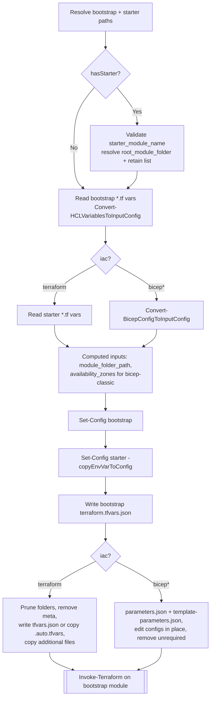
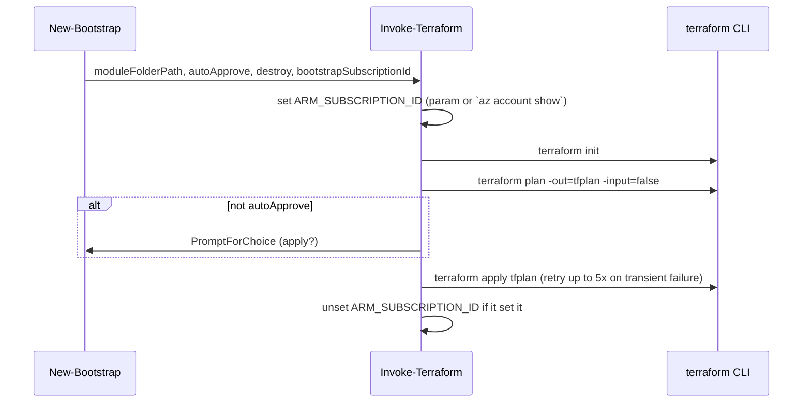

# Module: `New-Bootstrap`

| Field | Value |
|-------|-------|
| Repository | `Azure/ALZ-PowerShell-Module` |
| Flavor | PowerShell (private helper) |
| Entry file | `src/ALZ/Private/Deploy-Accelerator-Helpers/New-Bootstrap.ps1` |
| Source URL | <https://github.com/Azure/ALZ-PowerShell-Module/blob/main/src/ALZ/Private/Deploy-Accelerator-Helpers/New-Bootstrap.ps1> |
| Mode | deep |
| Last reviewed | 2026-06-16 |

## Purpose

`New-Bootstrap` is the **core engine** invoked by `Deploy-Accelerator`. It resolves the chosen starter
module, reads bootstrap + starter parameter definitions, maps the normalized input config onto those
parameters, **writes the configuration files** each module expects, and finally runs Terraform to apply
the bootstrap.

- The convergence point where the abstract `inputConfig` becomes concrete on-disk `*.tfvars.json` / `parameters.json`.
- Branches on `iac_type`: `terraform` vs `bicep*` produce different output files and file-pruning behaviour.
- Ends by calling `Invoke-Terraform` against the **bootstrap module** (not the starter).

## Inputs (function parameters)

| Name | Type | Required | Description |
|------|------|:--------:|-------------|
| `iac` | `string` | no | IaC flavor: `terraform`, `bicep`, or `bicep-classic`. |
| `bootstrapDetails` | `PSCustomObject` | no | Selected bootstrap entry (its `.Value.location` gives the module sub-path). |
| `inputConfig` | `PSCustomObject` | no | The normalized input config (`{Value,Source,Sensitive}` per key). |
| `bootstrapTargetPath` / `bootstrapRelease` | `string` | no | Base path + release tag → bootstrap module path. |
| `hasStarter` | `switch` | no | Whether a starter module was downloaded. |
| `starterTargetPath` / `starterRelease` | `string` | no | Base path + release tag → starter path. |
| `starterConfig` | `PSCustomObject` | no | Parsed starter config (module list, deployment files, retain/remove rules). |
| `autoApprove` | `switch` | no | Pass-through to skip Terraform plan confirmation. |
| `destroy` | `switch` | no | Run Terraform in destroy mode. |
| `writeVerboseLogs` | `switch` | no | Extra logging for meta-file removal. |
| `hclParserToolPath` | `string` | no | Path to the HCL→JSON parser binary. |
| `convertTfvarsToJson` | `switch` | no | Emit `terraform.tfvars.json` for the starter instead of copying `.tfvars`. |
| `inputConfigFilePaths` | `string[]` | no | Original input files (used to copy `.auto.tfvars` into the starter). |
| `starterAdditionalFiles` | `string[]` | no | Extra files/folders to copy into the starter root. |
| `cleanBootstrapFolder` | `switch` | no | Remove Terraform meta files from the bootstrap before running (dev). |

## Outputs

No return value. **Side effects:**

- Bootstrap: `terraform.tfvars.json` written into the bootstrap module folder.
- Terraform starter: `terraform.tfvars.json` (or copied `*.auto.tfvars`), pruned to retained folders, meta files removed, additional files copied.
- Bicep starter: `parameters.json` + `template-parameters.json` written; config files edited in place; unrequired files removed.
- A Terraform-applied bootstrap environment (via `Invoke-Terraform`).

## Flow (step by step)

1. **Resolve paths** — compute `bootstrapModulePath` from `bootstrapTargetPath/bootstrapRelease/bootstrapDetails.Value.location`; optionally clean Terraform meta files.
2. **Resolve starter** (if `hasStarter`):
   - Validate `starter_module_name` exists in `starterConfig.starter_modules`.
   - Resolve `starterModulePath`; honor `additional_retained_folders` and `root_module_folder` (added as `root_module_folder_relative_path` calculated input).
3. **Read bootstrap parameters** — for each `*.tf` in the bootstrap module, `Convert-HCLVariablesToInputConfig` → `$bootstrapParameters`.
4. **Read starter parameters** — Terraform: `*.tf` via `Convert-HCLVariablesToInputConfig`; Bicep: `Convert-BicepConfigToInputConfig`.
5. **Computed inputs** — add `module_folder_path`; for `bicep-classic` with `starter_locations`, compute `availability_zones_starter` via `Get-AzureRegionData` + `Get-AvailabilityZonesSupport`.
6. **Map config → params** — `Set-Config` for bootstrap; `Set-Config -copyEnvVarToConfig` for starter (so `TF_VAR_*` values are materialized for the starter).
7. **Write files:**
   - Bootstrap: `Write-TfvarsJsonFile` → `terraform.tfvars.json`.
   - **Terraform starter:** prune folders not in `starterFoldersToRetain`, remove Terraform meta files, then either write `terraform.tfvars.json` (`-convertTfvarsToJson`) or copy `.tfvars` as `*.auto.tfvars`; copy `starterAdditionalFiles`.
   - **Bicep starter:** optionally `Copy-ParametersFileCollection`; `Set-ComputedConfiguration`; `Edit-ALZConfigurationFilesInPlace`; `Write-JsonFile` → `parameters.json` and `template-parameters.json` (the latter with all three configs); `Remove-UnrequiredFileSet`.
8. **Run Terraform** — `Invoke-Terraform` against the **bootstrap** module (passes `bootstrap_subscription_id` if present); `-autoApprove` controls confirmation.

## Dependencies

**Upstream (needs):**
- `Deploy-Accelerator` — supplies `inputConfig`, `bootstrapDetails`, `starterConfig`, resolved paths, and the HCL parser path.
- Downloaded bootstrap + starter modules on disk.

**Downstream (depends on this):**
- `Invoke-Terraform` — performs `init` → `plan` → `apply` (with `ARM_SUBSCRIPTION_ID` handling and up to 5 apply retries).
- The customer's VCS pipeline later consumes the rendered starter committed by the bootstrap.

**Helpers called:** `Convert-HCLVariablesToInputConfig`, `Convert-BicepConfigToInputConfig`, `Set-Config`,
`Set-ComputedConfiguration`, `Edit-ALZConfigurationFilesInPlace`, `Write-TfvarsJsonFile`, `Write-JsonFile`,
`Copy-ParametersFileCollection`, `Remove-TerraformMetaFileSet`, `Remove-UnrequiredFileSet`,
`Get-AzureRegionData`, `Get-AvailabilityZonesSupport`, `Invoke-Terraform`.

## Invoke-Terraform (sub-flow)

## Notes & Gotchas

- **Bootstrap is what gets applied here** — the starter is only *rendered and pruned*, not applied by this module.
- The **starter's `root_module_folder`** is auto-added to the retained-folders list and exposed as
  `root_module_folder_relative_path`; Terraform tfvars land in that root module folder.
- `Set-Config` for the **starter uses `-copyEnvVarToConfig`** (real env values copied in), whereas the
  **bootstrap** run leaves env-sourced values as `sourced-from-env` placeholders.
- `bicep-classic` is the only flavor that computes availability-zone support per `starter_locations`.
- `Invoke-Terraform` only sets `ARM_SUBSCRIPTION_ID` if it is not already set, and removes it afterward
  to avoid leaking state between runs.

## Open Questions

- [ ] `TODO: verify` the exact shape of `starterConfig.starter_modules.*.deployment_files` and the
  `folders_or_files_to_retain` / `subfolders_or_files_to_remove` lists (defined in the remote starter config).
