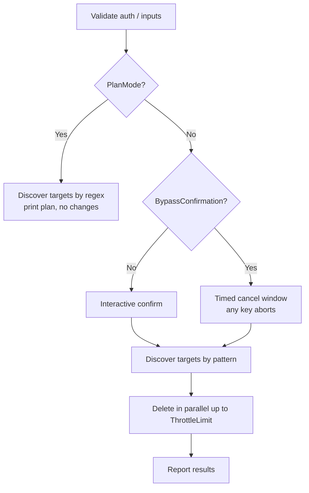
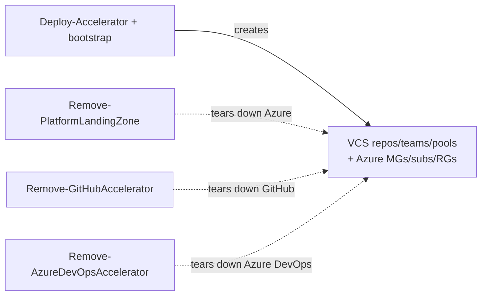

# Modules (cleanup family): `Remove-PlatformLandingZone`, `Remove-GitHubAccelerator`, `Remove-AzureDevOpsAccelerator`

| Field | Value |
|-------|-------|
| Repository | `Azure/ALZ-PowerShell-Module` |
| Flavor | PowerShell (cmdlets) |
| Entry files | `src/ALZ/Public/Remove-PlatformLandingZone.ps1`, `Remove-GitHubAccelerator.ps1`, `Remove-AzureDevOpsAccelerator.ps1` |
| Mode | deep |
| Last reviewed | 2026-06-16 |

## Purpose

Three **destructive cleanup** cmdlets that tear down what the Accelerator created. They are primarily
for **testing / experiment teardown**, not routine production use. All three share a safety pattern:
pattern-matched discovery, confirmation (or timed bypass), an optional `-PlanMode` dry run, and
parallelized deletion (`-ThrottleLimit`, default `11`).

| Cmdlet | Target plane | Deletes |
|--------|--------------|---------|
| `Remove-PlatformLandingZone` | **Azure** | Management group hierarchies, subscriptions' resource groups, MG/sub deployments, deployment stacks, orphaned/custom role assignments & definitions; resets Defender to Free. |
| `Remove-GitHubAccelerator` | **GitHub** | Repositories, teams, optionally runner groups (matched by regex). |
| `Remove-AzureDevOpsAccelerator` | **Azure DevOps** | Projects, optionally agent pools (matched by regex). |

> ⚠️ **Highly destructive.** `Remove-PlatformLandingZone` will, by default, delete **all** resource
> groups in the in-scope subscriptions except those matching retain patterns. Always run `-PlanMode` first.

## Shared safety inputs (all three)

| Name | Type | Default | Meaning |
|------|------|---------|---------|
| `BypassConfirmation` | `switch` | off | Skip interactive prompt; wait a cancel window instead. |
| `BypassConfirmationTimeoutSeconds` | `int` | `30` | Cancel window length when bypassing. |
| `ThrottleLimit` | `int` | `11` | Max parallel delete operations. |
| `PlanMode` | `switch` | off | Dry run — show what would be deleted, change nothing. |

## `Remove-PlatformLandingZone` — key inputs

| Name | Type | Default | Meaning |
|------|------|---------|---------|
| `ManagementGroups` | `string[]` (regex) | — | Match MG name/displayName. By default deletes **children one level below** matches. |
| `DeleteTargetManagementGroups` | `switch` | off | Also delete the matched target MGs themselves. |
| `SubscriptionsTargetManagementGroup` | `string` | `$null` | Where to move subscriptions after removal. |
| `Subscriptions` | `string[]` | `@()` | Explicit subs (skip discovery from MGs). IDs or names. |
| `AdditionalSubscriptions` | `string[]` | `@()` | Extra subs merged in (e.g. the bootstrap sub). |
| `ResourceGroupsToRetainNamePatterns` | `string[]` (regex) | `@("VisualStudioOnline-")` | RGs to keep (retains ADO billing RGs). |
| `Skip*` switches | `switch` | off | `SkipDefenderPlanReset`, `SkipDeploymentDeletion`, `SkipDeploymentStackDeletion`, `SkipOrphanedRoleAssignmentDeletion`, `SkipCustomRoleDefinitionDeletion`. |
| `*ToDeleteNamePatterns` | `string[]` (-like) | `@()` | Narrow which MGs / role definitions / deployment stacks to delete (empty = all). |
| `AllowNoManagementGroupMatch` | `switch` | off | Continue (warn) if no MGs match. |
| `ForceSubscriptionPlacement` | `switch` | off | Force-move subs to the target/default MG. |

### Documented deletion sequence (from the cmdlet help)

1. Validate provided MGs/subscriptions exist.
2. Confirm (unless bypassed / plan mode).
3. Recursively discover child MGs per target.
4. Remove subscriptions from MGs (optionally move to target MG).
5. Discover subscriptions from MGs (if not explicitly provided).
6. Delete MGs in **reverse depth order** (children before parents).
7. Delete MG-level deployments from retained target MGs.
8. Delete orphaned role assignments from retained target MGs.
9. Delete custom role assignments + definitions from retained target MGs.
10. Delete all resource groups in scope (except retain patterns).
11. Reset Defender for Cloud plans to Free.
12. Delete all subscription-level deployments.
13. Delete orphaned role assignments from subscriptions.

## `Remove-GitHubAccelerator` — key inputs

| Name | Type | Default | Meaning |
|------|------|---------|---------|
| `Organization` (`-org`) | `string` | — (required) | GitHub org. |
| `RepositoryNamePatterns` (`-repos`) | `string[]` (regex) | `@()` | Repos to delete. |
| `TeamNamePatterns` (`-teams`) | `string[]` (regex) | `@()` | Teams to delete. |
| `RunnerGroupNamePatterns` (`-runners`) | `string[]` (regex) | `@()` | Runner groups to delete. |

Requires GitHub CLI (`gh`) authenticated; needs `delete:repo` + `admin:org`.

## `Remove-AzureDevOpsAccelerator` — key inputs

| Name | Type | Default | Meaning |
|------|------|---------|---------|
| `Organization` (`-org`) | `string` | — (required) | ADO org URL or name (normalized internally). |
| `ProjectNamePatterns` (`-projects`) | `string[]` (regex) | `@()` | Projects to delete. |
| `AgentPoolNamePatterns` (`-pools`) | `string[]` (regex) | `@()` | Agent pools to delete. |

Requires Azure CLI + `azure-devops` extension; auth via `az devops login` (PAT supported, `az login` not required).

## Outputs

None meaningful — all three produce console logs and perform deletions as side effects.

## Dependencies

**Upstream (needs):**
- `Remove-PlatformLandingZone` → authenticated Azure CLI with rights over the MGs/subs/billing.
- `Remove-GitHubAccelerator` → `gh` CLI authenticated.
- `Remove-AzureDevOpsAccelerator` → `az` + `azure-devops` extension authenticated.

**Relationship:** these undo the work performed by the bootstrap (`accelerator-bootstrap-modules`, F2)
and the platform deployment seeded by the starter module — the inverse of the `Deploy-Accelerator` flow.

## Shared cleanup flow

## Notes & Gotchas

- All three default `ThrottleLimit` to `11` ("These go to eleven.") — raising it increases API throttling risk.
- `Remove-PlatformLandingZone` deletes MGs **children-first** (reverse depth) to respect hierarchy constraints.
- Default retain pattern `VisualStudioOnline-` preserves Azure DevOps billing resource groups.
- Regex (`-NamePatterns`) vs `-like` wildcard (`*ToDeleteNamePatterns`) semantics differ — read each parameter's help.
- `-PlanMode` is the recommended first run for every one of these.

## Open Questions

- [ ] `TODO: verify` the internal deletion implementation details (parallel runspace handling, error aggregation) — only documented behaviour and parameters were inspected here.
