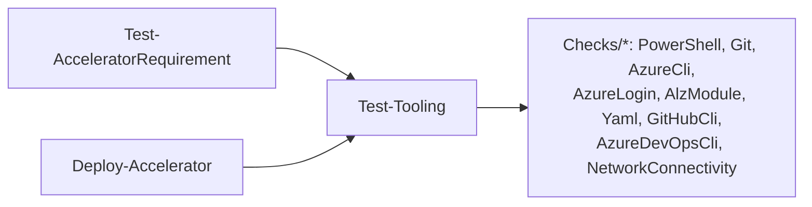
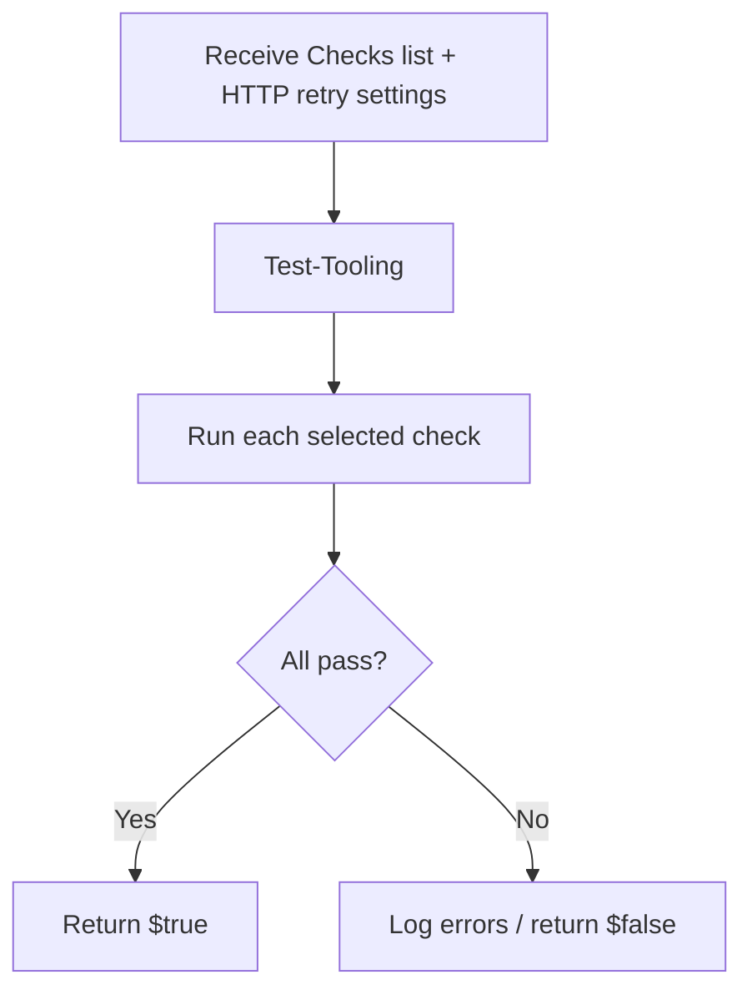

# Module: `Test-AcceleratorRequirement`

| Field | Value |
|-------|-------|
| Repository | `Azure/ALZ-PowerShell-Module` |
| Flavor | PowerShell (cmdlet) |
| Entry file | `src/ALZ/Public/Test-AcceleratorRequirement.ps1` |
| Source URL | <https://github.com/Azure/ALZ-PowerShell-Module/blob/main/src/ALZ/Public/Test-AcceleratorRequirement.ps1> |
| Mode | deep |
| Last reviewed | 2026-06-16 |

## Purpose

Pre-flight environment check. Verifies the prerequisite software and outbound network connectivity the
Accelerator needs are present before any work begins.

- Thin public wrapper around the private `Test-Tooling` helper (in `Private/Tools/`).
- Reused internally by `Deploy-Accelerator`, which composes a tailored `Checks` list.
- Returns `Boolean` — `$true` when all selected checks pass.

## Inputs (cmdlet parameters)

| Name | Type | Default | Meaning |
|------|------|---------|---------|
| `Checks` | `string[]` (ValidateSet) | `PowerShell, Git, AzureCliOrEnvVars, AzureLogin, AlzModule, AlzModuleVersion, NetworkConnectivity` | Which checks to run. |
| `http_request_max_retry_count` (`-hrmrc`) | `int` | `0` | Retries for transient HTTP errors during connectivity checks. |
| `http_request_retry_interval_seconds` (`-hrris`) | `int` | `3` | Wait between retries. |
| `http_request_timeout_seconds` (`-hrts`) | `int` | `10` | HTTP timeout for connectivity checks. |

### Valid `Checks` values

`PowerShell`, `Git`, `AzureCli`, `AzureEnvVars`, `AzureCliOrEnvVars`, `AzureLogin`, `AlzModule`,
`AlzModuleVersion`, `YamlModule`, `YamlModuleAutoInstall`, `GitHubCli`, `AzureDevOpsCli`, `NetworkConnectivity`.

## Outputs

`Boolean` (and console log lines). `$true` = all selected checks satisfied. The richer object form
(used internally) also surfaces flags such as `AzCliInstalledButNotLoggedIn` consumed by `Deploy-Accelerator`.

## Resources Created

None — read-only validation.

## Dependencies

**Upstream (needs):** local tools to probe (PowerShell, Git, Azure CLI, `powershell-yaml`, `gh`, `az devops`), network egress.
**Downstream (depends on this):** `Deploy-Accelerator` (gates the whole run); users may call it standalone.
**Internal:** delegates entirely to `Private/Tools/Test-Tooling.ps1` → `Private/Tools/Checks/*`.

## Module Dependency Diagram

## Deployment Flow

## Notes & Gotchas

- The default `Checks` set here differs from the set `Deploy-Accelerator` builds: the deploy path adds
  `AzureLogin`, `YamlModule*`, and `NetworkConnectivity` conditionally based on its own flags.
- `AzureCliOrEnvVars` passes if either Azure CLI is usable **or** the `ARM_*` environment variables are set.

## Open Questions

- [ ] `TODO: verify` the exact per-check logic in `Private/Tools/Checks/*` (not opened in detail).
