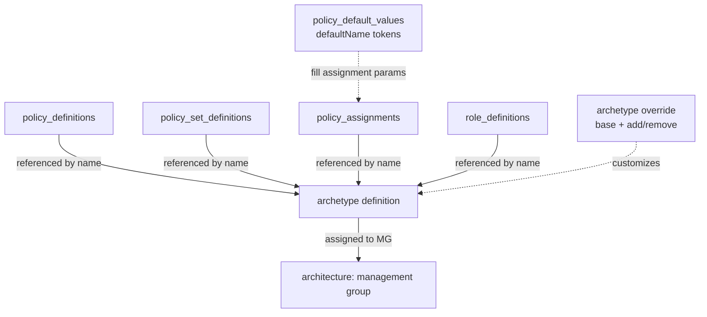
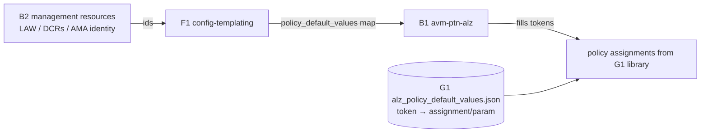

# Repository Overview: `Azure/Azure-Landing-Zones-Library`

| Field | Value |
|-------|-------|
| Repository | `Azure/Azure-Landing-Zones-Library` (catalog G1) |
| Flavor | Data (JSON/YAML) — the **ALZ Library** |
| Role | Authoritative **data source** for ALZ governance: archetypes, architectures, policy + role assets, policy default values |
| Entry | `platform/<library>/` (e.g. `platform/alz`); schemas in `schemas/` |
| Consumed by | `alz` provider (G3) → `alzlib` (G2) → **B1 `avm-ptn-alz`**; also AzGovViz, accelerators |
| Versioning | Per-library tags, e.g. `platform/alz/2026.04.2` (= the `ref` B1 pins) |
| Docs | <https://azure.github.io/Azure-Landing-Zones-Library/> |
| Source URL | <https://github.com/Azure/Azure-Landing-Zones-Library> |
| Mode | deep (remote analysis via GitHub) |
| Last reviewed | 2026-06-17 |

## Purpose

This repo is **not IaC** — it is the **library of governance data** that ALZ tooling reads to know *what
policies, roles, archetypes and management-group hierarchy to deploy*. It is the bottom of the Terraform
governance chain: B1 `avm-ptn-alz` reads it (via the `alz` provider + `alzlib`) and turns its archetype +
architecture definitions into actual Azure resources.

- The data/engine main line: **G1 (this, data) → G2 `alzlib` (Go reader) → G3 `terraform-provider-alz` → B1 `avm-ptn-alz`**.
- Pure declarative data: JSON resource definitions (policy/role) + JSON/YAML "construct" files (archetype/architecture).
- Versioned per library so consumers pin a known-good snapshot (`path = "platform/alz", ref = "2026.04.2"`).

> This resolves B1's open question — archetype→policy mapping lives **here**.

## Repository structure

```text
Azure-Landing-Zones-Library/
├── platform/                 # the libraries (one folder per library)
│   ├── alz/                  # ★ reference ALZ policies + archetypes + architecture
│   ├── amba/                 # Azure Monitor Baseline Alerts library
│   └── slz/                  # Sovereign Landing Zone library
├── schemas/                  # JSON schemas for the custom construct files
│   ├── archetype_definition.json
│   ├── archetype_override.json
│   ├── architecture_definition.json
│   ├── default_policy_values.json
│   └── library_metadata.json
├── docs/                     # GitHub Pages docs (asset taxonomy, client guidance)
└── scripts/ + Makefile       # automation (alzlibtool) that regenerates the library
```

### `platform/alz/` (the reference library)

```text
platform/alz/
├── archetype_definitions/        # *.alz_archetype_definition.json  (named bundles of assets)
├── architecture_definitions/     # *.alz_architecture_definition.json  (the MG hierarchy)
├── policy_definitions/           # *.alz_policy_definition.json   (149 custom policy defs)
├── policy_set_definitions/       # *.alz_policy_set_definition.json (42 initiatives)
├── policy_assignments/           # *.alz_policy_assignment.json   (80 assignments)
├── role_definitions/             # *.alz_role_definition.json     (5 custom roles)
├── alz_library_metadata.json     # library metadata
├── alz_policy_default_values.json# the defaultName token → assignment/parameter map
└── README.md                     # auto-generated index of all the above
```

## Asset type taxonomy (filename patterns)

The library distinguishes **resource definitions** (mirror Azure resource schemas) from **constructs**
(library-specific glue). From `docs/content/assets/`:

| Asset | Filename pattern | What it is |
|-------|------------------|------------|
| Policy definition | `*.alz_policy_definition.json` | An Azure Policy definition resource. |
| Policy set definition | `*.alz_policy_set_definition.json` | An Azure Policy **initiative** (references member policy defs). |
| Policy assignment | `*.alz_policy_assignment.json` | An Azure Policy assignment (references a policy/set def). |
| Role definition | `*.alz_role_definition.{json,yaml,yml}` | A custom Azure role definition. |
| **Archetype** | `*.alz_archetype_definition.{json,yaml,yml}` | A named **bundle** referencing assets by their `.name`. |
| **Archetype override** | `*.alz_archetype_override.{json,...}` | A delta on a base archetype (`*_to_add` / `*_to_remove`). |
| **Architecture** | `*.alz_architecture_definition.{json,yaml,yml}` | The **management-group hierarchy** with archetypes per MG. |
| Library metadata | `*_library_metadata.json` | Library name/dependencies. |
| Policy default values | `*_policy_default_values.json` | Maps a `defaultName` token → `{assignment → parameter}`. |

> Resource definitions (policy/role) use the native Azure resource schema, so the repo only ships custom
> JSON schemas for the constructs (archetype/override/architecture/metadata/default-values).

## The core model: assets → archetype → architecture



- An **archetype** = a `name` + lists of `policy_assignments`, `policy_definitions`, `policy_set_definitions`, `role_definitions` (all by `.name`). Multiple archetypes can attach to one MG.
- An **architecture** = a `name` + `management_groups[]`, each with `id`, `display_name`, `parent_id`, `exists`, and `archetypes[]`.
- An **archetype override** = `base_archetype` + `*_to_add` / `*_to_remove` lists (lets you tweak without forking).

### Example architecture (`docs` example, matches B1's `lib/` files)

```yaml
name: alz
management_groups:
  - id: my-mg
    display_name: My Management Group
    archetypes: [root]
    parent_id: null
    exists: false
  - id: my-mg-child
    display_name: My Management Group Child
    archetypes: [landing_zones]
    parent_id: my-mg
    exists: false
```

## `platform/alz` archetypes (and their assets)

From the auto-generated `platform/alz/README.md`:

| Archetype | Assets attached |
|-----------|-----------------|
| `root` | **149 policy defs + 42 set defs + 17 assignments + 5 role defs** (the bulk; sits at the intermediate root). Roles: Application-Owners, Network-Management, Network-Subnet-Contributor, Security-Operations, Subscription-Owner. |
| `platform` | 40 policy assignments (monitoring, guardrails). |
| `landing_zones` | 53 policy assignments (workload guardrails). |
| `connectivity` | 1 (`Enable-DDoS-VNET`). |
| `corp` | 5 (`Audit-PeDnsZones`, `Deny-HybridNetworking`, `Deny-Public-Endpoints`, `Deny-Public-IP-On-NIC`, `Deploy-Private-DNS-Zones`). |
| `identity` | 4 (`Deny-MgmtPorts-Internet`, `Deny-Public-IP`, `Deny-Subnet-Without-Nsg`, `Deploy-VM-Backup`). |
| `decommissioned` | 1 (`Enforce-ALZ-Decomm`). |
| `sandbox` | 1 (`Enforce-ALZ-Sandbox`). |
| `local` | 1 (`Enforce-ALDO-Services`). |

> Library totals (`alz`): **149** policy definitions, **42** policy set definitions, **80** policy assignments, **5** role definitions.

## Policy default values — the link to B2 management resources

`alz_policy_default_values.json` defines named tokens that get injected into policy-assignment parameters
at deploy time. **This is exactly the `policy_default_values` map B1 receives** (and which F1 fills from
B2's outputs). Key tokens and the assignments/parameters they feed:

| `defaultName` token | Feeds (assignment → parameter) | Sourced from |
|---------------------|-------------------------------|--------------|
| `log_analytics_workspace_id` | Deploy-AzActivity-Log → `logAnalytics`, Deploy-Diag-LogsCat, Deploy-MDFC-Config-H224, Deploy-AzSqlDb-Auditing… | **B2** LAW id |
| `ama_change_tracking_data_collection_rule_id` | Deploy-VM-ChangeTrack / VMSS / vmArc → `dcrResourceId` | **B2** change-tracking DCR |
| `ama_vm_insights_data_collection_rule_id` | Deploy-VM-Monitoring / VMSS / vmHybr → `dcrResourceId` | **B2** VM-insights DCR |
| `ama_mdfc_sql_data_collection_rule_id` | Deploy-MDFC-DefSQL-AMA → `dcrResourceId` | **B2** Defender-SQL DCR |
| `ama_user_assigned_managed_identity_id` | the AMA Deploy-* assignments → `userAssignedIdentityResourceId` | **B2** AMA UAMI |
| `ddos_protection_plan_id` | Enable-DDoS-VNET → `ddosPlan` | **B3/B4** DDoS plan |
| `private_dns_zone_{region,resource_group_name,subscription_id}` | Deploy-Private-DNS-Zones → dnsZone* | **B3/B4** connectivity |
| `email_security_contact`, `resource_group_*`, `resource_group_name_mdfc` | Deploy-MDFC-Config-H224, Deploy-SvcHealth-BuiltIn… | operator input |



## The three platform libraries

| Library | Purpose | Notable archetypes |
|---------|---------|--------------------|
| `alz` | Reference Azure Landing Zones policies + architecture. | root, platform, landing_zones, connectivity, corp, identity, management, decommissioned, sandbox, local. |
| `amba` | **Azure Monitor Baseline Alerts** — alert policies/initiatives. | amba_root (143 policy defs, 16 set defs), amba_connectivity/identity/landing_zones/management/platform. |
| `slz` | **Sovereign Landing Zone** — adds sovereignty/compliance controls. | inherits alz archetypes + `sovereign_l1_controls` / `_l2_controls` / `_l3_controls`, `public`. |

> Consumers can stack libraries: B1 examples reference `platform/alz` + optionally `platform/amba` and a
> local `lib/` override (e.g. the SLZ `sovereign_l1/l2/l3` overrides seen in F1).

## How it's consumed (the `alz` provider)

```hcl
provider "alz" {
  library_references = [
    { path = "platform/alz", ref = "2026.04.2" }   # pin a per-library release tag
  ]
}
```

The `alz` provider (G3, backed by `alzlib` G2) downloads this library into `.alzlib`, resolves the
architecture + archetypes + assets, and exposes them through the `alz_architecture` data source that B1
flattens into `azapi_resource`s. See [avm-ptn-alz/_overview.md](../avm-ptn-alz/_overview.md).

## Dependencies

**Upstream:** none (it is the source of truth); updated by automation (`alzlibtool`) + PRs. Its policy
**assignment** assets are (re)generated from upstream ARM policy templates by the
`Invoke-LibraryUpdatePolicyAssignmentArchetypes.ps1` script in `platform/alz/scripts/`, which uses the
**G4 `arm-template-parser`** CLI to evaluate the ARM offline — see
[arm-template-parser/_overview.md](../arm-template-parser/_overview.md). Those upstream ARM policy templates
originate in **E1 `Enterprise-Scale`** (the reference implementation) — see
[enterprise-scale-arm/_overview.md](../enterprise-scale-arm/_overview.md).
**Downstream:** `alzlib` (G2) and `terraform-provider-alz` (G3) read it; **B1 `avm-ptn-alz`** is the
ultimate Terraform consumer; AzGovViz and other tooling also consume it.

## Notes & Gotchas

- **Everything is referenced by `.name`** — archetypes list asset *names*, not file paths or ids; the
  client resolves names → resource definitions → scoped resource ids at deploy time.
- **Scope-specific values are placeholders:** policy/role/assignment JSON has resource ids, scopes,
  locations, and referenced-definition ids that the **client must rewrite** when deploying into a real
  architecture (documented per asset in `docs/content/assets/`).
- **`exists: true`** on a management group means "don't create it" (deploy under a pre-existing MG) — the
  same flag B1's `locals.tf` filters on.
- **Visual authoring (J3)** — the [ALZ Architecture Editor](../alzarchitectureeditor/_overview.md) is a browser
  app for hand-building an `architecture_definition.json` against this schema (MG tree + archetypes + `exists`),
  exporting the file consumers reference.
- **Per-library release tags** (`platform/alz/<date>`) let different consumers pin different snapshots.
- **The READMEs are auto-generated** by `alzlibtool` from the actual files — a reliable index of contents.
- New terms captured in [glossary.md](../glossary.md): ALZ Library, archetype definition (file), archetype override, architecture definition (file), policy default values, library reference, AMBA library, SLZ library, alzlibtool.

## Open Questions

- [ ] `TODO: verify` the exact `alz_library_metadata.json` schema (name + dependencies on other libraries) — only its role captured. alzlib resolves dependencies recursively via this metadata (see G2).
- [x] How names → scoped ids resolution works — now documented in **G2 `alzlib`**: see [alzlib/module-deployment-hierarchy.md](../alzlib/module-deployment-hierarchy.md) (the `update()` scope-rewrite step). The `policy_assignments_to_modify` overlay maps to alzlib's `ModifyPolicyAssignment` options, surfaced by **G3 `terraform-provider-alz`**: see [terraform-provider-alz/module-alz-architecture-datasource.md](../terraform-provider-alz/module-alz-architecture-datasource.md).
