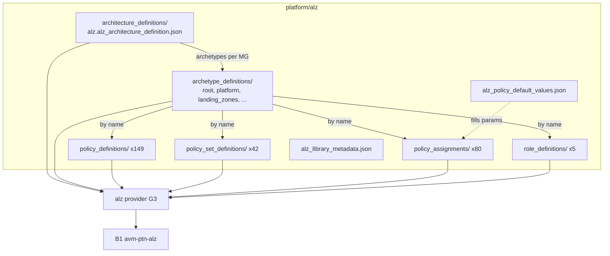
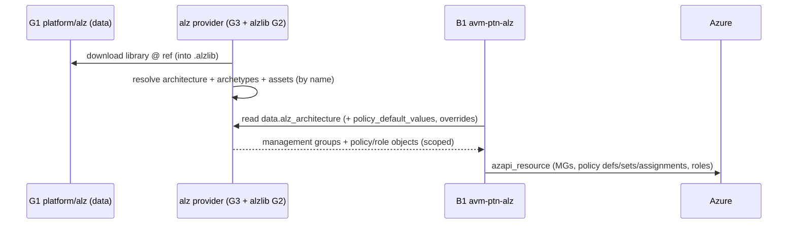

# Library: `platform/alz` (construct file formats + asset reference)

| Field | Value |
|-------|-------|
| Repository | `Azure/Azure-Landing-Zones-Library` |
| Flavor | Data (JSON/YAML library) |
| Entry | `platform/alz/` |
| Source URL | <https://github.com/Azure/Azure-Landing-Zones-Library/tree/main/platform/alz> |
| Mode | deep |
| Last reviewed | 2026-06-17 |

## Purpose

Deep dive on the **file formats** of the four library constructs (archetype, archetype override,
architecture, policy default values) and how they reference the resource-definition assets. This is the
contract the `alz` provider parses; understanding it explains everything B1 deploys.

## 1. Archetype definition (`*.alz_archetype_definition.{json,yaml,yml}`)

A named bundle that lists assets **by their `.name`** (not path/id). Schema:
<https://raw.githubusercontent.com/Azure/Azure-Landing-Zones-Library/main/schemas/archetype_definition.json>

```yaml
name: "landing_zones"
policy_assignments:
  - "Audit-AppGW-WAF"
  - "Deny-IP-forwarding"
  - "Deploy-MDFC-DefSQL-AMA"
  - "Deploy-VM-Monitoring"
  # ... (53 total for landing_zones)
policy_definitions: []          # usually empty except the root archetype
policy_set_definitions: []      # usually empty except the root archetype
role_definitions: []
```

> The **`root` archetype** is special: it carries all 149 policy definitions + 42 set definitions + 5 role
> definitions (the shared catalog), plus 17 assignments. Other archetypes carry only `policy_assignments`.
> This is why the architecture places `root` at the intermediate-root MG.

## 2. Archetype override (`*.alz_archetype_override.{json,...}`)

A delta on a base archetype — lets you customize without forking the whole bundle:

```yaml
name: "landing_zones_override"
base_archetype: "landing_zones"
policy_assignments_to_add: []
policy_assignments_to_remove:
  - "Deny-IP-forwarding"
policy_definitions_to_add: []
policy_definitions_to_remove: []
policy_set_definitions_to_add: []
policy_set_definitions_to_remove: []
role_definitions_to_add: []
role_definitions_to_remove: []
```

To use it, the architecture references the override's `name` instead of the base archetype on that MG.

## 3. Architecture definition (`*.alz_architecture_definition.{json,yaml,yml}`)

The management-group hierarchy + which archetypes apply to each MG. Schema:
<https://raw.githubusercontent.com/Azure/Azure-Landing-Zones-Library/main/schemas/architecture_definition.json>

```yaml
name: alz
management_groups:
  - id: my-mg
    display_name: My Management Group
    archetypes: [root]
    parent_id: null         # null = child of the user-supplied root MG
    exists: false           # false = create it; true = use pre-existing
  - id: my-mg-child
    display_name: My Management Group Child
    archetypes: [landing_zones]
    parent_id: my-mg
    exists: false
```

Per-MG properties: `id`, `display_name`, `archetypes[]` (one or more), `parent_id`, `exists`.

> This is the exact shape B1's `data.alz_architecture` returns and `locals.tf` flattens into
> `management_groups_level_0..6` (filtering `!exists`). See
> [avm-ptn-alz/module-avm-ptn-alz.md](../avm-ptn-alz/module-avm-ptn-alz.md).

## 4. Policy default values (`alz_policy_default_values.json`)

Named tokens → the assignments + parameter names they fill. Schema:
<https://raw.githubusercontent.com/Azure/Azure-Landing-Zones-Library/main/schemas/default_policy_values.json>

Conceptually each entry is:

```json
{
  "log_analytics_workspace_id": {
    "description": "...",
    "policy_assignments": [
      { "policy_assignment_name": "Deploy-AzActivity-Log", "parameter_names": ["logAnalytics"] },
      { "policy_assignment_name": "Deploy-Diag-LogsCat",  "parameter_names": ["logAnalytics"] }
    ]
  }
}
```

A client (B1) supplies a value per token via `policy_default_values = { log_analytics_workspace_id = jsonencode({ value = "<id>" }) }`
and the provider fans it out to every listed assignment/parameter. `TODO: verify` exact JSON key names
against the schema (structure inferred from the rendered README tables).

## 5. Resource-definition assets (policy / role)

These mirror the **native Azure resource schema** (no custom schema). Per `docs/content/assets/`, the
client must rewrite scope-specific values when deploying:

| Asset | Values the client must set per architecture |
|-------|---------------------------------------------|
| Policy definition | the resource id |
| Policy set definition | the resource id + the resource ids of member custom policy definitions |
| Policy assignment | the resource id, scope, location, and the referenced policy/set definition id |
| Role definition | the resource id (ends with a UUID), the UUID name, `properties.roleName`, assignable scopes |

> Recommendation in the docs: append the management-group id to role names to keep them tenant-unique.

## Dependency / consumption diagram



## Deployment flow (data → resources)



## Notes & Gotchas

- **Names are the join key** everywhere: architecture → archetype names → asset `.name`s. A typo'd name
  breaks resolution.
- **Only `root` holds the catalog** (defs/sets/roles); other archetypes are assignment-only. So policy
  *definitions* are deployed once at the root and *assigned* at multiple scopes.
- **`exists` + `parent_id: null`** identify the intermediate-root behavior consumers rely on.
- **Overrides are additive deltas**, not full replacements — ideal for sovereign/custom tweaks (SLZ uses
  this pattern, plus local `lib/` overrides in F1).
- **policy_default_values is the cross-layer contract** that wires B2's monitoring resources into ALZ
  policy at deploy time (see `_overview.md`).

## Open Questions

- [ ] `TODO: verify` exact JSON structure of `alz_policy_default_values.json` and `alz_library_metadata.json` against `schemas/`.
- [ ] `TODO: verify` whether any `alz` archetype besides `root` carries non-empty `policy_definitions` (the `management` archetype was not enumerated in the fetched README slice).
