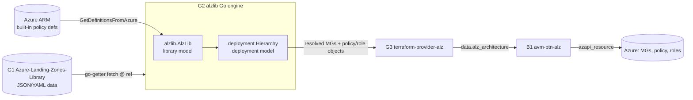
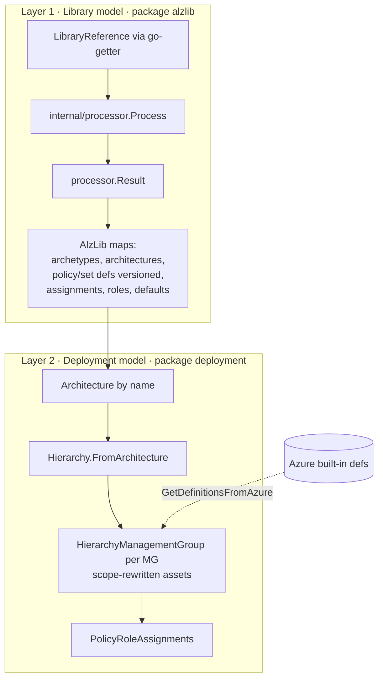
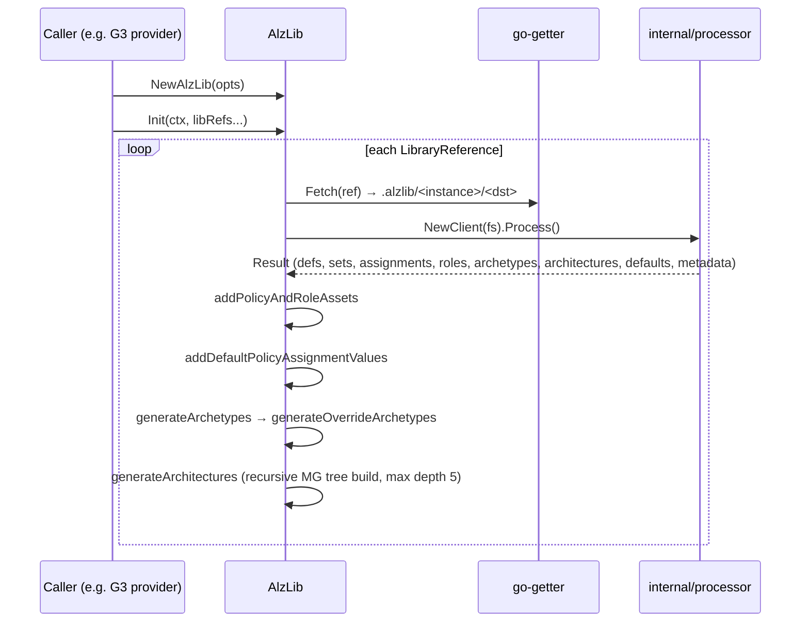
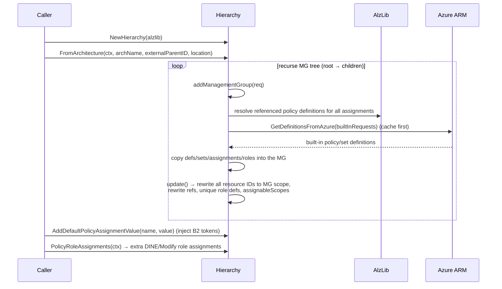

# Repository Overview: `Azure/alzlib`

| Field | Value |
|-------|-------|
| Repository | `Azure/alzlib` (catalog G2) |
| Flavor | Go library (Go 99.9%, MIT) |
| Role | **The engine** — reads the ALZ Library (G1) and builds an in-memory, deploy-ready model of management groups + policy + roles |
| Module path | `github.com/Azure/alzlib` |
| Entry types | `alzlib.AlzLib` (library model) + `deployment.Hierarchy` (deployment model) |
| Consumed by | **G3 `terraform-provider-alz`** (which B1 `avm-ptn-alz` uses); any IaC tooling (Terraform/Pulumi) |
| Reads | **G1 `Azure-Landing-Zones-Library`** via go-getter; Azure ARM (built-in policy definitions) |
| Latest | v0.31.0 (73 releases) |
| Docs | <https://pkg.go.dev/github.com/Azure/alzlib> |
| Source URL | <https://github.com/Azure/alzlib> |
| Mode | deep (remote analysis via GitHub) |
| Last reviewed | 2026-06-17 |

## Purpose

`alzlib` is the **brain between the data (G1) and the IaC (B1)**. It ingests the declarative ALZ
Library (archetypes, architectures, policy/role assets, policy default values) and turns it into a
fully-resolved, scope-correct, in-memory object graph that a provider can hand to Terraform/Pulumi.

From the README, its core value (the "Why?") is **correctness at scale**:

- **Assignability** — guarantees a policy assignment's referenced definition is built-in or in-scope
  (this management group or a parent).
- **Parameter validation** — every assignment parameter must exist in the referenced definition.
- **Correct role assignments for `Modify` / `DeployIfNotExists` policies** — reads the policy
  definition's `roleDefinitionIds`, assigns roles at the assignment scope, and for any parameter with
  `assignPermissions: true` metadata, also at the resource named by that parameter value (least
  privilege; auto-removed when the assignment/resource is removed).

> `doc.go`: *"Package alzlib provides the data structures needed to deploy Azure Landing Zones. It takes
> in fs.FS as input and returns a map of resources … It is up to the caller to transform this data into
> the required format for deployment."* — i.e. alzlib resolves the model; **G3** renders it to Terraform.

## Where it sits in the chain

## Package map

| Package | Responsibility |
|---------|----------------|
| `alzlib` (root) | The **library model**: `AlzLib` holds name-keyed maps of archetypes, architectures, policy assignments, (versioned) policy/set definitions, role definitions, default policy values, metadata. Also fetches **built-in** policy defs from Azure. |
| `assets` | Azure-SDK-typed (`armpolicy`) wrappers with validation + **version** support: `PolicyAssignment`, `PolicyDefinition`(+`PolicyDefinitionVersions`), `PolicySetDefinition`(+`Versions`), `RoleDefinition`; plus `semver.go`, `resourceId.go`. |
| `deployment` | The **deployment model**: `Hierarchy` + `HierarchyManagementGroup` — copies archetype assets per MG, rewrites every resource ID to the MG scope, computes the extra policy role assignments, and can write the hierarchy out (`writer_fs.go`). |
| `cache` | A lazy-load cache of built-in policy/set definitions so repeated runs can skip Azure API calls. |
| `cmd/alzlibtool` | CLI exposing alzlib features — `cache create`, library checks, document generation (the tool that regenerates G1's auto-generated READMEs). `go install github.com/Azure/alzlib/cmd/alzlibtool@latest`. |
| `internal/processor` | Reads raw library files (json/yaml) into a `Result` (`LibArchetypes`, `LibArchetypeOverrides`, `LibArchitectures`, `PolicyDefinitions`, `PolicySetDefinitions`, `PolicyAssignments`, `RoleDefinitions`, `LibDefaultPolicyValues`, `Metadata`). |
| `internal/environment` | Env-var helpers (`ALZLIB_DIR`, `ALZLIB_LIBRARY_GIT_URL`). |
| `to` | Pointer helpers (`to.Ptr`). |

## The two-layer model

- **Layer 1 (`alzlib`)** = *what the library says* — name-keyed catalogs, archetypes (sets of names),
  architectures (MG trees). Nothing is scoped to a real management group yet.
- **Layer 2 (`deployment`)** = *what to actually deploy* — an MG hierarchy where every policy/role asset
  has been copied, **re-IDed to its management-group scope**, cross-references rewritten, role
  definitions made unique, and the extra DINE/Modify role assignments computed.

## Flow 1 — Loading the library (`AlzLib.Init`)

`Init` validates as it builds: an archetype that references an unknown asset name, or an architecture MG
with an invalid `parent_id`, is a hard error. Override archetypes are resolved as set algebra on a base
(`base ∪ *_to_add \ *_to_remove`). An `empty` archetype is always ensured to exist.

## Flow 2 — Building a deployment (`deployment.Hierarchy.FromArchitecture`)

## Key types & API surface

| Type / func | Purpose |
|-------------|---------|
| `AlzLib` (`NewAlzLib(opts)`) | Root library container; all reads return **deep copies** (safe to mutate). Concurrency-guarded by `sync.RWMutex`. |
| `Options` | `Parallelism` (default 10 Azure calls), `AllowOverwrite` (default false), `UniqueRoleDefinitions` (default true). |
| `AlzLib.Init(ctx, libs...)` | The load pipeline above. |
| `FetchAzureLandingZonesLibraryMember(ctx, path, ref, dst)` | Convenience fetch of e.g. `platform/alz` @ tag → builds `git::<url>//<path>?ref=<path>/<ref>` (confirms G1's per-library tag format). |
| `LibraryReference` | Interface (`FS()`, `Fetch()`, `String()`); dependencies resolved recursively via library metadata. |
| `Archetype` | `name` + 4 `mapset.Set[string]` (PolicyDefinitions, PolicyAssignments, PolicySetDefinitions, RoleDefinitions) — **sets of asset names**, not the assets themselves. |
| `Architecture` / `ArchitectureManagementGroup` | Undeployed MG tree (id, displayName, parent, children, exists, archetypes). |
| `deployment.Hierarchy` / `HierarchyManagementGroup` | Deployed MG hierarchy with scope-resolved assets. |
| `deployment.PolicyRoleAssignment` | `{ RoleDefinitionID, Scope, AssignmentName, ManagementGroupID }` — JSON-serialized; the extra roles a DINE/Modify identity needs. |
| `GetDefinitionsFromAzure(ctx, reqs)` | Fetches built-in defs (cache → Azure) only for what isn't already loaded; also pulls definitions referenced by policy **sets**. |

## Inputs / Outputs (engine framing)

- **Inputs:** one or more `LibraryReference`s (a G1 library member @ ref, or a local `fs.FS`); optionally an
  authenticated `*armpolicy.ClientFactory` (`AddPolicyClient`) for built-in fetching; optional `BuiltInCache`.
- **Outputs:** `AlzLib` (queryable library: `Archetypes()`, `Architecture(name)`, `PolicyAssignment(name)`,
  `PolicyDefinition(name,ver)`, `PolicyDefaultValues()`, …) and `deployment.Hierarchy` (per-MG maps of
  policy assignments/definitions/set-definitions/role-definitions + `PolicyRoleAssignment`s), all
  JSON-marshalable for a provider to consume.

## Configuration (environment)

| Var | Default | Meaning |
|-----|---------|---------|
| `ALZLIB_DIR` | `.alzlib` | Local cache dir libraries are fetched into (git-ignore it). |
| `ALZLIB_LIBRARY_GIT_URL` | `github.com/Azure/Azure-Landing-Zones-Library` | Source of the library (G1). |

`alzlib.Instance` (an `atomic.Uint32`) is appended to the cache path to avoid `.alzlib` collisions when
multiple provider instances run concurrently.

## Dependencies

**Upstream:** G1 `Azure-Landing-Zones-Library` (the data); Azure SDK for Go (`armpolicy`); `hashicorp/go-getter`
(fetch), `deckarep/golang-set` (sets), `matt-FFFFFF/goarmfunctions` (evaluate ARM expressions in policy-set
params), `brunoga/deep` (deep copy). **Note:** `Azure/arm-template-parser` (G4) is **not** an alzlib
dependency — it's a C#/.NET build-time tool that generates G1 content; alzlib evaluates ARM expressions at
runtime with `goarmfunctions` instead. See [arm-template-parser/_overview.md](../arm-template-parser/_overview.md).

**Downstream:** G3 `terraform-provider-alz` wraps `AlzLib` + `Hierarchy` and exposes the `alz_architecture`
data source consumed by **B1 `avm-ptn-alz`**.

## Notes & Gotchas

- **Two layers, two structs:** don't conflate `alzlib.Architecture` (undeployed template) with
  `deployment.Hierarchy` (deployed, scope-resolved). The provider builds the first, then the second.
- **Resource IDs are rewritten at deploy-build time** to `/providers/Microsoft.Management/managementGroups/<mg>/providers/Microsoft.Authorization/...` — the library files only carry placeholder IDs (matches G1's "client must rewrite scope-specific values").
- **`UniqueRoleDefinitions=true`** renames each role def to a deterministic `uuidV5(mgID,name)` and suffixes the display name with ` (<mgID>)` to avoid tenant-wide name clashes.
- **Policy role assignments are computed separately** (`Hierarchy.PolicyRoleAssignments`) because
  system-assigned identity principal IDs aren't known until after deployment — the provider creates the
  assignments post-apply. Failures here are **soft** (returned as `PolicyRoleAssignmentErrors`) so callers
  can warn instead of halting.
- **Policy versioning** (`@version`, `PolicyDefinitionVersions`, semver) is first-class — assignments may pin `definitionVersion`; `SplitNameAndVersion`/`JoinNameAndVersion` use the `name@version` convention.
- **Built-in fetch is lazy + cached:** only definitions referenced by the assignments in the MGs being
  added are fetched, cache is checked first, and policy-set member definitions are auto-discovered.

## Open Questions

- [ ] `TODO: verify` exact `cmd/alzlibtool` subcommand names (`cache create`, library `check`, doc/`gen`) — inferred from commit history + README, not the command source.
- [x] `Azure/arm-template-parser` (G4) is **not** a direct alzlib dependency — confirmed it's a C#/.NET build-time tool that feeds G1; alzlib uses `goarmfunctions` for runtime ARM-expression evaluation. See [arm-template-parser/_overview.md](../arm-template-parser/_overview.md).
- [ ] Exact `processor.Result` field set + the `assets` validation rules — to confirm when reading G3 (which drives this end to end).
