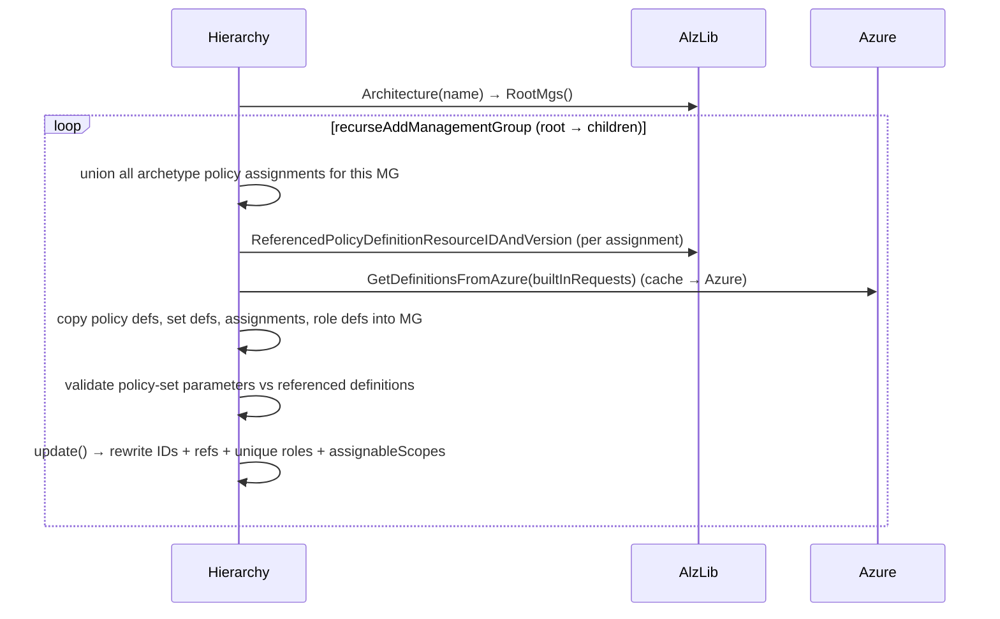

# Module: `deployment` package — the deployment model

| Field | Value |
|-------|-------|
| Repository | `Azure/alzlib` |
| Package | `deployment` |
| Entry types | `Hierarchy`, `HierarchyManagementGroup`, `PolicyRoleAssignment` |
| Source URL | <https://github.com/Azure/alzlib/blob/main/deployment/hierarchy.go> |
| Mode | deep |
| Last reviewed | 2026-06-17 |

## Purpose

Turn the abstract library model ([module-library-model.md](./module-library-model.md)) into a concrete,
**scope-resolved** management-group hierarchy ready for a provider to deploy: copy each archetype's assets
into each MG, rewrite every resource ID to that MG's scope, fix cross-references, make role definitions
unique, and compute the extra role assignments that `Modify`/`DeployIfNotExists` policies require.

## Core types

```go
type Hierarchy struct {
    mgs    map[string]*HierarchyManagementGroup
    alzlib *alzlib.AlzLib
    mu     *sync.RWMutex
}

type HierarchyManagementGroup struct {
    id, displayName, location string
    level                     int
    exists                    bool
    parent                    *HierarchyManagementGroup
    parentExternal            *string
    children                  mapset.Set[*HierarchyManagementGroup]
    policyAssignments         map[string]*assets.PolicyAssignment
    policyDefinitions         map[string]*assets.PolicyDefinition
    policySetDefinitions      map[string]*assets.PolicySetDefinition
    roleDefinitions           map[string]*assets.RoleDefinition
    policyRoleAssignments     mapset.Set[PolicyRoleAssignment]
    hierarchy                 *Hierarchy
}

type PolicyRoleAssignment struct {
    RoleDefinitionID  string `json:"role_definition_id,omitempty"`
    Scope             string `json:"scope,omitempty"`
    AssignmentName    string `json:"assignment_name,omitempty"`
    ManagementGroupID string `json:"management_group_id,omitempty"`
}
```

Each `HierarchyManagementGroup` is fully `MarshalJSON`-able (children ids, assets, role assignments) — this
is the shape a provider serializes to Terraform state / plan.

## Inputs

- An initialized **`AlzLib`** (the library model) — passed to `NewHierarchy(alzlib)`.
- An **architecture name** + **external parent MG id** + **default location** — passed to `FromArchitecture`.
- Optional per-assignment modifications (parameters, enforcement mode, identity, …) via
  `ModifyPolicyAssignment` options, and policy default values via `AddDefaultPolicyAssignmentValue`.

## Outputs

- A populated `Hierarchy` of `HierarchyManagementGroup`s with **scope-correct** policy/role objects.
- The set of `PolicyRoleAssignment`s (`Hierarchy.PolicyRoleAssignments`) the caller must create post-deploy.

## `FromArchitecture` → `addManagementGroup`



Per management group, `addManagementGroup`:

1. **Unions** policy assignments from all archetypes attached to the MG.
2. Resolves each assignment's **referenced definition** → builds `[]BuiltInRequest`.
3. `alzlib.GetDefinitionsFromAzure(...)` so every referenced built-in is present.
4. **Copies** policy definitions, set definitions, assignments, role definitions out of `AlzLib` into the MG.
5. **Validates** that policy-set parameter references match the member definitions' parameters.
6. `update()` — the scope-resolution step below.

## `update()` — scope resolution (the heart of the package)

For each MG, `update()` rewrites everything to the MG's own scope using these formats:

| Format constant | Pattern |
|-----------------|---------|
| `ManagementGroupIDFmt` | `/providers/Microsoft.Management/managementGroups/<mg>` |
| `PolicyDefinitionIDFmt` | `…/managementGroups/<mg>/providers/Microsoft.Authorization/policyDefinitions/<name>` |
| `PolicySetDefinitionIDFmt` | `…/policySetDefinitions/<name>` |
| `PolicyAssignmentIDFmt` | `…/policyAssignments/<name>` |
| `RoleDefinitionIDFmt` | `…/roleDefinitions/<name>` |

- `updatePolicyDefinitions` — set each def's ID to this MG.
- `updatePolicySetDefinitions` — set the set's ID, and **re-point each member reference**: if the member is
  custom it looks up which MG owns it (`pd2mg`) and rewrites to that MG (must be **this MG or a parent**),
  else assumes built-in.
- `updatePolicyAssignments` — set the assignment ID + `Scope`, copy the MG `location`, and re-point the
  referenced definition/set to the owning MG in the same hierarchy branch.
- `updateRoleDefinitions` — if `UniqueRoleDefinitions`, rename to `uuidV5(mgID, name)` and suffix
  `roleName` with ` (<mgID>)`; set the single `assignableScope` to this MG.

> Inheritance rule: a custom definition can only be referenced from the MG that owns it **or its
> descendants** (`HasParent`). This enforces Azure's "definition must be in-scope" requirement statically.

## Policy role assignment generation (`PolicyRoleAssignments`)

Computed **after** the hierarchy is built (and conceptually after deployment, since SA-identity principal
IDs are unknown until then). For each assignment whose identity != `None`:

- Get the referenced policy definition(s) (expanding policy **sets** to members).
- From each definition's `NormalizedRoleDefinitionResourceIDs()` (the `roleDefinitionIds`), emit a
  `PolicyRoleAssignment` scoped to the **MG**.
- For each parameter with `assignPermissions: true` whose value is a resource ID, emit an additional
  `PolicyRoleAssignment` scoped to **that resource** (least privilege). For policy sets, the parameter
  value may be an **ARM expression**, evaluated with `goarmfunctions` against the set+assignment parameters.

Errors are collected as a **soft** `PolicyRoleAssignmentErrors` so the caller (provider) can warn rather
than fail the whole plan.

## `AddDefaultPolicyAssignmentValue` — the G1↔B2 injection point

```go
func (h *Hierarchy) AddDefaultPolicyAssignmentValue(ctx, defaultName string, value *armpolicy.ParameterValuesValue) error
```

Looks up the `defaultName` token (e.g. `log_analytics_workspace_id`) in the library's default values, then
for every MG and every assignment/parameter that token maps to, calls
`ModifyPolicyAssignment(assignment, WithParameters{param: value})`. **This is exactly how B2's outputs
(workspace id, DCR ids, AMA identity) get injected into ALZ policy** — the provider surfaces it to B1 as
`policy_default_values`.

## `ModifyPolicyAssignment` options (functional options)

`WithParameters`, `WithEnforcementMode`, `WithNonComplianceMessages`, `WithIdentity`,
`WithResourceSelectors`, `WithOverrides`, `WithNotScopes` — each validates against the referenced
definition (e.g. `WithParameters` rejects a parameter the definition doesn't declare; `WithNotScopes`
validates ARM resource IDs). These are the same knobs B1 exposes as `policy_assignments_to_modify`.

## Dependencies

**Upstream:** `alzlib` (library model + built-in fetch), `assets`, Azure SDK `armpolicy`, `goarmfunctions`,
`google/uuid`, `deckarep/golang-set`.
**Downstream:** G3 `terraform-provider-alz` serializes `Hierarchy` + `PolicyRoleAssignment`s into the
`alz_architecture` data source consumed by **B1 `avm-ptn-alz`**.

## Notes & Gotchas

- **`exists` MGs** are represented but not (re)created — mirrors G1's `exists: true` and B1's `locals.tf` filter.
- **External vs internal parent:** the architecture's root MG attaches to an **external** parent (the
  user-supplied root MG id); internal parents must already exist in the hierarchy.
- **Role assignments are data, not resources here:** alzlib only *describes* them; the provider creates the
  actual `azapi`/`azurerm` role assignments after identities exist.
- **Deterministic unique role names** (uuidV5) mean re-runs are stable — important for Terraform to avoid churn.

## Open Questions

- [ ] `TODO: verify` `writer_fs.go` (`Hierarchy` → filesystem writer) usage — likely for `alzlibtool` doc/export.
- [x] Exact serialization the G3 provider expects — documented: the provider's `alzMgToProviderType` JSON-encodes each MG's policy/role asset maps and emits `policy_role_assignments` 1:1 from `deployment.PolicyRoleAssignment`. See [terraform-provider-alz/module-alz-architecture-datasource.md](../terraform-provider-alz/module-alz-architecture-datasource.md).
