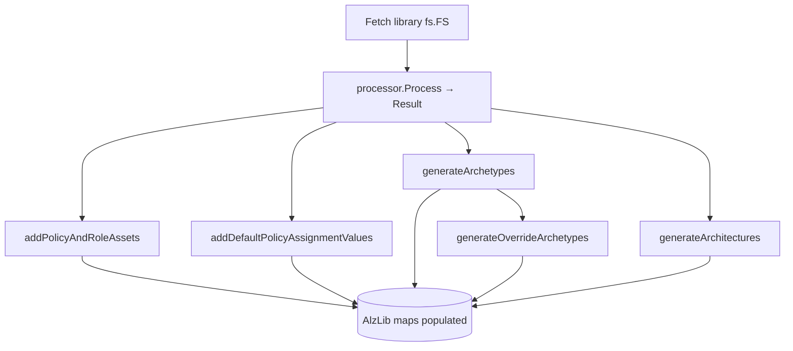

# Module: `alzlib` (root package) — the library model

| Field | Value |
|-------|-------|
| Repository | `Azure/alzlib` |
| Package | `alzlib` (root) + `assets` + `internal/processor` |
| Entry type | `AlzLib` (`alzlib.go`) |
| Source URL | <https://github.com/Azure/alzlib/blob/main/alzlib.go> |
| Mode | deep |
| Last reviewed | 2026-06-17 |

## Purpose

The in-memory **library model**: parse one or more ALZ Library members (G1) into name-keyed catalogs of
every asset, then derive archetypes and architectures from them. This is the read/validate half of
alzlib; the `deployment` package ([module-deployment-hierarchy.md](./module-deployment-hierarchy.md)) is
the resolve/scope half.

## `AlzLib` structure

```go
type AlzLib struct {
    Options                       *Options
    archetypes                    map[string]*Archetype
    architectures                 map[string]*Architecture
    policyAssignments             map[string]*assets.PolicyAssignment
    policyDefinitions             map[string]*assets.PolicyDefinitionVersions   // versioned
    policySetDefinitions          map[string]*assets.PolicySetDefinitionVersions // versioned
    roleDefinitions               map[string]*assets.RoleDefinition
    defaultPolicyAssignmentValues DefaultPolicyAssignmentValues
    metadata                      []*Metadata
    cache                         BuiltInCache
    clients                       *azureClients // armpolicy.ClientFactory
    mu                            sync.RWMutex
}
```

Everything is keyed by **name** (the library's join key) and every getter returns a **deep copy**, so
callers can freely mutate results without corrupting the shared library.

### Options (defaults)

| Option | Default | Effect |
|--------|---------|--------|
| `Parallelism` | `10` | Max concurrent Azure API calls when fetching built-ins. |
| `AllowOverwrite` | `false` | Whether a later library may overwrite an existing asset/archetype name. |
| `UniqueRoleDefinitions` | `true` | Make role-definition names unique per MG at deploy time. |

## Inputs

- **`LibraryReference`s** passed to `Init(ctx, libs...)`. Each is either already backed by an `fs.FS`, or is
  fetched on demand (go-getter) — see [_overview.md](./_overview.md) and `initialize.go`.
- Optional **`*armpolicy.ClientFactory`** via `AddPolicyClient` (needed to fetch built-in definitions).
- Optional **`BuiltInCache`** via `AddCache` (skip Azure calls entirely if the cache is complete).

## Outputs (query API)

| Method | Returns |
|--------|---------|
| `Archetypes()` / `Archetype(name)` | archetype names / a copy of one archetype |
| `Architectures()` / `Architecture(name)` | architecture names / the architecture (MG tree) |
| `PolicyAssignments()` / `PolicyAssignment(name)` | names / deep copy |
| `PolicyDefinitions()` / `PolicyDefinition(name, version)` | names / deep copy of a version |
| `PolicySetDefinitions()` / `PolicySetDefinition(name, version)` | names / deep copy |
| `RoleDefinitions()` / `RoleDefinition(name)` | names / deep copy |
| `PolicyDefaultValues()` / `PolicyDefaultValue(name)` | the `defaultName` tokens (the G1↔B2 link) |
| `*Exists(name[, version])` | membership checks |
| `SetAssignPermissionsOnDefinitionParameter(def, param)` / `Unset…` | toggle the `assignPermissions` metadata (fix mis-authored policies — same lever B1 exposes) |

## The `Init` pipeline (per library)

From `alzlib.go`:

1. `ref.Fetch(ctx, hash(ref))` if the ref isn't already an `fs.FS`.
2. `processor.NewClient(ref.FS()).Process(res)` → a `processor.Result`.
3. `addPolicyAndRoleAssets(res)` — merge policy defs/sets (version-aware `Upsert`), assignments, roles.
4. `addDefaultPolicyAssignmentValues(res)` — register the `defaultName` → (assignment, params) map;
   rejects duplicate assignment/parameter combos.
5. `generateArchetypes(res)` — build `Archetype`s, **validating** every referenced asset name exists
   (ensures an `empty` archetype too).
6. `generateOverrideArchetypes(res)` — `new = base ∪ *_to_add \ *_to_remove` (set algebra on the base archetype).
7. `generateArchitectures(res)` — build the MG tree recursively (`architectureRecursion`, **max depth 5**),
   validating each MG's `parent_id` and the `exists` rule (can't place an existing child under a
   to-be-created parent).



## `assets` package (typed, versioned, validated)

Thin wrappers over the Azure SDK `armpolicy` types that add validation + version handling:

| Type | Notes |
|------|-------|
| `PolicyAssignment` | `IdentityType()`, `ReferencedPolicyDefinitionResourceIDAndVersion()`, `ParameterValueAsString()`. |
| `PolicyDefinition` / `PolicyDefinitionVersions` | `NormalizedRoleDefinitionResourceIDs()` (the `roleDefinitionIds`), `AssignPermissionsParameterNames()`, `ParameterIsOptional()`, `Parameter()`. Version collection keyed by semver. |
| `PolicySetDefinition` / `…Versions` | `PolicyDefinitionReferences()` (member defs + their params). |
| `RoleDefinition` | name/properties/assignableScopes rewritten at deploy time. |
| `semver.go` / `resourceId.go` | version constraint matching; ARM resource-ID parsing. |

## Built-in policy fetching (`GetDefinitionsFromAzure`)

The library ships **custom** assets; **built-in** definitions referenced by assignments are pulled from
Azure on demand:

- Only fetches what isn't already loaded (keyed by the resource-ID last segment).
- For a policy **set**, inspects it and fetches any referenced built-in definitions that are missing.
- **Cache first** (`BuiltInCache`), then Azure (`armpolicy` versioned or latest client).
- `Parallelism` bounds concurrency.

This is why `alzlib` needs an authenticated policy client (or a complete cache) even though the bulk of
the model comes from the static library.

## Dependencies

**Upstream:** `internal/processor` (file parsing), `assets` (typed model), Azure SDK `armpolicy`, go-getter.
**Downstream:** `deployment` package (consumes the populated `AlzLib`).

## Notes & Gotchas

- **Versioned maps:** `policyDefinitions`/`policySetDefinitions` map a name → a *version collection*, not a
  single object. Always resolve with a `version *string` (nil = latest).
- **Validation is eager:** archetype/architecture generation fails fast on dangling names or bad parents —
  a good place to catch library-authoring mistakes.
- **`ExportBuiltInCache()`** lets a caller persist just the built-ins their library actually references
  (smaller than caching all of Azure's built-ins via `alzlibtool cache create`).

## Open Questions

- [ ] `TODO: verify` the full `processor.Result` field list + `assets` validation specifics (read alongside G3).
