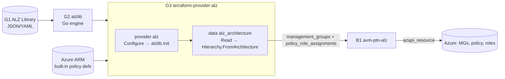
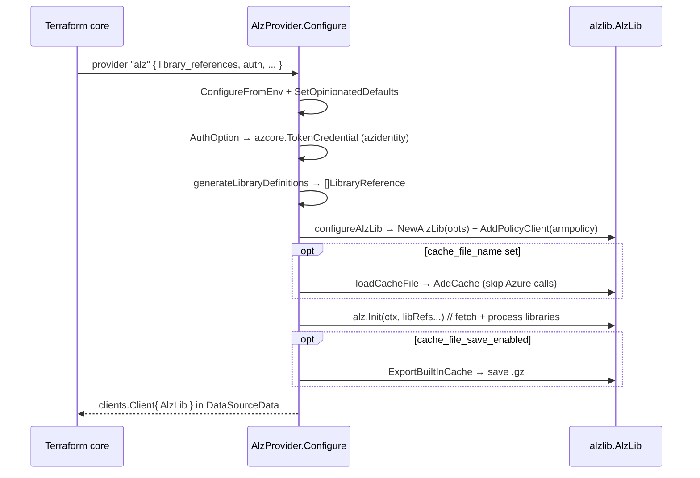

# Repository Overview: `Azure/terraform-provider-alz`

| Field | Value |
|-------|-------|
| Repository | `Azure/terraform-provider-alz` (catalog G3) |
| Flavor | Go — Terraform provider (Terraform Plugin Framework) |
| Registry | `azure/alz` — <https://registry.terraform.io/providers/Azure/alz/latest> |
| Role | The **`alz` provider** — a **data-source-only** provider that wraps `alzlib` (G2) and exposes the resolved ALZ model to Terraform |
| Data sources | `alz_architecture`, `alz_metadata` (no resources, no functions) |
| Consumes | **G2 `alzlib`** (which reads **G1 `Azure-Landing-Zones-Library`**) + Azure ARM (built-in policy) |
| Consumed by | **B1 `avm-ptn-alz`** (the `module.management_groups` call) → renders to `azapi_resource` |
| Latest | v0.21.0 (48 releases); still v0.x — pin on minor |
| Source URL | <https://github.com/Azure/terraform-provider-alz> |
| Mode | deep (remote analysis via GitHub) |
| Last reviewed | 2026-06-17 |

## Purpose

`terraform-provider-alz` is the **Terraform surface of the ALZ engine**. It runs `alzlib` (G2) inside a
provider so that Terraform can read a fully-resolved management-group hierarchy — with policy
definitions/sets/assignments, role definitions, and the extra policy role assignments — as plain **data**,
then deploy it with the **AzAPI** provider.

From the README/docs (verbatim intent): *"The ALZ Terraform Provider is primarily a **data source
provider** for Azure Landing Zones … It simplifies the task of creating Azure Management Group
hierarchies, together with Azure Policy and authorization."* It is **designed to be consumed from inside
the ALZ Terraform module (B1)**, not directly.

- **Input:** a list of ALZ Library references (`platform/alz` @ ref, and/or local `custom_url`).
- **Output:** the `alz_architecture` data source — management groups (per level) carrying JSON-encoded
  policy/role assets + a set of `policy_role_assignments`.
- **No resources:** it never calls ARM to *create* anything; B1 turns the data into `azapi_resource`s.

## Where it sits in the chain



## Repository structure

```text
terraform-provider-alz/
├── main.go                     # provider entrypoint (plugin server)
├── internal/
│   ├── provider/               # provider.go — AlzProvider: Schema, Configure, DataSources
│   │   └── provider.go         # configureAlzLib, generateLibraryDefinitions, loadCacheFile
│   ├── services/               # the data sources
│   │   ├── architecture_data_source.go   # alz_architecture (the important one)
│   │   └── metadata_data_source.go       # alz_metadata
│   ├── clients/                # clients.Client (holds *alzlib.AlzLib)
│   ├── gen/                    # generated schema/model types (tfplugingen)
│   └── typehelper/             # alzlib → framework type conversion (JSON encoding)
├── docs/                       # generated provider docs (index.md, data-sources/*)
├── examples/                   # provider + data-source usage examples
├── templates/                  # tfplugindocs templates
└── tools/ + GNUmakefile        # codegen + build
```

> Languages: Go 96%, Go Template 3.5% (the generated docs). Built on the **Terraform Plugin Framework**
> and code-generated types (`internal/gen`).

## Provider lifecycle (`Configure`)



- The configured `*alzlib.AlzLib` is stored once on `clients.Client` and shared by the data sources
  (`p.data != nil` short-circuits re-configuration — supporting multiple aliased provider instances).
- `configureAlzLib` maps provider options → `alzlib.Options`:
  `AllowOverwrite = library_overwrite_enabled`, `Parallelism = 10`,
  `UniqueRoleDefinitions = !role_definitions_use_supplied_names_enabled`.

## Provider schema (`provider "alz" { ... }`)

| Attribute | Req? | Meaning |
|-----------|------|---------|
| `library_references` | **required** | List of `{ path, ref }` (e.g. `platform/alz` @ `2024.07.5`) and/or `{ custom_url }` (go-getter, sensitive). The libraries alzlib loads. |
| `library_fetch_dependencies` | optional (true) | Recursively download dependent libraries via each library's `alz_library_metadata.json`. |
| `library_overwrite_enabled` | optional (false) | Allow later libraries to overwrite earlier assets. |
| `role_definitions_use_supplied_names_enabled` | optional (false) | Keep library role-definition names instead of unique-per-MG uuidV5 names. |
| `cache_file_name` / `cache_file_save_enabled` | optional | Load/save a gzipped built-in policy-definition cache (created with `alzlibtool cache create`) to skip Azure API calls. |
| `non_compliance_message_substitution_settings` | optional | Global placeholder substitution for non-compliance messages. |
| auth: `environment`, `tenant_id`, `client_id`, `subscription_id`, `oidc_*`, `endpoint`, `skip_provider_registration`, … | optional | Standard Azure auth (params → env vars), incl. sovereign clouds + custom endpoints. |

## Data sources

| Data source | Purpose |
|-------------|---------|
| **`alz_architecture`** | The core. Resolves an architecture into the management-group hierarchy + policy/role data. See [module-alz-architecture-datasource.md](./module-alz-architecture-datasource.md). |
| `alz_metadata` | Returns `alz_library_references` — the list of loaded ALZ Library refs (handy for surfacing which library versions are in play). |

## Dependencies

**Upstream:** `github.com/Azure/alzlib` (G2 — `alzlib`, `assets`, `deployment`), Azure SDK `armpolicy` +
`azidentity`, HashiCorp `terraform-plugin-framework`, go-getter (via alzlib).
**Downstream:** **B1 `avm-ptn-alz`** declares `provider "alz"` and reads `data.alz_architecture`; the AVM
module then feeds the data to the AzAPI provider. (See [avm-ptn-alz/_overview.md](../avm-ptn-alz/_overview.md).)

## Notes & Gotchas

- **Data-source-only:** `Resources()` returns empty; `Functions()` returns empty. All creation is delegated
  to AzAPI in B1. This keeps the provider side-effect-free and fast.
- **Designed for the module, not direct use** — the docs explicitly steer you to consume it via B1.
- **`.alzlib` must be git-ignored** — the provider downloads the library into it at plan time.
- **Multi-provider support:** aliased `provider "alz"` instances each get their own AlzLib (used to deploy
  multiple architectures / sovereign variants in one config).
- **Cache file** is the bridge to fast/offline runs — created by `alzlibtool` (G2) and consumed here.
- **Everything that's an Azure resource is returned as a JSON string** (policy assignments/definitions/sets/
  roles), because Terraform's type system can't express arbitrary ARM objects — B1 `jsondecode`s them.

## Open Questions

- [ ] `TODO: verify` exact `non_compliance_message_substitution_settings` semantics (enforcement-mode placeholder substitution) — only its role captured.
- [ ] `TODO: verify` the `endpoint` custom-cloud block fields — relevant only for air-gapped/sovereign clouds.
