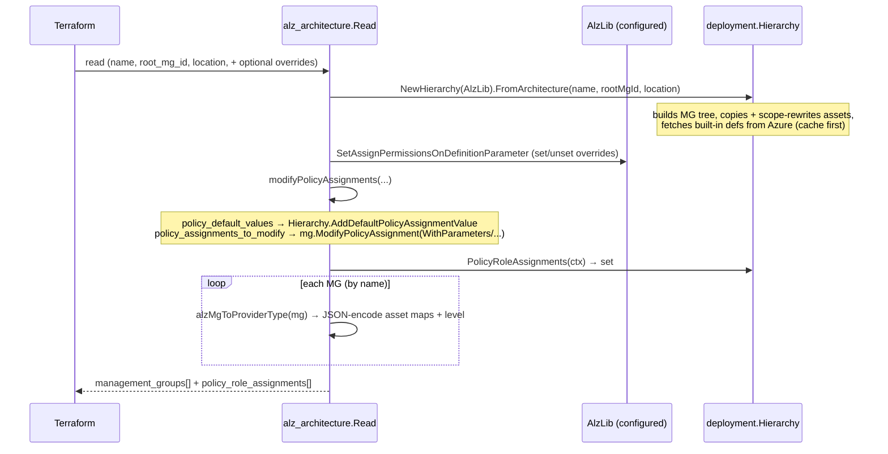

# Data Source: `alz_architecture`

| Field | Value |
|-------|-------|
| Repository | `Azure/terraform-provider-alz` |
| Source | `internal/services/architecture_data_source.go` |
| Type name | `alz_architecture` |
| Docs | <https://github.com/Azure/terraform-provider-alz/blob/main/docs/data-sources/architecture.md> |
| Mode | deep |
| Last reviewed | 2026-06-17 |

## Purpose

The one data source that matters: given an **architecture name** + **root management group id** +
**location**, it uses `alzlib`'s `deployment.Hierarchy` to resolve the whole management-group tree into
deploy-ready data — management groups (per level), each carrying JSON-encoded policy assignments,
definitions, set definitions, and role definitions, plus a flat set of **policy role assignments** to
create post-deploy. This is the exact contract **B1 `avm-ptn-alz`** flattens into `azapi_resource`s.

## Inputs

### Required

| Input | Type | Meaning |
|-------|------|---------|
| `name` | string | The architecture to deploy (e.g. `alz`) — resolved from the loaded library's `*.alz_architecture_definition.*`. |
| `root_management_group_id` | string | The external parent MG id under which to deploy (usually the tenant id). |
| `location` | string | Default Azure region for artifacts (policy assignment location, etc.). |

### Optional

| Input | Type | Meaning |
|-------|------|---------|
| `policy_default_values` | map(string) | `{ defaultName = jsonencode({ value = ... }) }` — fills the G1 `defaultName` tokens across all matching assignments (the **B2→policy** injection). |
| `policy_assignments_to_modify` | nested map | Per-MG, per-assignment overrides: `parameters`, `enforcement_mode`, `identity`/`identity_ids`, `non_compliance_messages`, `overrides`, `resource_selectors`, `not_scopes`. |
| `override_policy_definition_parameter_assign_permissions_set` | set | Force `assignPermissions = true` on a `(definition, parameter)` — fixes mis-authored policies so role assignments are generated. |
| `override_policy_definition_parameter_assign_permissions_unset` | set | Force it **off** (e.g. for disabled policies in a set). |
| `default_non_compliance_message_settings` | object | Apply a default non-compliance message to assignments. |
| `timeouts.read` | string | Read timeout (default 10m). |

### Nested: `policy_assignments_to_modify.<mg>.policy_assignments.<name>`

`parameters` (map of `jsonencode({ value = ... })`), `enforcement_mode` (`Default`/`DoNotEnforce`),
`identity` (`SystemAssigned`/`UserAssigned`), `identity_ids` (set; **must not be computed**),
`non_compliance_messages`, `overrides`, `resource_selectors` (kind = `resourceLocation`/`resourceType`/
`resourceWithoutLocation`, `in`/`not_in`), `not_scopes` (ARM resource IDs).

## Outputs (Read-Only)

| Output | Type | Meaning |
|--------|------|---------|
| `id` | string | Computed (the architecture name). |
| `management_groups` | list(object) | The hierarchy as a **flat list** — each item has `level` so B1 can deploy tier by tier. |
| `policy_role_assignments` | set(object) | The extra role assignments DINE/Modify policies need (principal unknown until deploy). |

### Nested: `management_groups[*]`

`id`, `parent_id`, `display_name`, `exists`, `level` (number), and four **maps of JSON strings**:
`policy_assignments`, `policy_definitions`, `policy_set_definitions`, `role_definitions`. Consumers
`jsondecode(...)` each value into an ARM object.

### Nested: `policy_role_assignments[*]`

`management_group_id`, `policy_assignment_name`, `role_definition_id`, `scope` — maps 1:1 to alzlib's
`deployment.PolicyRoleAssignment`.

## Read flow



Step by step (`architecture_data_source.go`):

1. **Build the hierarchy** — `deployment.NewHierarchy(d.data.AlzLib).FromArchitecture(name, rootMgId, location)`.
   alzlib does the heavy lifting: MG tree, asset copy, scope-ID rewriting, built-in fetch (cache → Azure).
2. **assignPermissions overrides** — apply `…_set` / `…_unset` via `SetAssignPermissionsOnDefinitionParameter`
   on the AlzLib (so role-assignment generation is correct).
3. **`modifyPolicyAssignments`** — apply `policy_default_values` (→ `Hierarchy.AddDefaultPolicyAssignmentValue`)
   and `policy_assignments_to_modify` (→ `mg.ModifyPolicyAssignment` with the functional options).
4. **`PolicyRoleAssignments(ctx)`** — collect the extra role assignments (soft errors surfaced as warnings).
5. **Serialize** — for each MG, `alzMgToProviderType` converts the alzlib maps to framework types via
   `typehelper.ConvertAlzMapToFrameworkType` (which **JSON-encodes** each asset), tagging `id`, `parent_id`,
   `display_name`, `exists`, `level`.

## Example (from docs)

```hcl
data "azapi_client_config" "example" {}

data "alz_architecture" "example" {
  name                     = "alz"
  root_management_group_id = data.azapi_client_config.example.tenant_id
  location                 = "swedencentral"

  policy_default_values = {
    log_analytics_workspace_id = jsonencode({ value = local.law_id })   # from B2
  }
  policy_assignments_to_modify = {
    alzroot = {
      policy_assignments = {
        mypolicy = { parameters = { p = jsonencode({ value = local.foo_resource_id }) } }
      }
    }
  }
}
```

> **Unknown-values caveat** (docs): `identity_ids` and parameter values that are resource IDs should be
> **constructed literally** (e.g. with `provider::azapi::resource_group_resource_id(...)`), not passed as
> computed values — the data source resolves at plan time and can't depend on apply-time-unknown ids.

## Dependencies

**Upstream:** `alzlib` `deployment.Hierarchy` + `AlzLib` (configured by the provider), Azure ARM (built-in
defs). **Downstream:** B1 `avm-ptn-alz` `locals.tf` flattens `management_groups` by `level` into
`azapi_resource` for_each loops and creates the `policy_role_assignments` after identities exist.

## Notes & Gotchas

- **Flat list + `level`**, not a nested tree — deliberately, so the consumer can `for_each` per tier and
  respect MG creation order. (This is exactly the `management_groups_level_0..6` pattern documented in B1.)
- **Assets are opaque JSON strings** — the provider doesn't model ARM schema; it hands through whatever
  alzlib produced (already scope-rewritten).
- **`policy_role_assignments` are data, not resources** — emitted because system-assigned identity principal
  ids aren't known until after the MGs/assignments deploy; B1 creates them in a later step.
- **The three override knobs** (`policy_default_values`, `policy_assignments_to_modify`, assignPermissions
  set/unset) are the provider's surface over alzlib's `AddDefaultPolicyAssignmentValue` /
  `ModifyPolicyAssignment` / `Set(Unset)AssignPermissionsOnDefinitionParameter` — same levers B1 re-exposes.

## Open Questions

- [ ] `TODO: verify` precise `default_non_compliance_message_settings` placeholder behavior (interaction with `non_compliance_message_substitution_settings` at provider level).
