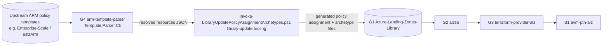

# Repository Overview: `Azure/arm-template-parser`

| Field | Value |
|-------|-------|
| Repository | `Azure/arm-template-parser` (catalog G4) |
| Flavor | **C# / .NET 7** (catalog says "Go" — **incorrect**, see Gotchas) |
| Role | Offline **ARM template processor** — fills parameters, evaluates ARM template-language functions, and emits the resolved `resources` array as JSON |
| Primary use | **Library authoring/build tooling**: extract `policyAssignments` from upstream ARM templates so they can be converted into the ALZ Library (G1) / other-IaC formats (Terraform/Bicep) |
| Core lib | `Template.Parser.Core` (class `ArmTemplateProcessor`) |
| CLI | `Template.Parser.Cli` (`template-parser/Program.cs`) — Linux + Windows binaries on Releases |
| Built on | `Azure.Deployments.Core` / `.Expression` / `.Templates` 1.34.0 (the **real ARM engine**) + Newtonsoft.Json |
| Latest | 0.2.5 (Jun 2025); 6 releases |
| Source URL | <https://github.com/Azure/arm-template-parser> |
| Mode | deep (remote analysis via GitHub) |
| Last reviewed | 2026-06-17 |

## Purpose

A standalone tool that **parses ARM templates offline the same way Azure would** — it references the
actual Azure Deployments engine NuGet packages, fills in any missing parameters with placeholders,
evaluates the ARM template language (functions, variables, copy loops, nested resources, outputs), and
returns the fully-expanded `resources` array as JSON.

From the README (verbatim intent): *"a tool that leverages Microsoft libraries to parse ARM templates
offline … Specifically for **copying policy assignments from upstream modules to modules written in other
IaC languages, such as Terraform and Bicep**."*

- **Input:** an ARM template (`*.json`) + optional parameters (file or `key=value`) + optional location.
- **Output:** JSON — either the first resource or all resources (`-a`).
- **Why it exists:** ALZ governance content originates as upstream **ARM** policy templates. To publish those
  policy assignments into the **ALZ Library** (G1, consumed by the Terraform toolchain), the upstream ARM
  must be *evaluated* (parameters/functions resolved) into concrete resource JSON. This tool does that
  evaluation step.

## Where it sits in the chain (corrected)



> **This is a build-time / authoring tool that feeds G1 — it is *upstream* of the runtime chain, not part
> of it.** It is **not** imported by alzlib (G2): alzlib is Go and evaluates ARM expressions at runtime
> with `goarmfunctions`, not this C# library. See Gotchas.

## Repository structure

```text
arm-template-parser/
├── Template.Parser.Core/              # the library
│   ├── ArmTemplateProcessor.cs        # ★ the processor (parse → validate → evaluate → expand)
│   ├── PlaceholderInputGenerator.cs   # synthesizes missing parameters + deployment metadata
│   ├── JTokenExtensions.cs            # Newtonsoft JToken helpers (case-insensitive access)
│   └── Template.Parser.Core.csproj    # net7.0; Azure.Deployments.* 1.34.0
├── template-parser/                   # the CLI
│   ├── Program.cs                     # System.CommandLine entrypoint → ArmTemplateProcessor
│   └── Template.Parser.Cli.csproj
├── Template.Parser.UnitTests/         # core tests
├── Template.Parser.Cli.UnitTests/     # CLI tests
└── template-parser.sln
```

> Languages: **C# 100%**. Origin: migrated from `jaredfholgate/template-parser`.

## CLI parameters (`Template.Parser.Cli`)

| Flag | Alias | Meaning |
|------|-------|---------|
| `--sourceTemplate` | `-s` | **Required.** Path to the source ARM template JSON. |
| `--parameter` | `-p` | A `key=value` pair (repeatable). Supports typed values via `[[[Int64]]]`, `[[[Array]]]a,b,c`. |
| `--parameterFilePath` | `-f` | Path to an ARM parameters file. |
| `--location` | `-l` | Default location (e.g. `uksouth`); defaults to `${default_location}` if omitted. |
| `--all` | `-a` | Return **all** resources; default returns just the first. |

Output is the resolved `resources` token serialized to stdout (indented JSON).

## Dependencies

**Upstream (build):** the Azure Deployments engine packages — `Azure.Deployments.Core`,
`Azure.Deployments.Expression`, `Azure.Deployments.Templates` (1.34.0) + `Microsoft.Extensions.Logging.Abstractions`
+ Newtonsoft.Json. These are the libraries the real ARM service uses, which is why offline evaluation
matches Azure behavior.

**Downstream (consumers):** the **`Invoke-LibraryUpdatePolicyAssignmentArchetypes.ps1`** script that
downloads the released binary and runs it — present in the **ALZ Library** `platform/alz/scripts/` (G1) and
historically in **caf-enterprise-scale** (D1). (The script also appears as a copy in alzlib's
`integrationtest/testdata/.../scripts/`, i.e. test fixtures, not runtime code.)

## Notes & Gotchas

- **Catalog correction #1 — language:** this repo is **C# / .NET 7**, *not* Go. `alz-repos.md` (G4) lists it
  as a "Go library"; that is inaccurate.
- **Catalog correction #2 — consumer:** `alz-repos.md` says it is *"被 alzlib 用于展开 policy 内嵌的 ARM/模板"*
  (used by alzlib to expand embedded ARM). That is **not** how it's wired. alzlib (Go) can't import a C#
  library; alzlib evaluates ARM expressions with `goarmfunctions`. The real consumer is the **PowerShell
  library-update tooling** that regenerates G1's policy-assignment files from upstream ARM. This tool is
  therefore **build-time/authoring**, upstream of G1.
- **Uses the genuine ARM engine** — function evaluation, copy loops, nested `Microsoft.Resources/deployments`,
  and outputs are processed by `Azure.Deployments.Templates`/`.Expression`, so results match Azure.
- **Graceful degradation** — most expression-evaluation errors are logged as warnings (not fatal); only
  "incorrect segment lengths" rethrows. Unparseable outputs become `"NOT_PARSED"`.
- **Placeholders** — when parameters/metadata aren't supplied, `PlaceholderInputGenerator` fabricates them so
  any template can be expanded without a real deployment context.
- **Small + stable** — 4★, 6 releases, last substantive change ~1 year ago; a focused utility, not a platform.

## Open Questions

- [ ] `TODO: verify` the exact contents of `PlaceholderInputGenerator.GeneratePlaceholderParameters` (how it
  types each placeholder) — only its role is captured.
- [ ] `TODO: verify` whether current ALZ Library generation still invokes this binary or has moved to a Go
  equivalent — confirmed present as of the `alzlib-2025-09-0` test fixture; the canonical script lives in G1.
