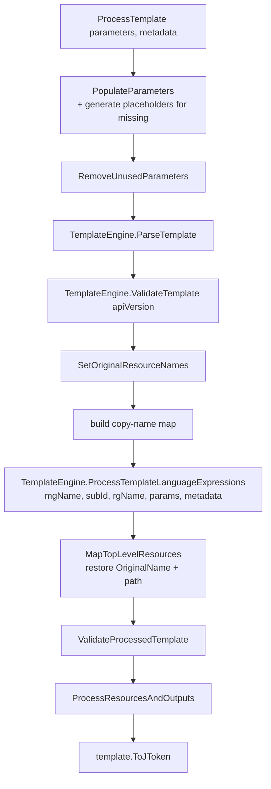
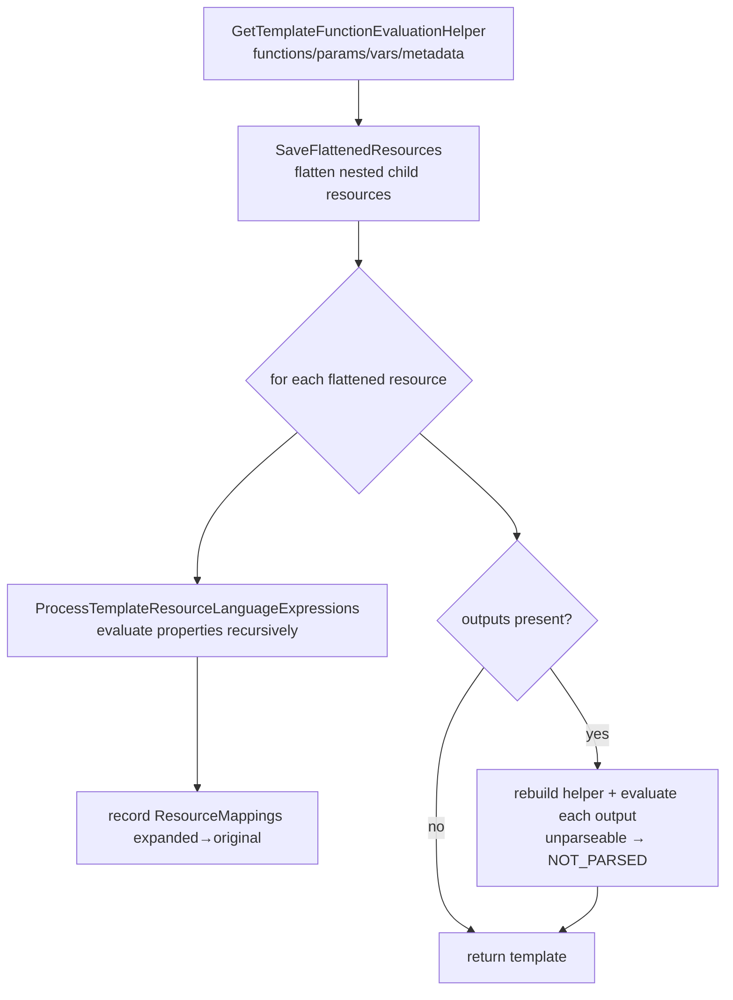

# Module: `ArmTemplateProcessor` (Template.Parser.Core)

| Field | Value |
|-------|-------|
| Repository | `Azure/arm-template-parser` |
| Source | `Template.Parser.Core/ArmTemplateProcessor.cs` |
| Type | `public class ArmTemplateProcessor` (net7.0) |
| Source URL | <https://github.com/Azure/arm-template-parser/blob/main/Template.Parser.Core/ArmTemplateProcessor.cs> |
| Mode | deep |
| Last reviewed | 2026-06-17 |

## Purpose

The engine class. Given an ARM template (and optional parameters/metadata), it runs the **real Azure
Deployments template engine** offline to produce a fully-resolved template — all parameters substituted,
all template-language expressions evaluated, nested resources flattened, outputs computed — returned as a
Newtonsoft `JToken`. The CLI ([_overview.md](./_overview.md)) is a thin wrapper over it.

## Public API

```csharp
// Construct
public ArmTemplateProcessor(string armTemplate,
                            string apiVersion = "2020-01-01",
                            ILogger? logger = null);

// Process (overloads)
public JToken ProcessTemplate();                                  // placeholder params + metadata
public JToken ProcessTemplate(string parameters);                 // params JSON + placeholder metadata
public JToken ProcessTemplate(string parameters, string metadata);// params + metadata JSON
public JToken ProcessTemplate(string parameters,
                              InsensitiveDictionary<JToken> metadataDictionary);

// Public field
public Dictionary<string,string> ResourceMappings;                // expanded-path → original-path (line mapping)
```

### Inputs

| Input | Type | Meaning |
|-------|------|---------|
| `armTemplate` | string | ARM template JSON (schema `2019-04-01/deploymentTemplate.json#`). |
| `apiVersion` | string | Deployment API version used for validation (default `2020-01-01`). |
| `logger` | ILogger? | Optional; receives warnings/debug for non-fatal evaluation issues. |
| `parameters` | string | ARM parameters JSON (`2015-01-01/deploymentParameters.json#`). Optional. |
| `metadata` | string / dict | Deployment metadata (subscription/managementGroup/resourceGroup). Optional → placeholder. |

### Output

- A `JToken` of the **processed template**; callers typically read `result.SelectToken("resources")`.
- `ResourceMappings` — maps each expanded resource path back to its original template path (so tooling can
  report line numbers despite copy-loop reordering).

## Processing pipeline (`ProcessTemplate` → `ParseAndValidateTemplate`)



Then `ProcessResourcesAndOutputs`:



### Key steps explained

1. **Parameter handling** — `PopulateParameters` reads supplied params; `PlaceholderInputGenerator`
   synthesizes any missing ones (and `RemoveUnusedParameters` drops params the template doesn't declare).
   A `reference`-based parameter becomes a sentinel `REF_NOT_AVAIL_<name>` (can't resolve key-vault refs offline).
2. **Parse + validate** — `TemplateEngine.ParseTemplate` / `ValidateTemplate` (from `Azure.Deployments.Templates`).
3. **Evaluate expressions** — `ProcessTemplateLanguageExpressions` resolves ARM functions using the
   parameters + deployment metadata (management group / subscription / resource group names).
4. **Copy loops** — copied resources are tracked via a copy-name map so `OriginalName`/order/path can be
   restored after expansion (`MapTopLevelResources`).
5. **Flatten + per-resource eval** — `SaveFlattenedResources` recursively flattens child resources;
   `ProcessTemplateResourceLanguageExpressions` evaluates each resource's `properties` with a
   `TemplateExpressionEvaluationHelper`.
6. **Outputs** — evaluated recursively; failures degrade to `"NOT_PARSED"` rather than throwing.

### Error handling

- Most evaluation exceptions are **logged as warnings** and processing continues (best-effort offline parse).
- The single hard-fail case is an exception whose message contains `"incorrect segment lengths"` (it rethrows,
  because subsequent processing would be corrupt).

## Helper types

| File | Responsibility |
|------|----------------|
| `PlaceholderInputGenerator.cs` | `GeneratePlaceholderParameters(template)` and `GeneratePlaceholderDeploymentMetadata([location])` — fabricate inputs so any template can be expanded without a live deployment. |
| `JTokenExtensions.cs` | Newtonsoft helpers (e.g. `InsensitiveToken`) for case-insensitive JSON access. |

## Resources Created

**None.** This is a parser/evaluator — it never calls Azure or creates resources. Its "output" is JSON
describing the resources an ARM deployment *would* create.

## Dependencies

**Upstream:** `Azure.Deployments.Core` / `.Expression` / `.Templates` 1.34.0 (the real ARM engine),
`Microsoft.Extensions.Logging.Abstractions`, Newtonsoft.Json. **Downstream:** `Template.Parser.Cli` and,
through it, the ALZ Library update scripts (see [_overview.md](./_overview.md)).

## Notes & Gotchas

- **Offline ≈ Azure** — because it uses the production deployment engine packages, evaluated output closely
  matches what ARM would compute, including most built-in functions.
- **Can't resolve runtime-only inputs** — `reference()` parameters and Key Vault references aren't available
  offline (become `REF_NOT_AVAIL_*`); nested `Microsoft.Resources/deployments` template bodies are processed
  but there's a note about optionally skipping them to avoid false-positive warnings.
- **Designed for policy extraction** — the practical output of interest is the
  `Microsoft.Authorization/policyAssignments` (and definitions) resources, which the ALZ Library tooling then
  reshapes into library assets.

## Open Questions

- [ ] `TODO: verify` `PlaceholderInputGenerator.GeneratePlaceholderParameters` typing rules (how each ARM
  parameter type gets a placeholder value).
