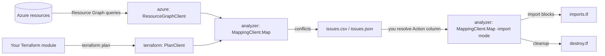
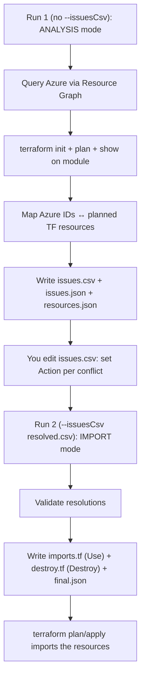
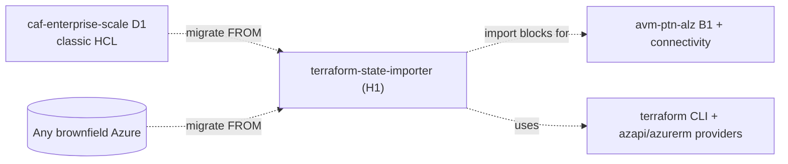

# Azure/terraform-state-importer — Repository Overview

| Field | Value |
|-------|-------|
| Repository | `Azure/terraform-state-importer` |
| Catalog id | H1 |
| Flavor | Go (100%) CLI tool — **engine/tooling**, not IaC |
| Role | Migrates existing Azure resources **into** Terraform modules by mapping them and generating **import blocks** |
| License | MIT · Latest 0.1.3 (Dec 2025) · 17 releases |
| Author | jaredfholgate (Microsoft) |
| Run | `terraform-state-importer run -t <module> --config <config.yaml>` |
| Source URL | <https://github.com/Azure/terraform-state-importer> |
| Mode | deep (source-verified) |
| Last reviewed | 2026-06-17 |

## Purpose

A CLI tool that helps you **brownfield-import** large Azure workloads into Terraform. It discovers existing
Azure resources (via **Resource Graph**), runs `terraform plan` on your target module, **maps** Azure resource
IDs to the planned Terraform resources, surfaces the **conflicts** as a reviewable CSV, and — once you've
resolved them — emits ready-to-use Terraform **`import {}` blocks**.

- The **migration tool** of the ALZ ecosystem: the canonical use case is moving from the classic
  [caf-enterprise-scale (D1)](../terraform-caf-enterprise-scale/_overview.md) HCL to the
  [AVM platform-landing-zone (B-series)](../avm-ptn-alz/_overview.md) modules — but it works for any
  Azure-brownfield → Terraform migration.
- Ships **pre-built ALZ configs** (`.config/alz.*.yaml`) for management groups, hub-and-spoke, and Virtual WAN.
- **Iterative by design** — run → resolve issues in CSV → run again → repeat until clean.



> **Not IaC.** Per the engine/tooling guidance, this analysis focuses on **packages / commands / data flow**.
> Inputs are CLI flags + a YAML config + Azure/Terraform state; outputs are CSV/JSON files and `.tf` import
> blocks.

## How it works (two phases, two runs)

1. **Phase 1 — Resource ID Mapping:** map Azure resource **IDs** to the resources in your Terraform module.
2. **Phase 2 — Resource Attribute Mapping:** guidance for aligning Azure resource **attributes** with module
   variables.

The tool is **run twice**:



## Repository structure (Go packages)

```
terraform-state-importer/
├── main.go                  # entry → cmd.Execute()
├── cmd/                     # Cobra CLI
│   ├── root.go              #   root command + global flags (Viper-bound)
│   └── run.go               #   the `run` subcommand: parses config, composes clients, calls Map()
├── analyzer/                # the mapping engine (MappingClient) + field mapping
├── azure/                   # ResourceGraphClient (KQL queries → Azure resources)
├── terraform/               # PlanClient (terraform init/plan/show wrapper + meta enrichment)
├── csv/                     # IssueCsvClient (issues.csv read/write)
├── hcl/                     # HclClient (imports.tf / destroy.tf generation)
├── json/                    # JsonClient (resources.json / issues.json / final.json)
├── filepathparser/          # cross-platform path handling (unix/windows)
├── types/                   # shared structs (Issue, ResourceGraphQuery, NameFormat, PropertyMapping, …)
├── .config/                 # pre-built ALZ configs (see below)
└── .goreleaser.yaml         # release build config
```

## The pre-built ALZ configs (`.config/`)

These are the direct ALZ-migration entry points:

| Config | Scope | Imports |
|--------|-------|---------|
| `alz.management-groups.config.yaml` | Management Group | MG hierarchy, policy definitions/sets, policy assignments, custom roles, role assignments |
| `alz.connectivity.hub-and-spoke.config.yaml` | Subscription | VNets, subnets, NSGs, route tables, VPN/ER gateways, private DNS zones, DDoS |
| `alz.connectivity.virtual-wan.config.yaml` | Subscription | Virtual WANs, virtual hubs, VPN/ER gateways, firewall policies, private DNS zones |

These mirror the AVM platform-landing-zone module surface — i.e. they are tuned to import a brownfield ALZ into
the [avm-ptn-alz (B1)](../avm-ptn-alz/_overview.md) / connectivity modules.

## Where it sits in the ALZ ecosystem



- **Migrate FROM:** classic [D1 caf-enterprise-scale](../terraform-caf-enterprise-scale/_overview.md) (or any
  brownfield Azure tenant) — the AVM migration story that D1's deprecation points to.
- **Migrate TO:** the [AVM platform-landing-zone (B1)](../avm-ptn-alz/_overview.md) + connectivity modules
  (`azapi` / `azurerm` resources).
- **Companion to** the [alz-terraform-accelerator (F1)](../alz-terraform-accelerator/_overview.md) Terraform line.

## Notes & gotchas

- **Go CLI with Cobra + Viper** — `cmd/run.go` parses the YAML config into typed structs, composes the
  per-concern clients (azure / terraform / csv / hcl / json), and calls `analyzer.MappingClient.Map()`.
- **Reader is enough** — minimum permission is `Reader` on the target subscriptions / management groups (plus
  Azure CLI auth for the plan).
- **Resource Graph is the discovery engine** — you write KQL queries in the config; every query must
  `project id, name, type, location, subscriptionId, resourceGroup`.
- **Three issue types, four actions** — `MultipleResourceIDs` / `NoResourceID` / `UnusedResourceID`, resolved
  with `Use` / `Ignore` / `Replace` / `Destroy` (see [module-issues-and-outputs.md](./module-issues-and-outputs.md)).
- **CSV round-trip** — issues export to CSV (and JSON), you resolve them in Excel/any editor, and re-import —
  enabling team review, version control, and scripted resolution.
- **No state surgery** — the tool generates `import {}` blocks; **you** run `terraform plan`/`apply` to perform
  the actual import (safe, reviewable).

## Open Questions

- [ ] `TODO: verify` the internal step sequence of `analyzer.MappingClient.Map()` (the function body was not read; reconstructed from `run.go` composition + README workflow).
- [ ] `TODO: verify` how `terraform.PlanClient` adds the `meta.*` properties and applies `propertyMappings` during plan post-processing (the `terraform/` package was not read line-by-line).
