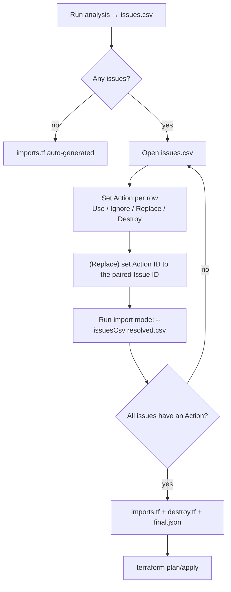

# Module: Issues, actions & outputs (the CSV resolution model + `hcl`/`json`)

| Field | Value |
|-------|-------|
| Repository | `Azure/terraform-state-importer` |
| Flavor | Go |
| Key packages | `csv` (IssueCsvClient), `hcl` (HclClient), `json` (JsonClient), `types` |
| Source URL | <https://github.com/Azure/terraform-state-importer> (README "Issue Resolution Guide") |
| Mode | deep (source-verified — issue/action model + output files) |
| Last reviewed | 2026-06-17 |

## Purpose

The human-in-the-loop resolution model: how mapping conflicts are expressed as **issues**, how you resolve them
with **actions** in a CSV, and what **output files** the tool produces. This is the iterative core of the tool.

## The three issue types

| Issue type | Meaning | Common cause |
|------------|---------|--------------|
| `MultipleResourceIDs` | several Azure resources match one Terraform resource | similar names across regions/environments |
| `NoResourceID` | a Terraform resource has no matching Azure resource | new resource in code, not yet deployed |
| `UnusedResourceID` | an Azure resource has no matching Terraform resource | exists in Azure, not yet in the module |

## The four actions

| Action | Applies to | Effect |
|--------|-----------|--------|
| `Use` | `MultipleResourceIDs` (pick one) | import the chosen Azure resource |
| `Ignore` | any | skip — Terraform will create new / leave Azure unmanaged |
| `Replace` | a `NoResourceID` **paired with** an `UnusedResourceID` | link a TF resource to an existing Azure resource (cross-reference via `Action ID`) |
| `Destroy` | `UnusedResourceID` | emit a cleanup command (to `destroy.tf`) for the Azure resource |

## The issues CSV

`csv.IssueCsvClient` serializes/deserializes the issue set. Columns:

| Column | Meaning |
|--------|---------|
| `Issue ID` | unique id (e.g. `i-a1b2c3`) |
| `Issue Type` | `MultipleResourceIDs` / `NoResourceID` / `UnusedResourceID` |
| `Resource Address` | full Terraform address (`module.network.azurerm_resource_group.main`) |
| `Resource Name` | extracted name used for matching |
| `Resource Type` | Terraform resource type (`azurerm_resource_group`) |
| `Resource Location` | Azure region |
| `Mapped Resource ID` | the Azure resource ID, if matched |
| `Action` | **you fill this in**: `Use` / `Ignore` / `Replace` / `Destroy` |
| `Action ID` | the paired `Issue ID` (only for `Replace`) |

### Resolution examples

**MultipleResourceIDs** — pick the right one:

```csv
Issue ID,Issue Type,Terraform Address,Mapped Resource ID,Action,Action ID
1,MultipleResourceIDs,module.network.azurerm_resource_group.main,/subscriptions/.../resourceGroups/prod-rg,Use,
2,MultipleResourceIDs,module.network.azurerm_resource_group.main,/subscriptions/.../resourceGroups/test-rg,Ignore,
```

**Replace** — link a `NoResourceID` to an `UnusedResourceID` (each references the other via `Action ID`):

```csv
Issue ID,Issue Type,Terraform Address,Mapped Resource ID,Action,Action ID
3,NoResourceID,module.network.azurerm_resource_group.new,N/A,Replace,4
4,UnusedResourceID,N/A,/subscriptions/.../resourceGroups/existing-rg,Replace,3
```

## The resolution loop



## Output files

| File | Writer | Contents |
|------|--------|----------|
| `issues.csv` | `csv` | conflicts to resolve (Action column blank on first run) |
| `issues.json` | `json` | machine-readable issues (automation / scripted resolution) |
| `resources.json` | `json` | **all** planned Terraform resources + properties + `meta.*` (debugging matches) |
| `imports.tf` | `hcl` | Terraform `import {}` blocks for `Use`-actioned resources |
| `destroy.tf` | `hcl` | cleanup commands (from `deleteCommands`) for `Destroy`-actioned resources |
| `final.json` | `json` | the successfully mapped resources after resolution |

## `hcl.HclClient` — generating the blocks

Constructed with the module path + the `deleteCommands` config. For each resolved issue:
- `Use` → an `import {}` block (`id = <azure id>`, `to = <terraform address>`).
- `Destroy` → looks up the matching `deleteCommands[].command` by resource type, substitutes `%s` with the
  resource ID, and writes it to `destroy.tf` (you run these **before** import to clear conflicts).

```hcl
# imports.tf (generated)
import {
  id = "/subscriptions/.../resourceGroups/prod-rg"
  to = module.network.azurerm_resource_group.main
}
```

## Dependencies

**Upstream:** the issue set from `analyzer.MappingClient.Map()`; the `deleteCommands` config.
**Downstream:** you review `imports.tf`/`destroy.tf`, run any destroys, then `terraform plan`/`apply` to import.

## Notes & Gotchas

- **`Replace` is a two-row handshake** — both the `NoResourceID` and the `UnusedResourceID` rows must be set to
  `Replace`, each pointing at the other's `Issue ID` via `Action ID`; otherwise validation fails.
- **`Destroy` runs are manual** — `destroy.tf` holds the commands but the tool does **not** execute them; you
  run them (e.g. `az role assignment delete --ids …`) before importing.
- **No-conflict fast path** — if analysis finds zero issues, `imports.tf` is generated immediately (skip the
  CSV round-trip).
- **CSV is the collaboration surface** — version-control it, review it as a team, or script its resolution from
  `issues.json`.
- **Small batches** — the README recommends importing in small batches for complex environments and backing up
  state first.

## Open Questions

- [ ] `TODO: verify` the exact `import {}` block field names emitted by `hcl` (shown above is the standard Terraform shape; not read from source).
- [ ] `TODO: verify` whether `final.json` is also consumed by a later run or is purely a record.
