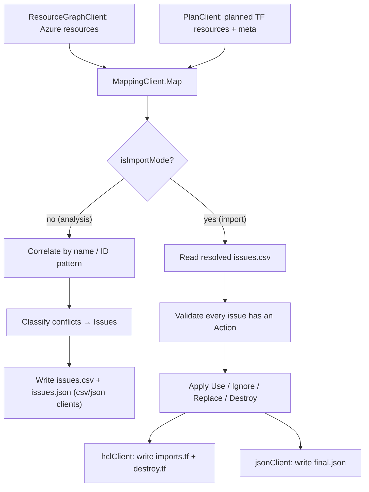
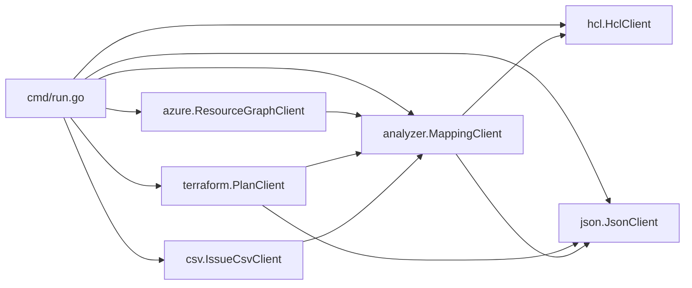

# Module: Mapping engine (`analyzer` + `azure` + `terraform` + `json`)

| Field | Value |
|-------|-------|
| Repository | `Azure/terraform-state-importer` |
| Flavor | Go |
| Key packages | `analyzer` (MappingClient), `azure` (ResourceGraphClient), `terraform` (PlanClient), `json` (JsonClient) |
| Source URL | <https://github.com/Azure/terraform-state-importer/tree/main/analyzer> |
| Mode | deep (source-verified — composition + workflow; package bodies summarized) |
| Last reviewed | 2026-06-17 |

## Purpose

The heart of the tool: the **mapping engine** that correlates **discovered Azure resources** (from Resource
Graph) with **planned Terraform resources** (from `terraform plan`), produces the issue set in analysis mode,
and produces the import blocks in import mode.

- `analyzer.MappingClient.Map()` is the single orchestration entry point; `run.go` constructs it with all the
  collaborator clients and a boolean `isImportMode = (issuesCsv != "")`.
- The two data sources are normalized to a common shape so they can be matched by **name / ID pattern**.

## The two data sources

### `azure.ResourceGraphClient` — discover Azure resources

Constructed with `cloud`, `managementGroupIDs`, `subscriptionIDs`, `ignoreResourceIDPatterns`, and the
`resourceGraphQueries`. It runs each KQL query against the **Azure Resource Graph** at the configured scope and
returns a flat list of resources (`id, name, type, location, subscriptionId, resourceGroup`), dropping any whose
ID matches an `ignoreResourceIDPatterns` entry. Results are de-duplicated (a noted fix prevents duplicate issue
IDs).

### `terraform.PlanClient` — discover planned Terraform resources

Constructed with the module path, working folder, optional `planSubscriptionID`, `ignoreResourceTypePatterns`,
the skip flags, and the `propertyMappings` + `nameFormats`. It:

1. runs `terraform init` (unless skipped; `-upgrade` unless `--skipInitUpgrade`),
2. runs `terraform plan` → `terraform show -json`,
3. parses the plan into resource objects, **injecting `meta.*` properties** (`meta.type`, `meta.address`,
   `meta.location`, and for `azapi_resource` `meta.subtype` / `meta.apiversion`),
4. applies `nameFormats` (compute the match name) and `propertyMappings` (resolve cross-resource values),
5. drops resources whose type/address matches `ignoreResourceTypePatterns`,
6. writes **`resources.json`** (all planned resources + properties + meta) via the `JsonClient`.

`--planAsTextOnly` stops after a textual plan (no JSON parse, no mapping).

## `analyzer.MappingClient.Map()` — the correlation

**Analysis mode (`isImportMode == false`):**
- For each Terraform resource, find the Azure resource(s) whose name / ID matches (using the `nameFormats`
  rules + `meta.*`).
- Classify the result into one of three **issue types** (see
  [module-issues-and-outputs.md](./module-issues-and-outputs.md)): zero matches → `NoResourceID`; multiple
  matches → `MultipleResourceIDs`; an Azure resource with no Terraform match → `UnusedResourceID`.
- Emit `issues.csv` + `issues.json`. If there are **no** conflicts, `issues.csv` is empty and `imports.tf` is
  generated directly.

**Import mode (`isImportMode == true`):**
- Read the resolved CSV (via `csv.IssueCsvClient`), validate that every issue has an `Action`.
- For `Use` → emit an `import {}` block; `Replace` → link a `NoResourceID`/`UnusedResourceID` pair; `Destroy`
  → emit a delete command; `Ignore` → skip.
- Write `imports.tf` + `destroy.tf` (via `hcl.HclClient`) and `final.json` (via `json.JsonClient`).

## Collaborator clients

| Client | Package | Responsibility |
|--------|---------|----------------|
| `ResourceGraphClient` | `azure` | run KQL queries → Azure resources (scoped, filtered, de-duplicated) |
| `PlanClient` | `terraform` | `init`/`plan`/`show` → planned resources + `meta.*` + name/property mapping → `resources.json` |
| `IssueCsvClient` | `csv` | serialize/deserialize the issue set to/from `issues.csv` |
| `JsonClient` | `json` | write `resources.json` / `issues.json` / `final.json` |
| `HclClient` | `hcl` | generate `imports.tf` (import blocks) + `destroy.tf` (delete commands) |
| (helpers) | `filepathparser`, `types` | cross-platform paths; shared structs (`Issue`, `ResourceGraphQuery`, `NameFormat`, `PropertyMapping`, …) |

## Module Dependency Diagram

## Dependencies

**Upstream:** the Azure Resource Graph API; the Terraform CLI (+ `azapi`/`azurerm` providers in the target
module). **Downstream:** the output files (CSV/JSON/`.tf`) that you review and apply.

## Notes & Gotchas

- **Name matching is the crux** — most config tuning (`nameFormats`, `propertyMappings`) exists to make a
  Terraform resource's computed name line up with the Azure resource's name/ID; check `resources.json` to see
  the `meta.*` and computed names when matches misfire.
- **`azapi_resource` needs subtype/apiversion** — AVM modules use `azapi` heavily, so `meta.subtype` /
  `meta.apiversion` matching matters for ALZ migrations.
- **De-duplication** — Resource Graph can return duplicates (e.g. union queries); the client de-dupes to avoid
  duplicate issue IDs.
- **Idempotent re-runs** — analysis is read-only; you can re-run until the issue set is clean, then switch to
  import mode.

## Open Questions

- [ ] `TODO: verify` the precise matching algorithm inside `analyzer` (exact vs fuzzy, tie-breaking) — reconstructed from README issue definitions + the `nameFormats`/`meta` design, not read line-by-line.
- [ ] `TODO: verify` whether `PlanClient` uses the `azapi`/`azurerm` providers' schema or only the plan JSON for `meta.*`.
