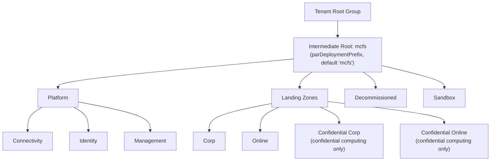
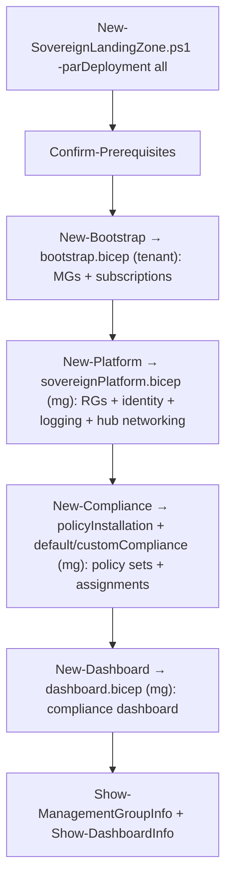
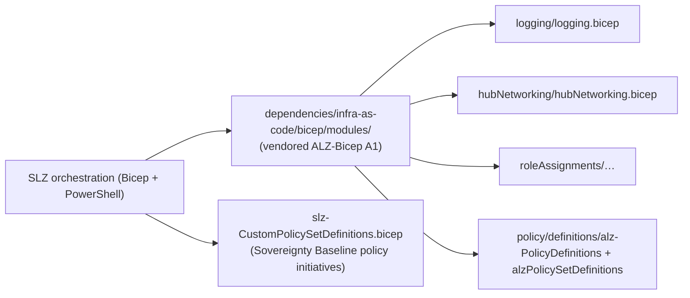

# Azure/sovereign-landing-zone (SLZ) — Repository Overview

| Field | Value |
|-------|-------|
| Repository | `Azure/sovereign-landing-zone` (aka **SLZ**) |
| Catalog id | I1 |
| Flavor | PowerShell (53.5%) + Bicep (46.5%) — a **PowerShell-orchestrated Bicep ALZ variant** |
| Role | **Microsoft Cloud for Sovereignty** offering: an opinionated ALZ variant for regulatory/sovereignty compliance |
| License | MIT · Latest v1.2.3 (Mar 2025) · 10 releases |
| Status | ⚠️ **Being archived in the first half of 2026** (repo notice). Latest guidance → `aka.ms/sovereign/slz` |
| Run | `New-SovereignLandingZone.ps1 -parDeployment all -parParametersFilePath …` |
| Source URL | <https://github.com/Azure/sovereign-landing-zone> |
| Mode | deep (source-verified) |
| Last reviewed | 2026-06-17 |

## Purpose

The **Sovereign Landing Zone (SLZ)** is a [Microsoft Cloud for Sovereignty](https://microsoft.com/sovereignty)
offering that provides opinionated infrastructure-as-code automation for deploying workloads that must meet
**regulatory / sovereignty** requirements (public sector, government). It is an **opinionated variant of the
Azure Landing Zone** that bakes in controls for **operational control of data at rest, in transit, and in use**.

- **Sovereignty controls (the three pillars):** service location / **data residency**, **customer-managed keys
  (CMK)**, and **confidential computing**.
- Ships the **Sovereignty Baseline policy initiatives (SBPI)** built-in, and layers the
  [ALZ Policies](../enterprise-scale-arm/_overview.md) on top — plus optional NIST 800-171 r2 and Microsoft
  Cloud Security Benchmark (MCSB).
- **Single parameter file + single command** deployment (DevSecOps-pipeline friendly).
- Technically it **vendors [ALZ-Bicep (A1)](../ALZ-Bicep/_overview.md)** (under `dependencies/`) and composes
  its modules, then adds the sovereign overlay (confidential management groups + SBPI + compliance dashboard).

> **Archival notice:** the repo states it will be archived in H1 2026; sovereign guidance moves to Microsoft
> Learn (`aka.ms/sovereign/slz`) + the implementation-options page. These notes document it as the Bicep SLZ
> offering and its relationship to ALZ-Bicep.

## Architecture — the four landing zones

The SLZ management-group hierarchy adds **confidential** variants to the standard ALZ landing zones:

| Landing zone | Internet-facing? | Confidential? | Constraint |
|--------------|------------------|---------------|------------|
| **Corp** | no | no | standard internal workloads |
| **Online** | yes | no | standard internet-facing workloads |
| **Confidential Corp** | no | **yes** | **only confidential-computing resources allowed** |
| **Confidential Online** | yes | **yes** | **only confidential-computing resources allowed** |



> The SBPI assigned to the **confidential** management groups enforce confidential computing + key management,
> so workload data is protected at rest, in transit, and **in use** — the defining SLZ capability over plain ALZ.

## Repository structure

```
sovereign-landing-zone/
├── orchestration/
│   ├── scripts/                       # ← PowerShell entry + stage scripts
│   │   ├── New-SovereignLandingZone.ps1   #   overarching entry (all | per-stage)
│   │   ├── New-Bootstrap.ps1  New-Platform.ps1  New-Compliance.ps1  New-Dashboard.ps1
│   │   ├── New-PolicyExemption.ps1  New-PolicyRemediation.ps1
│   │   ├── Confirm-SovereignLandingZonePrerequisites.ps1  Invoke-Helper.ps1
│   │   └── Invoke-SlzCustomPolicyToBicep.ps1   #   build-time: SLZ policy JSON → .bicep
│   ├── bootstrap/                     # bootstrap.bicep (tenant) + bootstrapScopeEscape.bicep (mg)
│   ├── sovereignPlatform/             # sovereignPlatform.bicep — composes ALZ-Bicep modules
│   ├── policyInstallation/            # policyInstallation.bicep — ALZ + SLZ policy set defs
│   ├── defaultCompliance/  customCompliance/   # policy assignments (default + custom)
│   ├── policyExemption/  policyRemediation/     # exemptions + remediation
│   ├── moveSubscription/  dashboard/            # sub placement + compliance dashboard
├── modules/                           # reusable Bicep (resourceGroups, managed identity, …) + util PS
├── dependencies/                      # ← VENDORED ALZ-Bicep (infra-as-code/bicep/modules/…) + Alz.Tools PS
├── custom/                            # customer customization point
└── docs/                             # 01-Overview … 13-Troubleshooting
```

## Deployment stages (PowerShell-orchestrated)

`New-SovereignLandingZone.ps1 -parDeployment <all|bootstrap|platform|compliance|dashboard|policyexemption|policyremediation>`
reads one parameter file and runs the chosen stage(s). The `all` flow:



| Stage | Script | Bicep | Scope | Does |
|-------|--------|-------|-------|------|
| bootstrap | `New-Bootstrap.ps1` | `bootstrap.bicep` (or `bootstrapScopeEscape.bicep`) | **tenant** (or mg) | management groups + subscriptions |
| platform | `New-Platform.ps1` | `sovereignPlatform.bicep` | managementGroup | RGs + managed identity + logging + hub networking (composes ALZ-Bicep) |
| compliance | `New-Compliance.ps1` | `policyInstallation` + `defaultCompliance` + `customCompliance` | managementGroup | install ALZ + SLZ policy sets, assign them per MG |
| dashboard | `New-Dashboard.ps1` | `dashboard.bicep` | managementGroup | the SLZ compliance dashboard (in the management subscription) |
| policyexemption | (helper) | `policyExemption.bicep` | managementGroup | exempt policies from `parPolicyExemptions` |
| policyremediation | (helper) | `policyRemediation.bicep` | managementGroup | remediate remediatable policies + refresh compliance |

## How it relates to ALZ-Bicep (A1)

`orchestration/sovereignPlatform/sovereignPlatform.bicep` and `policyInstallation.bicep` reference modules
under **`dependencies/infra-as-code/bicep/modules/`** — i.e. a **vendored copy of [ALZ-Bicep (A1)](../ALZ-Bicep/_overview.md)**:



- **Platform** = ALZ-Bicep `logging` + `hubNetworking` + `roleAssignments` (composed with SLZ resource groups +
  a management managed identity).
- **Policy** = ALZ default policy definitions + ALZ policy set definitions (optional) **+** the SLZ custom
  policy set definitions (the **Sovereignty Baseline**).

## Notes & gotchas

- **PowerShell drives Bicep** — unlike ALZ-Bicep (operator-wired, no orchestrator), SLZ ships its **own
  PowerShell orchestrator** (the `New-*.ps1` stages) so the whole landing zone deploys from one parameter file
  and one command.
- **Vendored ALZ-Bicep** — the ALZ modules live under `dependencies/`, pinned to a known version; SLZ is a
  thin sovereign overlay, not a fork of every module.
- **Confidential management groups are the differentiator** — the SBPI restrict the confidential MGs to
  confidential-computing SKUs + CMK, enforcing data-in-use protection.
- **Prefix `mcfs`** — the default `parDeploymentPrefix` is `mcfs` (Microsoft Cloud **f**or **S**overeignty),
  `@minLength(2) @maxLength(5)`.
- **Tenant-root or child MG** — deploy under the tenant root group (brownfield/greenfield/multiple SLZ) or an
  arbitrary child MG (PoC); `parTopLevelManagementGroupParentId` non-null ⇒ child-MG deployment + scope-escape.
- **Build-time policy generation** — `Invoke-SlzCustomPolicyToBicep.ps1` converts the SLZ policy JSON into the
  `slz-CustomPolicySetDefinitions.bicep` (auto-generated file).

## Open Questions

- [ ] `TODO: verify` the exact MG hierarchy emitted by `bootstrap.bicep` (the four landing zones are from docs; the bicep was not read line-by-line for the platform-child MG names).
- [ ] `TODO: verify` the precise contents of the Sovereignty Baseline policy initiatives (`slz-CustomPolicySetDefinitions.bicep` is auto-generated; the policy set list was not enumerated).
