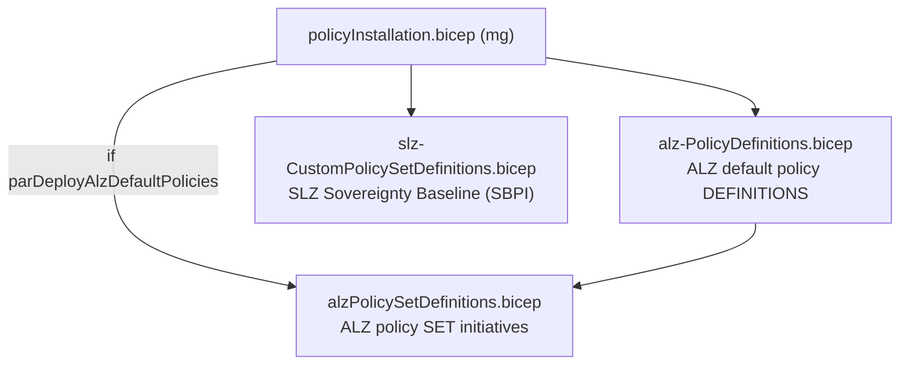
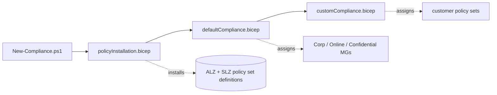
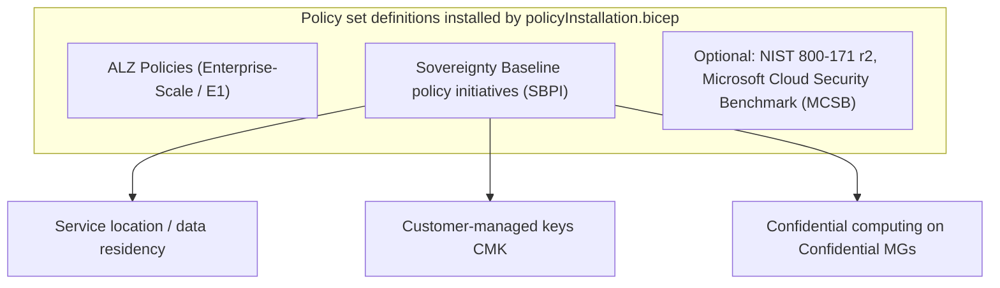

# Module — Compliance & Policy (`policyInstallation` + `defaultCompliance` + `customCompliance` + exemption/remediation + dashboard)

| Field | Value |
|-------|-------|
| Path | `orchestration/policyInstallation/`, `defaultCompliance/`, `customCompliance/`, `policyExemption/`, `policyRemediation/`, `dashboard/` |
| Stage | compliance (`New-Compliance.ps1`), dashboard, policyexemption, policyremediation |
| Author | Cloud for Sovereignty |
| Source-verified | full `policyInstallation.bicep`; others from repo tree + entry script |
| Last reviewed | 2026-06-17 |

## Purpose

This is the **sovereignty differentiator**: install the policy set definitions (ALZ default + the SLZ
**Sovereignty Baseline**), assign them to the right management groups, support exemptions and remediation, and
surface a **compliance dashboard**. Together they enforce data residency, customer-managed keys, and
confidential computing across the four landing zones.

## `policyInstallation.bicep` (verified)

> *"It will deploy the ALZ default policies and the SLZ default policy set definitions."* — `targetScope = 'managementGroup'`

| Module | Source | Gated by | Creates |
|--------|--------|----------|---------|
| `alz-PolicyDefinitions.bicep` | vendored ALZ-Bicep `policy/definitions/` | *(always)* | the **ALZ default policy definitions** |
| `alzPolicySetDefinitions.bicep` | vendored ALZ-Bicep `policy/definitions/` | `if (parDeployAlzDefaultPolicies)` | the **ALZ policy set initiatives** (`parTargetManagementGroupId`) |
| `slz-CustomPolicySetDefinitions.bicep` | vendored ALZ-Bicep `policy/definitions/` (auto-generated) | *(always)* | the **SLZ custom policy set definitions = Sovereignty Baseline policy initiatives (SBPI)** |

> `Inputs:` `parDeploymentPrefix` (`@minLength 2 @maxLength 5`), `parDeploymentSuffix`, `parDeploymentLocation`
> (`@allowed`), `parDeployAlzDefaultPolicies` (default `false`), `parTimestamp` (`utcNow()`).
> The MG id is `${parDeploymentPrefix}${parDeploymentSuffix}`.

### Where the SBPI come from

`Invoke-SlzCustomPolicyToBicep.ps1` (`New-AlzPolicySetDefinitionBicepFile`) is a **build-time** generator that
turns the SLZ policy JSON into `slz-CustomPolicySetDefinitions.bicep` (marked *auto-generated by the Cloud for
Sovereignty team*). At deploy time `policyInstallation.bicep` simply references the generated file.

## `defaultCompliance.bicep` / `customCompliance.bicep`

After the sets are *installed*, the compliance stage **assigns** them:

| Bicep | Scope | Does |
|-------|-------|------|
| `defaultCompliance.bicep` | managementGroup | assigns the **default** policy set assignments (`parPolicyAssignments`) per landing zone by convention (Corp / Online / Confidential Corp / Confidential Online) |
| `customCompliance.bicep` | managementGroup | assigns **customer-supplied** policy sets (`parCustomerPolicySets`) |

`New-Compliance.ps1` (`New-InstallPolicySets`) runs `policyInstallation` → `defaultCompliance` →
`customCompliance`, adding `parDeployAlzDefaultPolicies` / `parCustomerPolicySets` as conditionally-required
parameters (per the entry switch's `compliance` branch). The **confidential** MGs receive the assignments that
restrict them to confidential-computing SKUs + key management.

## `policyExemption.bicep` / `policyRemediation.bicep`

| Stage | Bicep | Helper | Does |
|-------|-------|--------|------|
| policyexemption | `policyExemption.bicep` (mg) | `Invoke-PolicyExemption` | exempts the policies listed in `parPolicyExemptions` (justified deviations) |
| policyremediation | `policyRemediation.bicep` (mg) | `Invoke-PolicyRemediation` | triggers remediation tasks for remediatable (DeployIfNotExists/Modify) policies and refreshes compliance status |

These map to the standalone `New-SovereignLandingZone.ps1 -parDeployment policyexemption|policyremediation`
entry points and are *not* part of the `all` flow (run on demand).

## `dashboard.bicep`

| Field | Value |
|-------|-------|
| Scope | managementGroup |
| Stage | dashboard (`New-Dashboard.ps1`) |
| Does | deploys a resource group + an **Azure portal dashboard** showing SLZ compliance, in the **management subscription** |
| Prefix | `parDeploymentPrefix` default `'mcfs'` |

In the `all` flow the dashboard runs last (with the bootstrap outputs) and `Show-DashboardInfo` prints its URL.

## The policy layers (what gets enforced)

## Inputs / Outputs / Resources / Dependencies (summary)

- **Inputs:** `parDeploymentPrefix/Suffix/Location`, `parDeployAlzDefaultPolicies`, `parCustomerPolicySets`,
  `parPolicyAssignments`, `parPolicyExemptions`, plus platform outputs (LAW id) threaded from
  `sovereignPlatform.bicep`.
- **Outputs:** policy assignment ids; the compliance dashboard URL.
- **Resources:** policy definitions, policy set definitions (initiatives), policy assignments, exemptions,
  remediation tasks, a dashboard RG + portal dashboard.
- **Dependencies:** vendored ALZ-Bicep `policy/definitions/` modules; the platform stage (for LAW + identity);
  the bootstrap stage (for the MG hierarchy the assignments target).

## Notes & gotchas

- **Three layers stack:** ALZ Policies (from [Enterprise-Scale (E1)](../enterprise-scale-arm/_overview.md)) +
  SBPI + optional NIST/MCSB — SLZ's value is the curated *sovereignty* overlay on top of standard ALZ policy.
- **SBPI file is generated** — don't hand-edit `slz-CustomPolicySetDefinitions.bicep`; regenerate via
  `Invoke-SlzCustomPolicyToBicep.ps1`.
- **Confidential MGs** get the strictest assignments (confidential computing + CMK) — this is what makes
  "Confidential Corp/Online" enforce data-in-use protection.
- **Exemption / remediation are operational** — used day-2, separate from the initial `all` deployment.

## Open Questions

- [ ] `TODO: verify` the exact list of policy set definitions inside the SBPI (`slz-CustomPolicySetDefinitions.bicep` not enumerated — it is large + auto-generated).
- [ ] `TODO: verify` the precise per-MG assignment mapping in `defaultCompliance.bicep` (which initiative lands on Corp vs Confidential Corp etc.).
