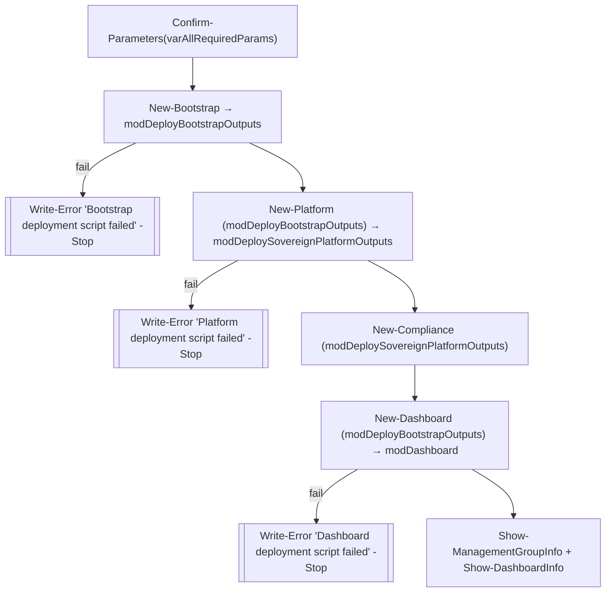

# Module — Orchestration & Stages (`New-SovereignLandingZone.ps1` + stage scripts)

| Field | Value |
|-------|-------|
| Path | `orchestration/scripts/` |
| Entry | `New-SovereignLandingZone.ps1` |
| Kind | PowerShell orchestrator over per-stage Bicep deployments |
| Source-verified | `New-SovereignLandingZone.ps1` (entry, full); stage scripts from repo tree |
| Last reviewed | 2026-06-17 |

## Purpose

`New-SovereignLandingZone.ps1` is the **overarching script to deploy the SLZ either in its entirety or in a
piecemeal manner**. It reads a single parameter file, validates the requested stage's parameters, logs in /
confirms prerequisites, then dot-sources and invokes the per-stage scripts in the correct order.

## Inputs

| Parameter | Default | Meaning |
|-----------|---------|---------|
| `parDeployment` | *(Read-Host prompt)* | one of `all, bootstrap, platform, compliance, dashboard, policyexemption, policyremediation` |
| `parParametersFilePath` | `.\parameters\sovereignLandingZone.parameters.json` | the single SLZ parameter file |
| `parAttendedLogin` | `$true` | interactive login + prerequisite confirmation |

**Required parameters for `all`** (validated by `Confirm-Parameters`):
`parDeploymentPrefix`, `parTopLevelManagementGroupName`, `parSubscriptionBillingScope`, `parCustomer`,
`parDeploymentLocation`, `parAllowedLocations`, `parAllowedLocationsForConfidentialComputing`
(+ `parCustomerPolicySets` when custom policy sets are supplied).

## Outputs

- Returns the bootstrap / dashboard deployment objects (per stage), and prints management-group + dashboard
  info via `Show-ManagementGroupInfo` / `Show-DashboardInfo`.
- Side effects: management groups, subscriptions, platform resources, policy assignments, and the compliance
  dashboard (depending on the stage).

## Control flow (verified)

```powershell
$varDeploy = @("all","bootstrap","platform","compliance","dashboard","policyexemption","policyremediation")
# validate $parDeployment ∈ $varDeploy

# dot-source the helpers + stage scripts
. ".\Invoke-Helper.ps1"
. ".\New-Bootstrap.ps1" -parAttendedLogin $parAttendedLogin
. ".\New-Platform.ps1"  -parAttendedLogin $parAttendedLogin
. ".\New-PolicyExemption.ps1"   -parAttendedLogin $parAttendedLogin
. ".\New-PolicyRemediation.ps1" -parAttendedLogin $parAttendedLogin
. ".\New-Compliance.ps1" -parAttendedLogin $parAttendedLogin
. ".\New-Dashboard.ps1"  -parAttendedLogin $parAttendedLogin

Get-DonotRetryErrorCodes
$varParameters = Read-ParametersValue($parParametersFilePath)

if ($parAttendedLogin) {
    $parIsSLZDeployedAtTenantRoot = $true
    if ($null -ne $varParameters.parTopLevelManagementGroupParentId.value) {
        $parIsSLZDeployedAtTenantRoot = $false   # ← deploying to a child MG, not tenant root
    }
    Confirm-Prerequisites $parIsSLZDeployedAtTenantRoot
}

switch ($parDeployment) { … }
```

The `all` branch (verified order):



> Each output object is **threaded into the next stage**: bootstrap outputs (subscription IDs etc.) feed the
> platform and dashboard; platform outputs (LAW id, hub network ids) feed compliance.

## The stage scripts

| Script | Stage | Bicep invoked | Notes |
|--------|-------|---------------|-------|
| `New-Bootstrap.ps1` | bootstrap | `bootstrap.bicep` / `bootstrapScopeEscape.bicep` | management groups + subscriptions; tenant scope (or mg for scope-escape) |
| `New-Platform.ps1` | platform | `sovereignPlatform.bicep` | RGs + managed identity + logging + hub networking — see [module-sovereign-platform.md](module-sovereign-platform.md) |
| `New-Compliance.ps1` | compliance | `policyInstallation` + `defaultCompliance` + `customCompliance` | `New-InstallPolicySets` installs the sets; assigns per MG — see [module-compliance-and-policy.md](module-compliance-and-policy.md) |
| `New-Dashboard.ps1` | dashboard | `dashboard.bicep` | SLZ compliance dashboard in the management subscription |
| `New-PolicyExemption.ps1` | policyexemption | `policyExemption.bicep` | `Invoke-PolicyExemption` exempts `parPolicyExemptions` |
| `New-PolicyRemediation.ps1` | policyremediation | `policyRemediation.bicep` | `Invoke-PolicyRemediation` remediates + refreshes compliance |

### Helpers

- **`Invoke-Helper.ps1`** — shared functions: `Read-ParametersValue`, `Confirm-Parameters`,
  `Confirm-Prerequisites`, `Get-DonotRetryErrorCodes`, `Show-ManagementGroupInfo`, `Show-DashboardInfo`.
- **`Confirm-SovereignLandingZonePrerequisites.ps1`** — `Confirm-SLZ-PreRequisites`,
  `Confirm-PowerShellVersion` (tooling/version checks before deploying).
- **`Invoke-SlzCustomPolicyToBicep.ps1`** — *build-time* utility: `New-AlzPolicySetDefinitionBicepFile`
  converts SLZ policy JSON into the auto-generated `slz-CustomPolicySetDefinitions.bicep`.

## bootstrap vs bootstrapScopeEscape

| Bicep | `targetScope` | Used when |
|-------|---------------|-----------|
| `bootstrap/bootstrap.bicep` | `tenant` | deploying under the **tenant root group** (needs tenant-root access) |
| `bootstrap/bootstrapScopeEscape.bicep` | `managementGroup` | deploying under an **existing child MG** (no tenant-root access needed) — selected when `parTopLevelManagementGroupParentId` is set |

## Dependencies

- **Upstream:** the single parameter file; the vendored `Alz.Tools` PowerShell module
  (`dependencies/.../Alz.Tools/functions/Alz.Tools.ps1`); Azure CLI / Az PowerShell + Bicep.
- **Downstream:** all stage Bicep modules under `orchestration/<stage>/`.

## Open Questions

- [ ] `TODO: verify` the full body of each `New-<stage>.ps1` (only `New-SovereignLandingZone.ps1` was read line-by-line; stage scripts inferred from the entry's invocations + docs).
- [ ] `TODO: verify` the exact contents of `sovereignLandingZone.parameters.json` (parameter names confirmed from the required-params arrays, not the sample file).
