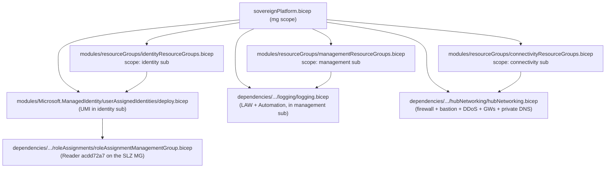

# Module — Sovereign Platform (`sovereignPlatform.bicep`)

| Field | Value |
|-------|-------|
| Path | `orchestration/sovereignPlatform/sovereignPlatform.bicep` |
| `targetScope` | `managementGroup` |
| Stage | platform (`New-Platform.ps1`) |
| Author | Cloud for Sovereignty |
| Source-verified | full `sovereignPlatform.bicep` |
| Last reviewed | 2026-06-17 |

## Purpose

> *"This is the main file for the deployment of the management group resources."*

`sovereignPlatform.bicep` builds the **common platform** shared by all landing zones: resource groups across
the management / connectivity / identity subscriptions, a management-group managed identity + role assignment,
the Log Analytics / Automation logging stack, and the hub network. It does this by **composing the vendored
ALZ-Bicep modules** under `dependencies/infra-as-code/bicep/modules/` plus a few SLZ-owned modules under
`modules/`.

## Inputs (selected)

| Parameter | Default | Meaning |
|-----------|---------|---------|
| `parDeploymentPrefix` | *(req, `@minLength(2) @maxLength(5)`)* | prefix on every resource (default deployment value `mcfs`) |
| `parDeploymentSuffix` | `''` | optional suffix appended to MG + resource names |
| `parDeploymentLocation` | *(req, `@allowed[...]`)* | the deployment region (large allow-list) |
| `parManagementSubscriptionId` / `parIdentitySubscriptionId` / `parConnectivitySubscriptionId` | *(req)* | the three platform subscription IDs |
| `parLogRetentionInDays` | `365` (`@minValue 30 @maxValue 730`) | LAW retention |
| `parDeployHubNetwork` | `true` | toggle the hub network |
| `parDeployBastion` | `true` | deploy Azure Bastion |
| `parDeployDdosProtection` | `true` | DDoS protection plan |
| `parUsePremiumFirewall` | `true` | Azure Firewall tier Premium vs Standard |
| `parDeployLogAnalyticsWorkspace` | `true` | toggle the logging stack |
| `parHubNetworkAddressPrefix` | `10.20.0.0/16` | hub VNet address space |
| `parSubnets` | Bastion / Gateway / Firewall subnets | hub subnets |
| `parExpressGateway*` / `parVpnGateway*` | various | optional ExpressRoute / VPN gateway config |
| `parTags` | `{}` | tags on deployed resources |

## Modules composed

| Module | Source | Scope | Creates |
|--------|--------|-------|---------|
| `managementResourceGroups.bicep` | `modules/resourceGroups/` (SLZ) | management sub | RGs (logging, dashboard, …) |
| `connectivityResourceGroups.bicep` | `modules/resourceGroups/` (SLZ) | connectivity sub | RGs (hub network) |
| `identityResourceGroups.bicep` | `modules/resourceGroups/` (SLZ) | identity sub | RGs (managed identities) |
| `userAssignedIdentities/deploy.bicep` | `modules/Microsoft.ManagedIdentity/` (SLZ) | identity sub | the platform user-assigned managed identity |
| `roleAssignmentManagementGroup.bicep` | **vendored ALZ-Bicep** | the SLZ MG | **Reader** (`acdd72a7-3385-48ef-bd42-f606fba81ae7`) to the UMI |
| `logging/logging.bicep` | **vendored ALZ-Bicep** | management sub | Log Analytics Workspace + Automation Account + solutions |
| `hubNetworking/hubNetworking.bicep` | **vendored ALZ-Bicep** | connectivity sub | hub VNet, Azure Firewall (+ policies), Bastion, DDoS plan, route table, VPN/ER gateways, ~60 Private DNS zones |

> The **logging** and **hubNetworking** modules are the same ALZ-Bicep modules documented in
> [ALZ-Bicep/module-logging.md](../ALZ-Bicep/module-logging.md) and
> [ALZ-Bicep/module-hubNetworking.md](../ALZ-Bicep/module-hubNetworking.md) — SLZ simply wires them with
> sovereign-friendly defaults (Premium firewall, private DNS zones, etc.).

### Logging solutions (LAW)

`AgentHealthAssessment`, `AntiMalware`, `ChangeTracking`, `Security`, `SecurityInsights` (Sentinel),
`ServiceMap`, `SQLAssessment`, `Updates`, `VMInsights`, … — i.e. a security-leaning workspace.

### Hub networking

Premium Azure Firewall (by default) with DNS proxy, Azure Bastion (Standard), a DDoS protection plan,
optional ExpressRoute / VPN gateways, and **~60 `privatelink.*` Private DNS zones** (storage, SQL, Key Vault,
managed HSM, Cosmos, AKS, monitor, etc.) — important for sovereign workloads that must keep traffic private.

## Outputs (verified)

`outConnectivitySubscriptionId`, `outDeploymentLocation`, `outDeploymentPrefix`,
`outDdosProtectionResourceId`, `outLogAnalyticsWorkspaceId`, `outAutomationAccountName`,
`outPrivateDNSZones`, `outHubVirtualNetworkId`, `outHubRouteTableId`, `outHubRouteTableName`,
`outBastionNsgId`, `outBastionNsgName`.

These feed **`New-Compliance`** (LAW id for diagnostic policies) and downstream wiring.

## Resources created

Resource groups in three subscriptions; a user-assigned managed identity + MG Reader role assignment;
Log Analytics Workspace + Automation Account (+ solutions); hub VNet + Azure Firewall (+ policy) + Bastion +
DDoS plan + route table + optional gateways + ~60 Private DNS zones.

## Dependencies

- **Upstream:** bootstrap stage (subscription IDs threaded in via `modDeployBootstrapOutputs`); vendored
  ALZ-Bicep modules under `dependencies/`.
- **Downstream:** compliance stage (uses LAW + network outputs); dashboard stage.
- **Intra-module `dependsOn`:** identity RGs → managed identity → role assignment; management RGs → logging;
  connectivity RGs → hub networking.

## Notes & gotchas

- **All toggles default `true`** — a full platform (Premium firewall, Bastion, DDoS, LAW) deploys unless
  explicitly disabled (the `parDeploy*` booleans exist mostly for testing).
- **`@maxLength(5)` prefix** keeps generated resource names within Azure limits given the long suffixes.
- The role assignment grants the platform UMI **Reader** at the SLZ MG (`acdd72a7…` is the built-in Reader id),
  used for compliance scanning / remediation identity.

## Open Questions

- [ ] `TODO: verify` the exact RG names emitted by the three `*ResourceGroups.bicep` modules.
- [ ] `TODO: verify` how the **confidential** landing-zone MGs receive their network/identity wiring (this file deploys the shared platform; per-LZ specialization happens in bootstrap + compliance).
