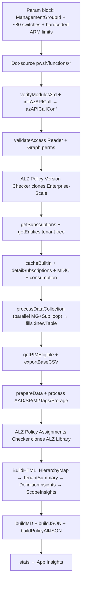
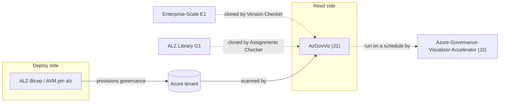

# Azure/Azure-Governance-Visualizer (AzGovViz) — Repository Overview

| Field | Value |
|-------|-------|
| Repository | `Azure/Azure-Governance-Visualizer` (aka **AzGovViz**) |
| Catalog id | J1 |
| Flavor | PowerShell (100%) — **engine/tooling**, not IaC |
| Role | A **read-only governance reporting tool** that scans the tenant MG hierarchy and renders HTML/CSV/MD/JSON insights |
| License | MIT · Latest 6.7.2 (May 2025) · 17 releases |
| Author | Julian Hayward (Microsoft) — a **personal/community** project, *not* a Microsoft product |
| Run | `.\pwsh\AzGovVizParallel.ps1 -ManagementGroupId <id>` |
| Docs | `aka.ms/AzGovViz` |
| Source URL | <https://github.com/Azure/Azure-Governance-Visualizer> |
| Mode | deep (source-verified) |
| Last reviewed | 2026-06-17 |

## Purpose

AzGovViz is a ~20,000-line PowerShell 7 script that **iterates the Azure tenant's management-group hierarchy**
(root MG → subscription → resource group → resource), **polls Azure ARM + Microsoft Graph + Storage APIs**
(through the **AzAPICall** module), and turns the collected data into enriched **governance insights** — Azure
Policy, RBAC, Blueprints, network, Defender, diagnostics, limits, consumption, and more.

- The **READ / audit side** of Azure Landing Zones — it visualizes and validates what the deploy-side repos
  ([ALZ-Bicep](../ALZ-Bicep/_overview.md), [avm-ptn-alz](../avm-ptn-alz/_overview.md), etc.) provision.
- Listed in the **Microsoft Cloud Adoption Framework** as a *Govern*-discipline tool.
- Two ALZ-specific features make it directly relevant: the **ALZ Policy Version Checker** and the **ALZ Policy
  Assignments Checker** (see below).

```mermaid
flowchart LR
    subgraph Inputs
        arm[Azure ARM API]
        graph[Microsoft Graph API]
        storage[Storage API]
    end
    azapicall["AzAPICall module<br/>(auth + throttling + paging)"]
    script["AzGovVizParallel.ps1<br/>(PowerShell 7, parallel)"]
    table["$newTable<br/>(synchronized flat table)"]
    subgraph Outputs
        html[HTML report]
        csv[CSV exports]
        md[Markdown + Mermaid]
        json[JSON folder]
    end
    arm --> azapicall
    graph --> azapicall
    storage --> azapicall
    azapicall --> script
    script --> table
    table --> html
    table --> csv
    table --> md
    table --> json
```

> **Not IaC.** Per the engine/tooling guidance, this analysis focuses on **packages / commands / data flow**,
> not parameter→resource mappings. The "inputs" are CLI parameters and API responses; the "outputs" are report
> files.

## How it runs (end-to-end)



## Repository structure

```
Azure-Governance-Visualizer/
├── pwsh/
│   ├── AzGovVizParallel.ps1          # ← the BUILT monolith (the entry users run)
│   ├── prerequisites.ps1             # AzDO / GitHub Actions only
│   └── dev/
│       ├── devAzGovVizParallel.ps1   # dev entry (param block + dot-sources functions/*)
│       ├── buildAzGovVizParallel.ps1 # BUILD script: concatenates functions/**/*.ps1 → monolith
│       └── functions/                # ~70 function files (one function each)
│           ├── getEntities.ps1, getSubscriptions.ps1, processDataCollection.ps1, …
│           ├── dataCollection/dataCollectionFunctions.ps1   # parallel data-collection helpers
│           ├── html/htmlFunctions.ps1                       # HTML builders (HierarchyMgHTML, …)
│           ├── processALZPolicyVersionChecker.ps1           # ← ALZ cross-link (clones E1)
│           └── processALZPolicyAssignmentsChecker.ps1       # ← ALZ cross-link (clones G1)
├── setup/  slides/  img/  .azuredevops/pipelines  .devcontainer  .github
├── version.json / version.txt  history.md  setup.md  contributionGuide.md
```

> **Dev vs prod layout:** developers edit the many `pwsh/dev/functions/*.ps1`; `buildAzGovVizParallel.ps1`
> concatenates them into the single `pwsh/AzGovVizParallel.ps1` that ships and runs.

## The four output formats

| Output | Contents | Use |
|--------|----------|-----|
| **HTML** | HierarchyMap + TenantSummary + DefinitionInsights + ScopeInsights (JS/CSS from CDNs) | interactive governance dashboard |
| **CSV** | enriched per-capability tables (role/policy assignments, all resources, ALZ checkers, …) | analysis / Excel / pipelines |
| **MD** | Mermaid hierarchy for Azure DevOps Wiki | wiki-as-code |
| **JSON** | per-MG hierarchy + all policy/role definitions & assignments | backup / change-tracking / tenant migration |

## ALZ relevance (the two checkers)

These are the features that make AzGovViz an **ALZ** tool rather than a generic governance scanner:

| Feature | Parameter | What it does |
|---------|-----------|--------------|
| **ALZ Policy Version Checker** | on by default (`-NoALZPolicyVersionChecker` to disable) | `git clone`s [Enterprise-Scale (E1)](../enterprise-scale-arm/_overview.md), collects the ALZ policy/set-definition **history**, compares with your tenant → lifecycle recommendations + `*_ALZPolicyVersionChecker.csv` |
| **ALZ Policy Assignments Checker** | opt-in `-ALZPolicyAssignmentsChecker` + `-ALZManagementGroupsIds` | `git clone`s the [Azure-Landing-Zones-Library (G1)](../Azure-Landing-Zones-Library/_overview.md), collects the standard ALZ policy/set **assignments**, compares with your tenant → missing-assignment report per ALZ MG |

The `-ALZManagementGroupsIds` hashtable maps your MG ids to the ALZ archetype slots (`root`, `platform`,
`connectivity`, `identity`, `management`, `landing_zones`, `corp`, `online`, `sandbox`, `decommissioned`) when
your hierarchy deviates from the ALZ defaults.

## Ecosystem placement



- **[J2 Azure-Governance-Visualizer-Accelerator](../Azure-Governance-Visualizer-Accelerator/_overview.md)** runs
  AzGovViz on a pipeline and publishes the HTML to an Azure Web App.
- **Sister tools** by the same author: **AzAdvertizer** (policy/role catalog) and **AzADServicePrincipalInsights**.

## Notes & gotchas

- **Reader is enough** — the mandatory permission is the `Reader` RBAC role at the (root) management group;
  Graph permissions are only needed to *resolve* identities (groups, service principals, guest users).
- **PowerShell 7 + parallel** — uses `ForEach-Object -Parallel` with `-ThrottleLimit` (default 5/10) and
  **synchronized** hashtables/arraylists so parallel runspaces can share state safely.
- **AzAPICall does the heavy lifting** — auth, token refresh (incl. OIDC in AzDO/GHA), throttling, paging, and
  per-cloud endpoint resolution are delegated to the external **AzAPICall** module (`$azAPICallConf`).
- **Large tenants** — `-LargeTenant` / `-NoScopeInsights` / `-HtmlTableRowsLimit` exist because the HTML can
  exceed browser limits beyond ~500 subscriptions; CSV/JSON still generate.
- **Hardcoded ARM limits** — the limit-warning thresholds (role-assignment, policy-assignment counts, …) are
  hardcoded parameters, not queried from Azure.
- **Stats telemetry** — anonymized usage stats go to Application Insights unless `-StatsOptOut` is set.
- **PSRule integration is paused** — `-DoPSRule` exists but the integration is currently disabled in-script.

## Open Questions

- [ ] `TODO: verify` the internal mechanics of `processDataCollection` parallel runspace fan-out (the `-Parallel` script-block body was not read line-by-line).
- [ ] `TODO: verify` the exact compare logic inside `processALZPolicyVersionChecker` / `processALZPolicyAssignmentsChecker` (function bodies summarized from README + headers, not fully read).
