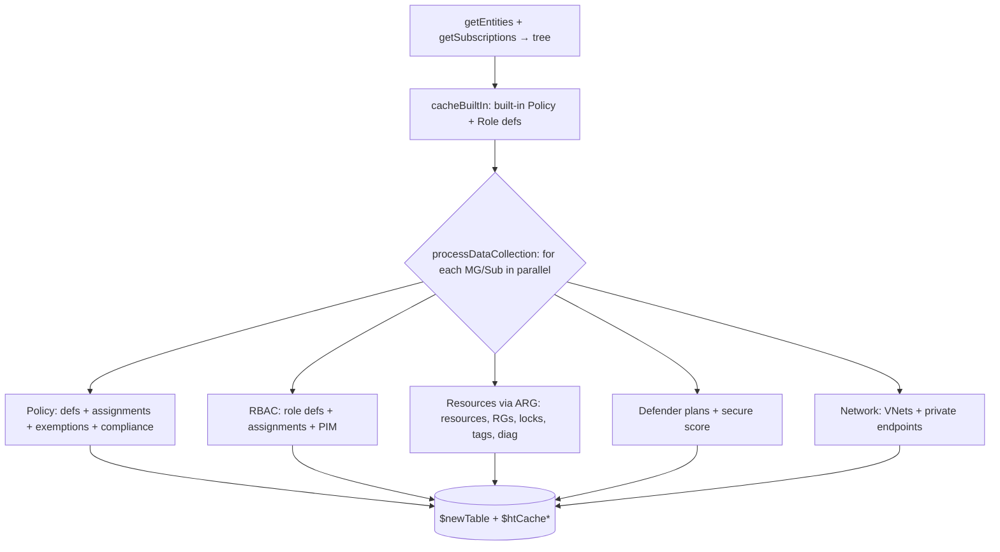

# Module: Data collection layer

| Field | Value |
|-------|-------|
| Repository | `Azure/Azure-Governance-Visualizer` |
| Flavor | PowerShell 7 (parallel) |
| Key files | `getEntities.ps1`, `getSubscriptions.ps1`, `detailSubscriptions.ps1`, `cacheBuiltIn.ps1`, `processDataCollection.ps1`, `dataCollection/dataCollectionFunctions.ps1` |
| Source URL | <https://github.com/Azure/Azure-Governance-Visualizer/tree/master/pwsh/dev/functions> |
| Mode | deep (source-verified — function inventory + orchestration; parallel body summarized) |
| Last reviewed | 2026-06-17 |

## Purpose

The layer that **reads Azure** and fills the in-memory model. It discovers the MG/subscription tree, caches
built-in definitions, then fans out a **parallel** per-scope collection that populates `$newTable` and the
`$htCache*` hashtables with policy, RBAC, blueprint, resource, network, Defender, and diagnostics data.

- All reads go through the **AzAPICall** module (`AzAPICall -AzAPICallConfiguration $azAPICallConf -uri … -method …`).
- Built for scale: PowerShell `ForEach-Object -Parallel` + `-ThrottleLimit` + **synchronized** collections.

## Discovery functions (sequential)

| Function | Reads (API) | Produces |
|----------|-------------|----------|
| `getEntities` | `Microsoft.Management/getEntities` (2020-02-01) | the full MG + subscription **tree** (`$htEntities`) |
| `getSubscriptions` | `/subscriptions` (2020-01-01) | all subscriptions |
| `detailSubscriptions` | per-sub detail | `$subsToProcessInCustomDataCollection` (in-scope subs; skips disabled / `AAD_*` quota) |
| `getTenantDetails` | `/tenants` | tenant display name / domain |
| `getDefaultManagementGroup` | `…/managementGroups/<tenant>/settings` (2023-04-01) | the hierarchy default-MG setting |
| `cacheBuiltIn` | built-in Policy / PolicySet / Role definitions (parallel) | `$htCacheDefinitionsPolicy/PolicySet/Role` (built-ins) |
| Tenant Resource Providers | `/providers` (2021-04-01) | `$htResourceProvidersRef` (latest API per type) |
| `getPrivateEndpointCapableResourceTypes` | `availablePrivateEndpointTypes` | PE-capable type map |
| `getMDfCSecureScoreMG` | ARG secure-score query | MG secure scores |
| `getConsumptionv2` | `Microsoft.CostManagement/query` | consumption data (if `-DoAzureConsumption`) |
| `getOrphanedResources` | `Microsoft.ResourceGraph/resources` (ARG) | orphaned/unused resources (cost savings) |

## The core: `processDataCollection`

`processDataCollection -mgId $ManagementGroupId` walks the MG hierarchy and **fans out a parallel loop over
subscriptions** (and MGs), calling the helpers in `dataCollection/dataCollectionFunctions.ps1`. For each scope
it queries (verified from the README's API reference + function set):

- **Policy:** custom policy/set definitions, policy assignments, exemptions, compliance states
  (`Microsoft.Authorization/*`, `Microsoft.PolicyInsights/policyStates`).
- **RBAC:** role definitions, role assignments, PIM `roleAssignmentScheduleInstances`, classic administrators.
- **Resources:** `Microsoft.ResourceGraph/resources` (ARG) for resources, resource groups, locks, tags,
  diagnostic settings, Defender plans (`Microsoft.Security/pricings`, `securescores`, `securityContacts`).
- **Network:** virtual networks, subnets, private endpoints (`Microsoft.Network/*`).

Each finding is written into **`$newTable`** via `addRowToTable` and/or the relevant synchronized `$htCache*`
hashtable. Because the loop is parallel, every shared collection is `[…]::Synchronized(…)`.

## Identity-resolution functions (after collection)

The raw assignments reference object ids; these functions resolve them via **Microsoft Graph**:

| Function | Resolves |
|----------|----------|
| `processAADGroups` + `getGroupmembers` | Entra group → transitive members (`/groups`, `/transitiveMembers`) |
| `processApplications` | service principals of type **Application** (secrets/certs expiry) |
| `processManagedIdentities` | service principals of type **ManagedIdentity** (which resources / policy assignments) |
| `resolveObjectIds` | bulk `directoryObjects/getByIds` |
| `getPIMEligible` | PIM eligible assignments (`privilegedAccess/azureResources`) — needs SP + `PrivilegedAccess.Read.AzureResources` |

## Enrichment / shaping

- `prepareData` builds the `optimizedTableForPathQuery*` lookups (MG path resolution) from `$newTable`.
- `createTagList` aggregates tag-name usage across subs/RGs/resources.
- `processNetwork` / `processPrivateEndpoints` enrich the network objects (peerings, subnet IP usage).
- `processMDfCCoverage` aggregates Defender plan coverage.
- `getResourceDiagnosticsCapability` determines which resource types can emit logs/metrics.
- `processStorageAccountAnalysis` flags anonymous-access storage accounts (separate bearer token for the
  Storage endpoint).

## Dependencies

**Upstream:** `$azAPICallConf` (AzAPICall), the discovered tree. **Downstream:** the preQueries + output
builders read `$newTable` + caches.

## Notes & Gotchas

- **AzAPICall abstracts the hard parts** — paging, throttling/429 retry, token refresh, per-cloud API versions
  (`$APIMappingCloudEnvironment`) are all handled by the module, so collection functions just build a URI and
  call `AzAPICall`.
- **Scope skipping** — disabled subscriptions and `AAD_*` quota subscriptions are skipped; whitelists
  (`-SubscriptionIdWhitelist` / `-SubscriptionQuotaIdWhitelist`) further restrict scope.
- **`-ManagementGroupsOnly`** short-circuits all subscription-level collection (auto-enabled if the tenant has
  no subscriptions).
- **Synchronized everything** — the parallel runspaces share `$newTable` and `$htCache*`; they must be
  `[System.Collections.*]::Synchronized(...)` or `[System.Collections.Hashtable]::Synchronized(@{})`.
- **ARG-centric** — much of the resource-side data uses `Microsoft.ResourceGraph/resources` (ARG) rather than
  per-resource ARM GETs, for speed at scale.

## Open Questions

- [ ] `TODO: verify` the exact per-scope query sequence inside the `processDataCollection` parallel script block (the `-Parallel { … }` body was not read line-by-line; reconstructed from the function set + README API list).
