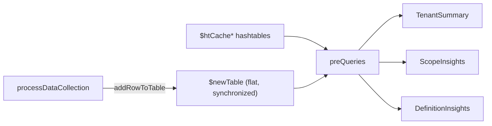

# Module: Entry script + execution flow (`AzGovVizParallel.ps1`)

| Field | Value |
|-------|-------|
| Repository | `Azure/Azure-Governance-Visualizer` |
| Flavor | PowerShell 7 |
| Entry file | `pwsh/AzGovVizParallel.ps1` (built) · `pwsh/dev/devAzGovVizParallel.ps1` (source) |
| Build | `pwsh/dev/buildAzGovVizParallel.ps1` concatenates `pwsh/dev/functions/**/*.ps1` |
| Source URL | <https://github.com/Azure/Azure-Governance-Visualizer/blob/master/pwsh/dev/devAzGovVizParallel.ps1> |
| Mode | deep (source-verified) |
| Last reviewed | 2026-06-17 |

## Purpose

The orchestrator: parses parameters, loads the ~70 function files, initializes the **AzAPICall** config, sets
up the thread-safe state caches, then drives the **collect → enrich → build outputs** pipeline.

- Single entry point; no cmdlet exports (it's a script, not a module).
- Establishes `$azAPICallConf` (the central config) and `$newTable` (the central data table).
- Decides feature execution from the parameter switches and the detected run platform
  (console vs Azure DevOps / GitHub Actions).

## Parameters (the contract)

There are ~80 parameters. Grouped by theme:

| Theme | Representative parameters |
|-------|---------------------------|
| **Scope** | `-ManagementGroupId` (root MG = tenant id), `-SubscriptionQuotaIdWhitelist`, `-SubscriptionIdWhitelist`, `-ManagementGroupsOnly`, `-HierarchyMapOnly` |
| **AzAPICall / context** | `-AzAPICallModuleName`/`-AzAPICallVersion` (`1.4.1`), `-SubscriptionId4AzContext`, `-TenantId4AzContext`, `-ARMLocation` |
| **Output** | `-OutputPath`, `-CsvDelimiter` (`;`), `-NoCsvExport`, `-NoJsonExport`, `-FileTimeStampFormat`, `-NoDefinitionInsightsDedicatedHTML`, `-MermaidDirection` (`TD`/`LR`) |
| **Privacy / security** | `-DoNotShowRoleAssignmentsUserData` (PII scrub), `-StatsOptOut` |
| **Feature toggles** | `-NoMDfCSecureScore`, `-NoPolicyComplianceStates`, `-NoNetwork`, `-NoResources`, `-DoAzureConsumption`, `-NoPIMEligibility`, `-NoStorageAccountAccessAnalysis`, `-DoPSRule` |
| **ALZ** | `-NoALZPolicyVersionChecker` (on by default), `-ALZPolicyAssignmentsChecker` (opt-in), `-ALZManagementGroupsIds` (hashtable map) |
| **Scale tuning** | `-LargeTenant`, `-ThrottleLimit` (5/10), `-PolicyAtScopeOnly`, `-RBACAtScopeOnly`, `-NoScopeInsights`, `-HtmlTableRowsLimit` (20000), `-AADGroupMembersLimit` (500) |
| **Hardcoded limits** | `-LimitRBACRoleAssignmentsManagementGroup` (500), `-LimitPOLICYPolicyAssignmentsManagementGroup` (200), … (ARM limits are *not* queried — they're parameter defaults) |
| **Static config** | `$ValidPolicyEffects`, `$APIMappingCloudEnvironment` (per-cloud API versions), `$MSTenantIds` |

> `-LargeTenant` is a meta-switch: it forces `-PolicyAtScopeOnly`, `-RBACAtScopeOnly`,
> `-NoResourceProvidersAtAll`, and `-NoScopeInsights` (set inside `addHtParameters`).

## Execution flow (verified order)

1. **Param block** + `$ErrorActionPreference = 'Stop'`; reject a `-ManagementGroupId` containing spaces.
2. **Dot-source** every `pwsh/functions/*.ps1` (including `dataCollection/` and `html/`).
3. `testPowerShellVersion` (≥ 7.0.3) → `setOutput` → `setTranscript` (if `-DoTranscript`).
4. `verifyModules3rd` (ensures the **AzAPICall** module) → `initAzAPICall` → **`$azAPICallConf`** (holds
   `htParameters`, `azAPIEndpointUrls`, `checkContext`, `arrayAPICallTracking`); enforce AzAPICall ≥ 1.2.4.
5. `checkAzGovVizVersion` (compares `version.json` on `master`); `handleCloudEnvironment`; PIM hint.
6. `addHtParameters` (folds the switches into `$azAPICallConf['htParameters']`) + `validateAccess` (Reader +
   Graph). `getFileNaming`.
7. **Initialize ~100 thread-safe state objects** — `$newTable` (synchronized `ArrayList`) plus synchronized
   hashtables: `$htCacheDefinitionsPolicy/PolicySet/Role/Blueprint`, `$htCacheAssignmentsPolicy/Role/Blueprint`,
   `$htCachePolicyComplianceMG/SUB`, `$htServicePrincipals`, `$htAADGroupsDetails`, `$resourcesAll`,
   `$arrayVNets`, `$arrayDefenderPlans`, `$alzPolicies`/`$alzPolicySets`, …
8. **ALZ Policy Version Checker** (`processALZPolicyVersionChecker`) — runs by default on supported clouds.
9. `getSubscriptions` → `getEntities` (the MG+sub tree via `Microsoft.Management/getEntities`) →
   `setBaseVariablesMG`; `getTenantDetails`, `getDefaultManagementGroup`; `runInfo`.
10. `detailSubscriptions` → `getMDfCSecureScoreMG` → `getConsumptionv2` (if enabled) → `getOrphanedResources`
    (ARG) → `cacheBuiltIn` (built-in Policy + RBAC defs, parallel) → tenant resource providers →
    `getPrivateEndpointCapableResourceTypes`.
11. **`processDataCollection -mgId $ManagementGroupId`** — the core parallel collection (see
    [module-data-collection.md](./module-data-collection.md)).
12. `exportResourceLocks`, `getPolicyRemediation`, AdvisorScores CSV, `getPIMEligible`; **`exportBaseCSV`** (the
    master CSV from `$newTable`).
13. `prepareData` (builds the `optimizedTableForPathQuery*` lookups) → `processAADGroups` → `processApplications`
    → `processManagedIdentities` → `createTagList` → `processStorageAccountAnalysis` →
    `getResourceDiagnosticsCapability`.
14. **ALZ Policy Assignments Checker** (`processALZPolicyAssignmentsChecker`) — if `-ALZPolicyAssignmentsChecker`.
15. **BuildHTML** → **buildMD** → **buildJSON** → **buildPolicyAllJSON** (see
    [module-outputs-and-alz-checkers.md](./module-outputs-and-alz-checkers.md)).
16. `apiCallTracking`, `stats` (→ Application Insights unless `-StatsOptOut`), `Stop-Transcript`.

## The central data model — `$newTable`

`$newTable` is a **synchronized flat `ArrayList`**. `addRowToTable` adds **one row per scope × policy/role
combination** (columns: `Level`, `mg*`, `subscription*`, `Policy*`, `Role*`, `Blueprint*`). Every downstream
query is a `.where({ … })` over this table (plus the `$htCache*` hashtables). This single denormalized table is
the "connecting the dots" mechanism that lets the tool cross-reference policy, RBAC, and scope.

## Dependencies

**Upstream (runtime):** PowerShell 7, `Az.Accounts`, the **AzAPICall** module; network access to ARM / Microsoft
Graph / Storage; `git` (for the two ALZ checkers, which `git clone` external repos).
**Downstream:** the output builders consume `$newTable` + caches.

## Notes & Gotchas

- **`$azAPICallConf['htParameters']`** is the single source of truth for effective settings at runtime — many
  parameters are *not* read directly later; they're read from this hashtable.
- **Platform auto-detection** — the script detects Azure DevOps / GitHub Actions from environment variables and
  changes auth (OIDC), file paths, and the `-AzureDevOpsWikiAsCode` behaviour accordingly.
- **Idempotent reruns** — the JSON output supports change-tracking/backup; each run is timestamped via
  `-FileTimeStampFormat`.
- **Errors are collected, not fatal** — handled API errors are accumulated and dumped at the end ("don't bother
  about dumped errors").

## Open Questions

- [ ] `TODO: verify` the precise contents of `initAzAPICall` (it lives in the external AzAPICall module, not this repo).
