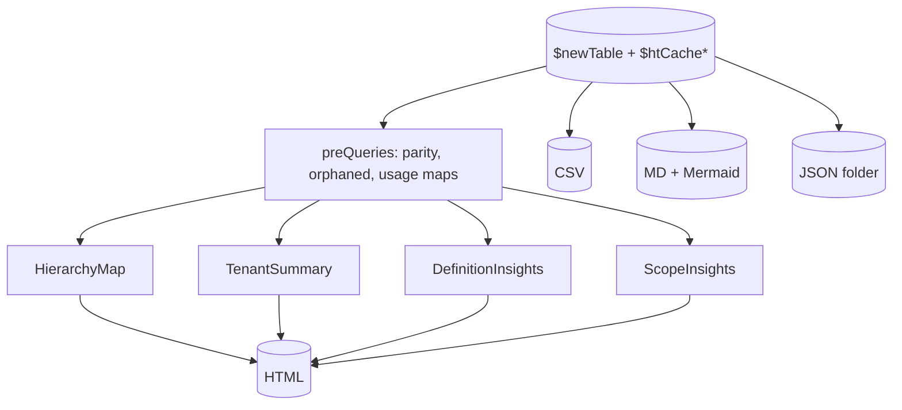
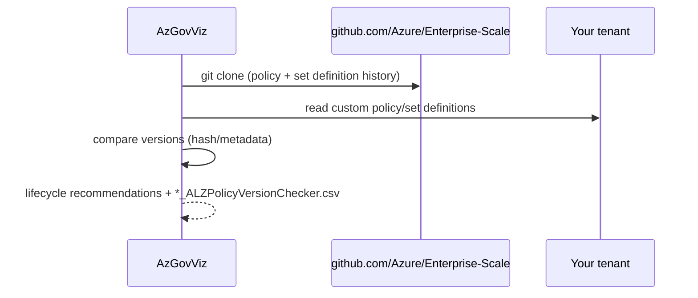
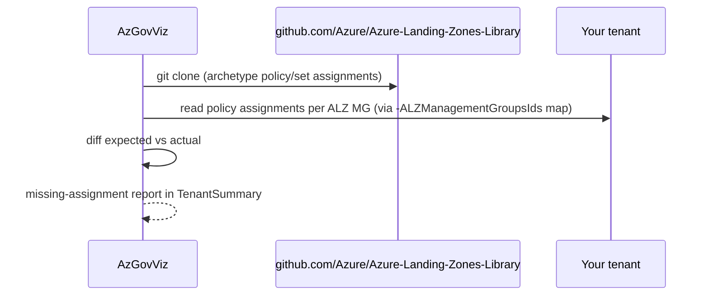

# Module: Output builders + the two ALZ checkers

| Field | Value |
|-------|-------|
| Repository | `Azure/Azure-Governance-Visualizer` |
| Flavor | PowerShell 7 |
| Key files | `html/htmlFunctions.ps1`, `processTenantSummary.ps1`, `processScopeInsightsMgOrSub.ps1`, `processDefinitionInsights.ps1`, `buildMD.ps1`, `buildJSON.ps1`, `buildPolicyAllJSON.ps1`, `exportBaseCSV.ps1`, `processALZPolicyVersionChecker.ps1`, `processALZPolicyAssignmentsChecker.ps1` |
| Source URL | <https://github.com/Azure/Azure-Governance-Visualizer/tree/master/pwsh/dev/functions> |
| Mode | deep (source-verified — orchestration + ALZ checker headers) |
| Last reviewed | 2026-06-17 |

## Purpose

The layer that turns the collected `$newTable` + caches into the four deliverables (HTML / CSV / MD / JSON),
and the **two ALZ-specific features** that compare your tenant against the canonical ALZ repos. These checkers
are why AzGovViz is catalogued as an **ALZ** tool.

## Output builders

### HTML (the main report)

Built in the `BuildHTML` region of the entry script, after a **preQueries** phase that precomputes helper
hashtables (Policy/Set usage, custom-vs-built-in **parity** via `getPolicyHash` SHA-256, role-definition-ids
used in policies, orphaned detection, diagnostics, Defender). The HTML has four sections:

| Section | Builder | Contents |
|---------|---------|----------|
| **HierarchyMap** | `HierarchyMgHTML` (in `html/htmlFunctions.ps1`) | the visual MG tree with per-MG counts (subs, policy assignments, scoped defs, role assignments) |
| **TenantSummary** | `processTenantSummary` | the big cross-tenant insight tables (policy, RBAC, blueprints, network, Defender, limits, Entra, consumption, the ALZ checkers' results) |
| **DefinitionInsights** | `processDefinitionInsights` | filterable catalog of every policy/set/role **definition** (own `*_DefinitionInsights.html` by default) |
| **ScopeInsights** | `processScopeInsights` / `processScopeInsightsMgOrSub` | per-MG and per-subscription drill-down (can be huge → `-NoScopeInsights`) |

The HTML references JavaScript/CSS from CDNs (jQuery, TableFilter, highlight.js, JSON-viewer, dom-to-image) —
see the `BuildHTML` region for the exact list.

### CSV / MD / JSON

| Builder | Output |
|---------|--------|
| `exportBaseCSV` | the master enriched CSV from `$newTable` (role/policy assignments, all resources) |
| per-feature CSVs | `*_ALZPolicyVersionChecker.csv`, `*_PolicyCustomBuiltInParity.csv`, `*_AdvisorScores.csv`, `*_DailySummary.csv`, … |
| `buildMD` | Markdown with a **Mermaid** hierarchy for Azure DevOps Wiki (`-MermaidDirection TD`/`LR`) |
| `buildJSON` + `buildTree` | a JSON folder: per-MG hierarchy + all policy/role definitions & assignments (backup / change-tracking / migration) |
| `buildPolicyAllJSON` | a consolidated `PolicyAll` JSON (all policy + set + assignment objects) |



## ALZ Policy Version Checker (`processALZPolicyVersionChecker`)

**Runs by default** (disable with `-NoALZPolicyVersionChecker`), supported on AzureCloud / AzureChinaCloud /
AzureUSGovernment.

- **Clones** `https://github.com/Azure/Enterprise-Scale.git` ([E1](../enterprise-scale-arm/_overview.md)) into
  a timestamped working folder.
- Collects the **history** of ALZ policy and policy-set **definitions** from that repo.
- **Compares** with the definitions in your tenant → for each ALZ definition that already exists, a **lifecycle
  recommendation** (is your version current?); plus a list of ALZ definitions **not present** in your tenant.
- Results → **TenantSummary** + CSV `*_ALZPolicyVersionChecker.csv`, enriched with AzAdvertizer links.



## ALZ Policy Assignments Checker (`processALZPolicyAssignmentsChecker`)

**Opt-in** via `-ALZPolicyAssignmentsChecker` (+ `-ALZManagementGroupsIds`).

- **Clones** `https://github.com/Azure/Azure-Landing-Zones-Library.git`
  ([G1](../Azure-Landing-Zones-Library/_overview.md)).
- Collects the standard ALZ **archetype** policy/set **assignments** (what *should* be assigned at each ALZ MG).
- **Compares** with your tenant's assignments → the **missing** ALZ policy/set assignments per ALZ management
  group, plus ALZ definitions missing entirely.
- Results → **TenantSummary**.
- `-ALZManagementGroupsIds` maps your MG ids to the ALZ archetype slots when your hierarchy deviates from ALZ
  defaults:

```powershell
@{
  root = '...'; platform = '...'; connectivity = '...'; identity = '...'; management = '...'
  landing_zones = '...'; corp = '...'; online = '...'; sandbox = '...'; decommissioned = '...'
}
```



> These two checkers are the **direct bridge** between the read tool (J1) and the ALZ deploy/data repos: the
> version checker validates against the **ARM reference** (E1), the assignments checker validates against the
> **Library data** (G1) — the same data the [avm-ptn-alz (B1)](../avm-ptn-alz/_overview.md) engine consumes.

## Other reports surfaced (TenantSummary highlights)

Custom/orphaned policy & set definitions, policy exemptions, deprecated built-in usage, custom/orphaned role
definitions, "Owner-capable" custom roles, role assignments that can write role assignments, PIM eligibility,
Defender coverage, diagnostic-settings coverage, ARM-limit proximity warnings, Entra app secret/cert expiry,
resource fluctuation (vs previous run), CAF resource-abbreviation alignment.

## Dependencies

**Upstream:** `$newTable` + caches; `git` (the two checkers); AzAdvertizer (link enrichment).
**Downstream:** the HTML/CSV/MD/JSON files; [J2 accelerator](../Azure-Governance-Visualizer-Accelerator/_overview.md)
publishes the HTML.

## Notes & Gotchas

- **DefinitionInsights is its own HTML by default** (`*_DefinitionInsights.html`) to keep the main file
  smaller; `-NoDefinitionInsightsDedicatedHTML` inlines it.
- **Parity check** — `getPolicyHash` SHA-256-hashes each custom policy's `policyRule` to detect custom
  definitions that duplicate a built-in (reported in `*_PolicyCustomBuiltInParity.csv`).
- **The checkers need `git`** and outbound access to github.com; they write into the output folder under a
  timestamped subfolder.
- **JSON output doubles as backup/migration** — it captures the full MG hierarchy + all definitions/assignments,
  usable to re-seed another tenant.

## Open Questions

- [ ] `TODO: verify` the exact diff/version algorithm inside each checker (compared field set, how "version" is determined) — summarized from headers + README, function bodies not fully read.
- [x] **Resolved:** the ALZ Policy Assignments Checker reads the **`alz_policy_assignment` asset files directly from the cloned [G1 `Azure-Landing-Zones-Library`](../Azure-Landing-Zones-Library/_overview.md)** (it `git clone`s G1 at runtime) — not a derived manifest — and diffs those archetype assignments against the tenant to report the missing ones per ALZ management group.
