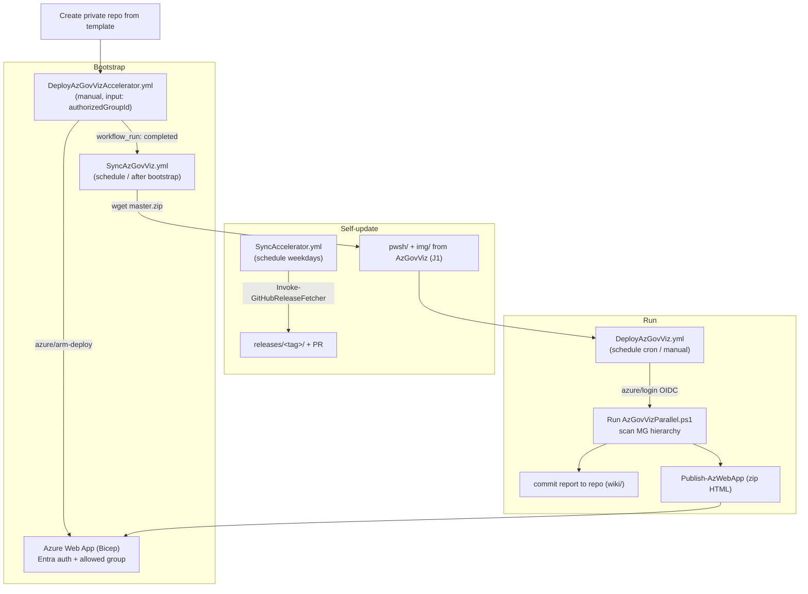
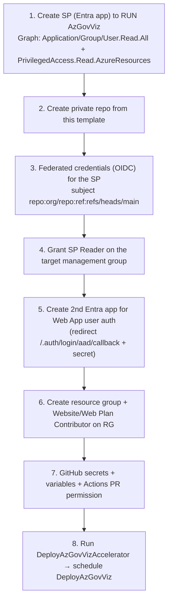
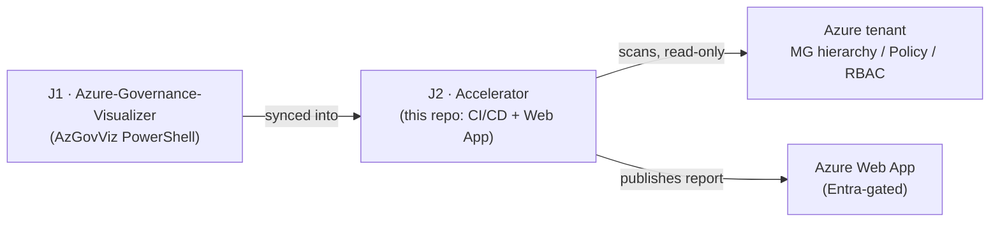

# Azure/Azure-Governance-Visualizer-Accelerator (J2) — Repository Overview

| Field | Value |
|-------|-------|
| Repository | `Azure/Azure-Governance-Visualizer-Accelerator` |
| Catalog id | J2 |
| Flavor | CI/CD (GitHub Actions + Bicep + PowerShell) |
| Role | A **template repository** that schedules [AzGovViz (J1)](../Azure-Governance-Visualizer/_overview.md) via GitHub Actions and publishes its report to an Entra-authenticated Azure Web App |
| License | MIT |
| Run | Create-from-template → run `DeployAzGovVizAccelerator` → run/schedule `DeployAzGovViz` |
| Source URL | <https://github.com/Azure/Azure-Governance-Visualizer-Accelerator> |
| Mode | deep (source-verified) |
| Last reviewed | 2026-06-17 |

## Purpose

The **Azure Governance Visualizer Accelerator** speeds up adoption of [AzGovViz (J1)](../Azure-Governance-Visualizer/_overview.md):
instead of running the AzGovViz PowerShell by hand, you create a **private copy from this GitHub template** and get a
ready-made CI/CD setup that:

1. **Deploys** a secure **Azure Web App** (Bicep) to host the AzGovViz HTML report, gated by **Microsoft Entra
   authentication** and restricted to an authorized Entra **security group**.
2. **Runs AzGovViz on a schedule** (cron) via GitHub Actions using **OIDC / federated credentials** (no stored
   client secret for the scanning identity), commits the generated report back to the repo, and **publishes** it
   to the Web App.
3. **Self-updates**: scheduled workflows pull the latest **AzGovViz** code and the latest **accelerator** release
   into the repo (auto-push or pull-request).

> This is a **tooling / CI-CD** repo, not an IaC landing-zone deployment. The only Azure resource it creates is the
> Web App that hosts the report; everything else is pipeline orchestration around J1.

## Repository structure (verified via git tree)

```
Azure-Governance-Visualizer-Accelerator/
├── .github/
│   ├── dependabot.yml
│   ├── scripts/
│   │   └── Invoke-GitHubReleaseFetcher.ps1     # generic GitHub release fetcher (vendored, jtracey93 v1.3.0)
│   └── workflows/
│       ├── deployAzGovVizAccelerator.yml       # ENTRY: deploy Web App + bootstrap, triggers SyncAzGovViz
│       ├── deployAzGovViz.yml                   # run AzGovViz (schedule/cron) + publish HTML to Web App
│       ├── syncAzGovViz.yml                     # pull upstream AzGovViz code into the repo
│       ├── syncAccelerator.yml                  # pull latest accelerator release (PR to releases/)
│       ├── codeql.yml  scorecard.yml            # security scanning (standard OSS)
├── bicep/
│   ├── webApp.bicep                            # App Service Plan + Web App + Entra Easy Auth
│   └── webApp.parameters.json                  # sku=B1, runtimeStack=DOTNETCORE|7.0, publicNetworkAccess=Enabled
├── version.json                                # { AzGovVizVersion, AcceleratorVersion } (seed 0.0.0 / 0.0.1)
├── media/                                       # screenshots for the README guide
└── README.md  LICENSE  SECURITY.md  SUPPORT.md  CODE_OF_CONDUCT.md
```

> `pwsh/` (the actual `AzGovVizParallel.ps1` + `prerequisites.ps1`) and `img/` are **not** in this repo — they are
> synced in from upstream [AzGovViz (J1)](../Azure-Governance-Visualizer/_overview.md) by the `SyncAzGovViz` workflow.

## The four workflows (data flow)



| Workflow | Trigger | Purpose |
|----------|---------|---------|
| `deployAzGovVizAccelerator.yml` | manual (`workflow_dispatch`, input `authorizedGroupId`) | deploy the Web App via Bicep, then trigger `SyncAzGovViz` |
| `deployAzGovViz.yml` | schedule (cron, opt-in) + manual | run AzGovViz, commit the report, publish HTML to the Web App |
| `syncAzGovViz.yml` | after bootstrap (`workflow_run`) + schedule + manual | pull the latest **AzGovViz** `pwsh/` + `img/` into the repo |
| `syncAccelerator.yml` | schedule (weekdays) + manual | pull the latest **accelerator** release into `releases/` via PR |

## Onboarding model (README, verified)

The accelerator is consumed by **creating a private repo from this template** and wiring up identity + secrets. The
8-step guide:



**Two identities are involved:**

| Identity | Auth method | Used for |
|----------|-------------|----------|
| AzGovViz SP (`CLIENT_ID`) | **OIDC / federated** (no secret in repo) | run AzGovViz (Reader on MG) + publish to Web App (Website/Web Plan Contributor on RG) |
| Web App auth app (`ENTRA_CLIENT_ID` / `ENTRA_CLIENT_SECRET`) | client secret | Entra **Easy Auth** sign-in for users viewing the report |

**GitHub secrets:** `CLIENT_ID`, `ENTRA_CLIENT_ID`, `ENTRA_CLIENT_SECRET`, `SUBSCRIPTION_ID`, `TENANT_ID`,
`MANAGEMENT_GROUP_ID`. **Variables:** `RESOURCE_GROUP_NAME`, `WEB_APP_NAME`.

## Ecosystem placement



- **J1 → J2:** the accelerator is a thin CI/CD + hosting wrapper around AzGovViz (J1); it does not re-implement any
  scanning logic — it syncs J1's `pwsh/` scripts and runs them on a schedule.
- Like other Azure accelerators (e.g. [alz-bicep-accelerator (A3)](../alz-bicep-accelerator/_overview.md)), it uses
  **`Invoke-GitHubReleaseFetcher.ps1`** (jtracey93's public script) to keep itself in sync with upstream releases.

## Notes & gotchas

- **Security guard on publish** — `deployAzGovViz.yml` calls the ARM `authsettings/list` API and **refuses to
  publish** the report unless the Web App has Entra authentication enabled (prevents leaking tenant governance data
  to an unauthenticated/public site). See [module-deploy-workflows.md](module-deploy-workflows.md).
- **Template self-exclusion** — every workflow guards with `if: github.repository != 'Azure/Azure-Governance-Visualizer-Accelerator'`
  so the jobs only run in your *copy*, never in the upstream template.
- **OIDC for the scanner, secret only for user-auth** — the scanning identity never stores a secret in the repo; only
  the Web App's user-authentication app uses a client secret.
- **`version.json` is a seed** — the template ships `AzGovVizVersion: 0.0.0` / `AcceleratorVersion: 0.0.1`; the sync
  workflows bump these to the real upstream versions on first run.
- **Hosting is .NET on Windows B1** — `webApp.parameters.json` sets `sku=B1`, `runtimeStack=DOTNETCORE|7.0`; the
  default document is `AzGovViz_<managementGroupId>.html`.

## Open Questions

- [ ] `TODO: verify` whether an **Azure DevOps** pipeline variant exists (the repo as inspected is GitHub-Actions-only; the catalog lists J2 generically as "CI/CD").
- [ ] `TODO: verify` the exact `pwsh/` entry parameters consumed at runtime — these live in upstream J1, not this repo.
