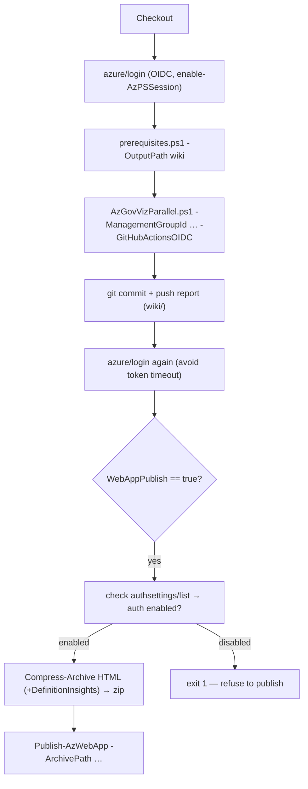

# Module — Deploy Workflows (`deployAzGovVizAccelerator.yml` + `deployAzGovViz.yml`)

| Field | Value |
|-------|-------|
| Path | `.github/workflows/deployAzGovVizAccelerator.yml`, `.github/workflows/deployAzGovViz.yml` |
| Kind | GitHub Actions workflows |
| Source-verified | both workflow files (full) |
| Last reviewed | 2026-06-17 |

## Purpose

Two workflows do the actual work: **`DeployAzGovVizAccelerator`** is the one-time bootstrap that deploys the Azure
Web App, and **`DeployAzGovViz`** is the recurring job that runs AzGovViz and publishes its report.

---

## `deployAzGovVizAccelerator.yml` — bootstrap / infra

> *Deploys the Web App that will host AzGovViz and triggers the first AzGovViz code sync.*

### Inputs

| Input / secret / var | Source | Meaning |
|----------------------|--------|---------|
| `authorizedGroupId` | `workflow_dispatch` input (required) | Entra **security** group object id allowed to view the Web App |
| `CLIENT_ID`, `TENANT_ID`, `SUBSCRIPTION_ID` | secrets | AzGovViz SP for `azure/login` (OIDC) |
| `ENTRA_CLIENT_ID`, `ENTRA_CLIENT_SECRET` | secrets | the Web App's user-auth Entra app |
| `MANAGEMENT_GROUP_ID` | secret | root MG id (default document name) |
| `RESOURCE_GROUP_NAME`, `WEB_APP_NAME` | variables | target RG + Web App name |

### Flow (verified)

```yaml
on: { workflow_dispatch: { inputs: { authorizedGroupId: { required: true } } } }
jobs:
  AzureGovernanceVisualizer:
    runs-on: ubuntu-latest
    permissions: { id-token: write, contents: read }
    steps:
      - Harden Runner (step-security/harden-runner, egress-policy: audit)
      - Checkout
      - azure/login            # OIDC: CLIENT_ID + TENANT_ID + SUBSCRIPTION_ID
      - azure/arm-deploy:       # scope resourcegroup
          template: ./bicep/webApp.bicep
          parameters: ./bicep/webApp.parameters.json
                      webAppName=<WEB_APP_NAME>
                      managementGroupId=<MANAGEMENT_GROUP_ID>
                      clientId=<ENTRA_CLIENT_ID>
                      clientSecret=<ENTRA_CLIENT_SECRET>
                      authorizedGroupId=<input.authorizedGroupId>
```

- Uses **OIDC** (`id-token: write`) — no stored secret for the scanning identity.
- Deploys [`webApp.bicep`](module-webapp-infra.md) into the pre-created resource group.
- On completion it triggers `SyncAzGovViz` (via that workflow's `workflow_run` trigger — see
  [module-sync-workflows.md](module-sync-workflows.md)), which pulls the AzGovViz `pwsh/` code into the repo.

### Outputs / resources

No workflow outputs; side effect = the deployed Azure Web App (+ App Service Plan).

---

## `deployAzGovViz.yml` — run + publish (the recurring job)

> Header: *“Azure Governance Visualizer v6_major_20230308_3”* — this is AzGovViz's own GitHub Actions template,
> adapted for the accelerator. It scans the tenant and publishes the HTML report.

### Configuration (env)

| Env | Default | Meaning |
|-----|---------|---------|
| `OutputPath` | `wiki` | folder for the generated report |
| `ManagementGroupId` | `secrets.MANAGEMENT_GROUP_ID` | root MG to scan |
| `ScriptDir` | `pwsh` | folder holding the synced AzGovViz scripts |
| `ScriptPrereqFile` | `prerequisites.ps1` | AzGovViz prerequisite installer |
| `ScriptFile` | `AzGovVizParallel.ps1` | the AzGovViz entry script |
| `WebAppPublish` | `true` | publish the HTML to the Web App |
| `WebApp*` | secrets/vars | subscription / RG / name of the Web App |

### Triggers

```yaml
on:
  # schedule:
  #   - cron: '30 5 * * *'   # opt-in: uncomment to run daily
  workflow_dispatch:
permissions: { id-token: write, contents: write }
jobs:
  AzureGovernanceVisualizer:
    if: github.repository != 'Azure/Azure-Governance-Visualizer-Accelerator'   # never in the template
```

### Flow (verified)



1. **Login (OIDC)** with `enable-AzPSSession: true`.
2. **Check prerequisites** — runs `pwsh/prerequisites.ps1` (installs the AzAPICall / Az modules AzGovViz needs).
3. **Run AzGovViz** — `pwsh/AzGovVizParallel.ps1 -ManagementGroupId <id> -SubscriptionId4AzContext <sub> -ScriptPath pwsh -OutputPath wiki -GitHubActionsOIDC`.
4. **Push report to repo** — commits the generated `wiki/` output back to the repo (as `azgvz`).
5. **Re-login** — refreshes the OIDC token to avoid timeout before publishing.
6. **Publish HTML to Web App** *(if `WebAppPublish == true`)* — see security guard below.

### Security guard (notable)

Before publishing, it queries the Web App's `config/authsettings/list` ARM API and reads
`properties.enabled`:

- **If authentication is enabled** → `Compress-Archive` the report HTML (and `DefinitionInsights.html` if present)
  into a zip and `Publish-AzWebApp -Force`.
- **If authentication is NOT enabled** → prints *“Assuming and insisting that you do not want to publish your tenant
  insights to the public”* and **`exit 1`**.

> This prevents accidentally exposing sensitive tenant governance data (Policy/RBAC/PIM insights) on an
> unauthenticated public Web App. It also throws a helpful error if the `ManagementGroupId` casing is wrong
> (Linux runners are case-sensitive: `Linux != linuX`).

### Dependencies

- **Upstream:** the synced `pwsh/` scripts from [AzGovViz (J1)](../Azure-Governance-Visualizer/_overview.md)
  (provided by `SyncAzGovViz`); the deployed Web App (from `DeployAzGovVizAccelerator`).
- **Requires:** AzGovViz SP with **Reader** on the MG (to scan) + **Website Contributor** on the RG (to publish).

## Open Questions

- [ ] `TODO: verify` the full parameter set passed to `AzGovVizParallel.ps1` in customised copies (users add AzGovViz params like `-NoPIMEligibility` per the README).
