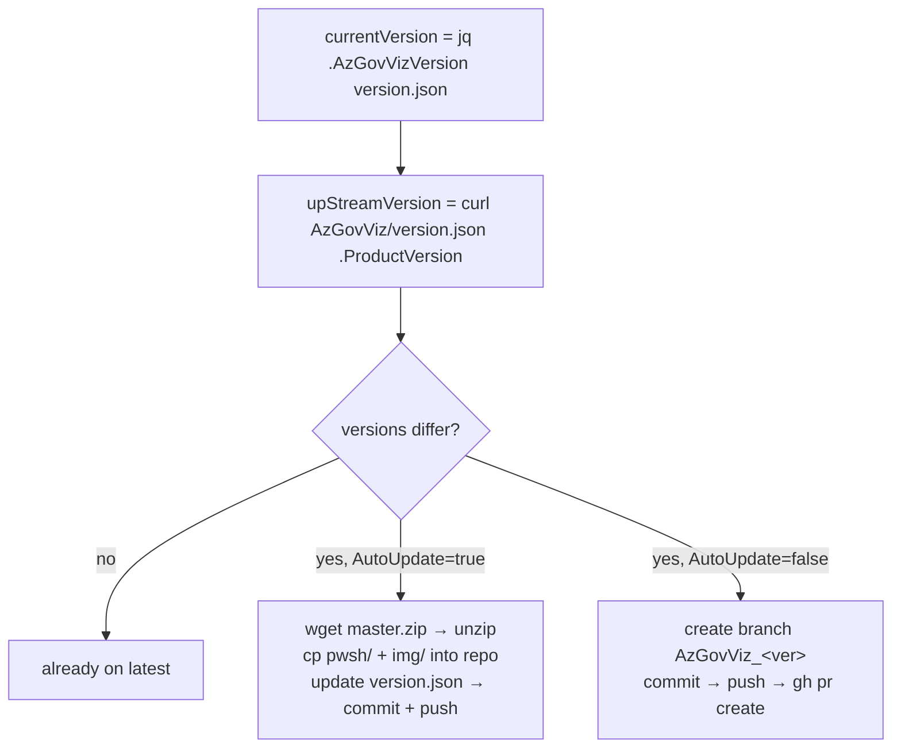
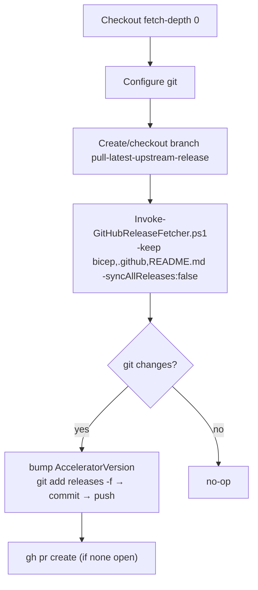

# Module — Sync Workflows (`syncAzGovViz.yml` + `syncAccelerator.yml` + `Invoke-GitHubReleaseFetcher.ps1`)

| Field | Value |
|-------|-------|
| Path | `.github/workflows/syncAzGovViz.yml`, `.github/workflows/syncAccelerator.yml`, `.github/scripts/Invoke-GitHubReleaseFetcher.ps1` |
| Kind | GitHub Actions workflows + PowerShell |
| Source-verified | all three files (full) |
| Last reviewed | 2026-06-17 |

## Purpose

These two workflows keep the user's copy current with **two different upstreams**: `SyncAzGovViz` pulls the latest
**AzGovViz code** (J1), and `SyncAccelerator` pulls the latest **accelerator release** (this repo). Both can either
push directly or open a pull request, so teams control their own update cadence.

---

## `syncAzGovViz.yml` — sync the AzGovViz code (J1)

> Brings the actual `pwsh/` + `img/` from [AzGovViz (J1)](../Azure-Governance-Visualizer/_overview.md) into the repo
> so `DeployAzGovViz` has something to run.

### Config (env)

| Env | Value |
|-----|-------|
| `AutoUpdateAzGovViz` | `'true'` (auto-push) or `'false'` (open PR) |
| `AzGovVizRepoPath` | `https://github.com/Azure/Azure-Governance-Visualizer/archive/refs/heads/master.zip` |
| `AzGovVizVersionPath` | `https://raw.githubusercontent.com/Azure/Azure-Governance-Visualizer/master/version.json` |

### Triggers

```yaml
on:
  # schedule: [ cron: '0 1 * * *' ]    # opt-in daily
  workflow_dispatch:
  workflow_run:
    workflows: [DeployAzGovVizAccelerator]   # ← runs right after bootstrap
    types: [completed]
permissions: { contents: write, pull-requests: write }
```

The `workflow_run` trigger is what makes `DeployAzGovVizAccelerator` “trigger another workflow to sync” — after
bootstrap completes successfully, `SyncAzGovViz` runs automatically.

### Flow (verified)



- **`UpdateAzGovVizAutomatically`** (`AutoUpdateAzGovViz == 'true'`): downloads the AzGovViz `master.zip`, copies the
  `pwsh/` and `img/` folders into the repo, bumps `version.json` (`AzGovVizVersion`), and **commits + pushes directly**.
- **`UpdateAzGovVizPR`** (`AutoUpdateAzGovViz == 'false'`): same content, but on a new branch `AzGovViz_<version>`
  with a **pull request** for review.

---

## `syncAccelerator.yml` — sync the accelerator release (this repo)

> Keeps the accelerator's own scaffolding current by pulling the latest **GitHub Release** into a `releases/` folder
> via a PR.

### Config

| Env | Value |
|-----|-------|
| `remote_repository` | `Azure/Azure-Governance-Visualizer-Accelerator` |
| `AcceleratorVersionPath` | `.../main/version.json` |
| `branch_name` | `pull-latest-upstream-release` |
| `pr_title` / `pr_body` | “New AzGovViz Accelerator GitHub Release Available” / automated PR notice |

### Triggers

```yaml
on:
  schedule: [ cron: "0 0 * * 1-5" ]   # weekdays midnight
  workflow_dispatch: {}
permissions: { contents: write, pull-requests: write }
```

### Flow (verified)



The key step shells out to PowerShell:

```powershell
$keepThese = @("bicep", ".github", "README.md")
.github/scripts/Invoke-GitHubReleaseFetcher.ps1 `
  -githubRepoUrl "https://github.com/Azure/Azure-Governance-Visualizer-Accelerator" `
  -directoryAndFilesToKeep $keepThese -syncAllReleases:$false
```

The new release content lands under `releases/<tag>/`, and a PR is opened so teams **adopt newer accelerator
versions at their own pace** (the README's stated design).

---

## `Invoke-GitHubReleaseFetcher.ps1` — generic release fetcher

> Version 1.3.0, author **Jack Tracey** (vendored from `jtracey93/PublicScripts`). A reusable script also used by
> other Azure accelerators to stay in sync with upstream GitHub releases.

### Inputs

| Parameter | Default | Meaning |
|-----------|---------|---------|
| `githubRepoUrl` | *(required)* | full URL of the repo to check for releases |
| `syncAllReleases` | `$false` | sync **all** releases (one dir each) vs only the latest |
| `directoryForReleases` | `$PWD/releases` | output folder |
| `directoryAndFilesToKeep` | `@()` | only these paths are moved out of each extracted release (else everything) |
| `moveToRoot` | `$false` | when fetching a single latest release, copy it to the repo root |

### Behaviour (verified)

1. `GET https://api.github.com/repos/<org>/<repo>/releases` → list all releases.
2. Latest = newest by `published_at` among non-prerelease, non-draft.
3. For each target release: download `archive/refs/tags/<tag>.zip`, `Expand-Archive`, then **move only the
   `directoryAndFilesToKeep` paths** into `releases/<tag>/` (or everything if the keep-list is empty), clean up `tmp`.
4. `moveToRoot` (single-latest only) copies the release content to the repo root.

> Idempotent — if `releases/<tag>/` already has content, it skips that release.

## Dependencies

- **`SyncAzGovViz`** depends on upstream [AzGovViz (J1)](../Azure-Governance-Visualizer/_overview.md) `master` +
  its `version.json`.
- **`SyncAccelerator`** depends on this repo's GitHub Releases and `Invoke-GitHubReleaseFetcher.ps1`.
- Both write to `version.json` (the `AzGovVizVersion` / `AcceleratorVersion` fields) and use `GITHUB_TOKEN`.

## Notes & gotchas

- **Two independent version trackers** — `version.json` holds both `AzGovVizVersion` (code) and `AcceleratorVersion`
  (scaffolding); the two sync workflows own one field each.
- **Auto vs PR is a per-team choice** — flip `AutoUpdateAzGovViz` to `'false'` to require review of every AzGovViz
  bump; `SyncAccelerator` is always PR-based.
- **Template self-exclusion** — both guard with `github.repository != 'Azure/Azure-Governance-Visualizer-Accelerator'`.

## Open Questions

- [ ] `TODO: verify` whether `SyncAzGovViz`'s `master.zip` strategy (vs tagged release) ever pulls pre-release AzGovViz code — it tracks `master`/`ProductVersion`, not GitHub Releases.
