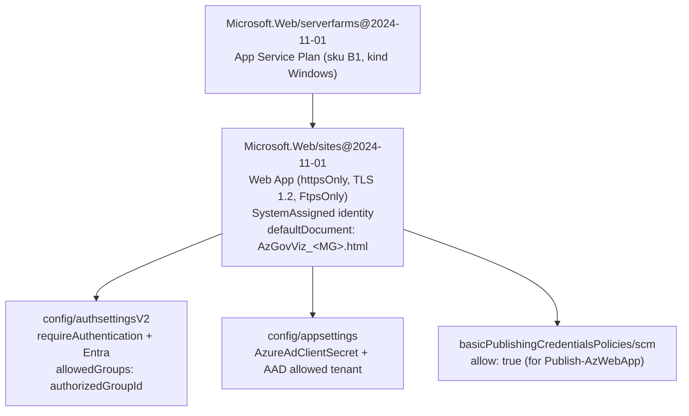

# Module — Web App Infrastructure (`webApp.bicep` + `webApp.parameters.json`)

| Field | Value |
|-------|-------|
| Path | `bicep/webApp.bicep`, `bicep/webApp.parameters.json` |
| `targetScope` | resourceGroup (default) |
| Deployed by | `deployAzGovVizAccelerator.yml` (`azure/arm-deploy`) |
| Source-verified | full `webApp.bicep` + `webApp.parameters.json` |
| Last reviewed | 2026-06-17 |

## Purpose

The only Azure infrastructure in the accelerator: an **App Service Plan + Web App** that hosts the AzGovViz HTML
report, locked down with **Microsoft Entra Easy Auth** and restricted to a named **authorized security group**.

## Inputs (params)

| Parameter | Type | Default | Meaning |
|-----------|------|---------|---------|
| `webAppName` | string | `AzGovViz-${uniqueString(resourceGroup().id)}` | Web App name |
| `location` | string | `resourceGroup().location` | region |
| `sku` | string | *(req — `B1`)* | App Service Plan SKU |
| `runtimeStack` | string | *(req — `DOTNETCORE|7.0`)* | runtime (set as `windowsFxVersion`) |
| `appServicePlanName` | string | `AppServicePlan-${webAppName}` | plan name |
| `kind` | string | `Windows` | App Service Plan kind |
| `publicNetworkAccess` | string | *(req — `Enabled`)* | public network access |
| `tenantId` | string | `subscription().tenantId` | Entra tenant for user auth |
| `clientId` | string | *(req)* | Web App user-auth Entra app id (`ENTRA_CLIENT_ID`) |
| `clientSecret` | string `@secure` | *(req)* | its client secret (`ENTRA_CLIENT_SECRET`) |
| `managementGroupId` | string | *(req)* | root MG id — sets the default document name |
| `authorizedGroupId` | string | *(req)* | Entra security group allowed to view the report |

**`webApp.parameters.json` (verified):** `sku = B1`, `runtimeStack = DOTNETCORE|7.0`, `publicNetworkAccess = Enabled`.

## Resources created (verified)

| Resource | Type | Key config |
|----------|------|------------|
| App Service Plan | `Microsoft.Web/serverfarms@2024-11-01` | `sku` (B1), `kind` (Windows) |
| Web App | `Microsoft.Web/sites@2024-11-01` | `httpsOnly: true`, `minTlsVersion: 1.2`, `ftpsState: FtpsOnly`, `windowsFxVersion: runtimeStack`, `defaultDocuments: [AzGovViz_<managementGroupId>.html]`, `identity: SystemAssigned` |
| Auth settings | `config` `authsettingsV2` | `requireAuthentication: true`, `unauthenticatedClientAction: RedirectToLoginPage`, Entra provider (`openIdIssuer = loginEndpoint/tenantId/v2.0`, `clientId`, `clientSecretSettingName: AzureAdClientSecret`), `jwtClaimChecks.allowedGroups = [authorizedGroupId]`, `defaultAuthorizationPolicy.allowedPrincipals.groups = [authorizedGroupId]` |
| App settings | `config` `appsettings` | `AzureAdClientSecret = clientSecret`, `WEBSITE_AUTH_AAD_ALLOWED_TENANTS = tenantId` |
| SCM publishing | `basicPublishingCredentialsPolicies` `scm` | `allow: true` (lets `Publish-AzWebApp` push the zip) |

## Outputs

| Output | Meaning |
|--------|---------|
| `webAppName` | the deployed Web App name |

## Dependencies

- **Deployed by** `deployAzGovVizAccelerator.yml` via `azure/arm-deploy` (scope resourcegroup).
- **Consumes** the Web App user-auth Entra app (`clientId`/`clientSecret`) created in README step 5, and the
  `authorizedGroupId` workflow input.
- **Consumed by** `deployAzGovViz.yml`'s publish step (`Publish-AzWebApp` into this Web App).

## Notes & gotchas

- **Auth is baked into the infra** — authentication is enforced declaratively via `authsettingsV2`
  (`requireAuthentication: true`), so the [deploy workflow's publish guard](module-deploy-workflows.md) and the Bicep
  agree: the report is never reachable anonymously.
- **Group-scoped access** — only members of `authorizedGroupId` (an Entra **Security** group, not Microsoft 365) can
  view the report, via both `jwtClaimChecks` and `defaultAuthorizationPolicy`.
- **SystemAssigned identity** — present on the Web App, though publishing is done with the AzGovViz SP's RBAC
  (`Website Contributor`) rather than the Web App identity.
- **Windows + DOTNETCORE** — the plan is `kind: Windows` with `windowsFxVersion: DOTNETCORE|7.0`; the app simply
  serves the static AzGovViz HTML as its default document.
- **`@secure` secret** — `clientSecret` is marked `@secure()` and stored in the `AzureAdClientSecret` app setting.

## Open Questions

- [ ] `TODO: verify` whether `publicNetworkAccess: Enabled` is ever flipped to `Disabled` + Private Endpoint in customised deployments (the shipped parameters use public access, relying on Entra auth for protection).
