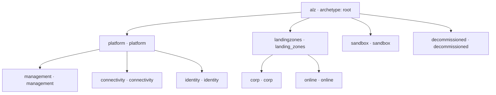
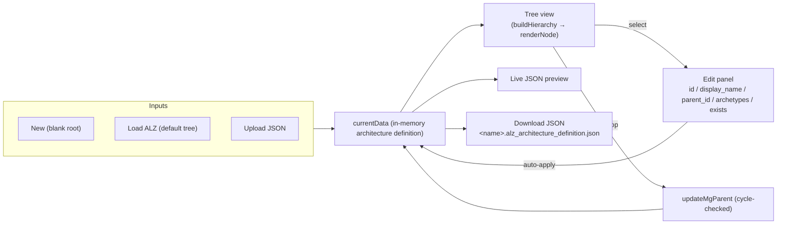
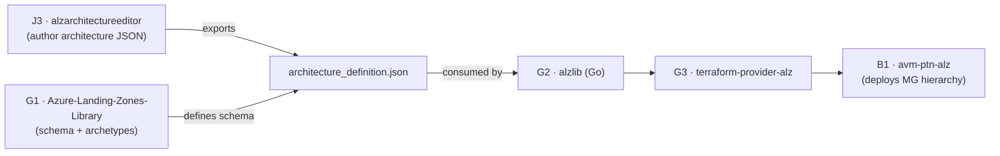

# Azure/alzarchitectureeditor (J3) — Repository Overview

| Field | Value |
|-------|-------|
| Repository | `Azure/alzarchitectureeditor` |
| Catalog id | J3 |
| Flavor | Web app (static, framework-free single-page app) |
| Role | **Experimental** browser editor for ALZ **architecture definitions** — author the MG hierarchy + archetypes and export the JSON consumed by the ALZ Terraform provider |
| License | MIT |
| Run | `git clone` → open `index.html` in a browser (no build, no server) |
| Source URL | <https://github.com/Azure/alzarchitectureeditor> |
| Mode | deep (source-verified) |
| Last reviewed | 2026-06-17 |

## Purpose

The **ALZ Architecture Editor** is a small, **experimental**, client-side web app for visually authoring an ALZ
**architecture definition** — the file that declares the **management-group hierarchy** and which **archetypes**
apply to each MG. You build/edit the tree in the browser and **export a JSON** that plugs straight into the
[Azure Landing Zones Terraform provider (G3)](../terraform-provider-alz/_overview.md) via the
[ALZ Library (G1)](../Azure-Landing-Zones-Library/_overview.md) schema.

- **No framework, no build, no backend** — a single `index.html` + `script.js` + `styles.css`. Open the HTML file
  locally and it runs entirely in the browser.
- **Privacy by design** — the header states *“We do not record any data. All data handling, validation and
  debugging is done on the client side.”*
- It is the **visual front-end for the G1 `architecture` construct**: the exported file's `$schema` points at
  `Azure-Landing-Zones-Library/main/schemas/architecture_definition.json`.

> **Engine/tooling repo** — analyzed for app structure + data model + data flow (per the skill's tooling track),
> not as IaC inputs/outputs.

## Repository structure (verified via git tree)

```
alzarchitectureeditor/
├── index.html                                   # page shell: header + tree panel + edit panel + JSON preview
├── script.js                                    # ALL editor logic (~35 KB, vanilla JS, one DOMContentLoaded closure)
├── styles.css                                   # styling (tree, tags, legend, JSON highlight)
├── schema.json                                  # JSON Schema (draft-07) for the architecture definition
├── sample.alz_architecture_definition.json      # sample export = the default ALZ hierarchy
├── img/screenshot.png
└── README.md  LICENSE  SECURITY.md  SUPPORT.md  CODE_OF_CONDUCT.md  .gitignore
```

## The data model (architecture definition)

The whole app edits one object — the **architecture definition** — matching `schema.json`:

```jsonc
{
  "$schema": "https://raw.githubusercontent.com/Azure/Azure-Landing-Zones-Library/main/schemas/architecture_definition.json",
  "name": "alz",                       // architecture name (also the file name)
  "management_groups": [
    {
      "id": "alz",                     // unique id
      "display_name": "Azure Landing Zones",
      "parent_id": null,               // null = root
      "archetypes": ["root"],          // archetype names applied to this MG
      "exists": false                  // true = brownfield (already in Azure), false = planned/greenfield
    }
    // …
  ]
}
```

Both `name` and `management_groups` are required; every MG requires all five fields
(`id`, `display_name`, `parent_id`, `archetypes`, `exists`). See
[module-data-model-and-schema.md](module-data-model-and-schema.md).

## Default ALZ hierarchy (the “Load ALZ” button)

`loadDefaultAlz()` seeds the canonical ALZ management-group tree (all `exists: false`):



## How the editor works (high level)



There is **no Save button** — every edit applies to `currentData` immediately and refreshes the tree + JSON
preview. Full UI + logic breakdown in [module-editor-app.md](module-editor-app.md).

## Ecosystem placement



- **G1 → J3:** the editor targets G1's `architecture_definition.json` schema; archetype names typed in the editor
  must match archetypes defined in a G1 library.
- **J3 → G3:** the exported JSON is the `architecture` an `alz` provider deployment references to build the MG
  hierarchy (see [terraform-provider-alz (G3)](../terraform-provider-alz/_overview.md) and
  [alzlib (G2)](../alzlib/_overview.md)).
- Sits in the **governance-tooling cluster** with [AzGovViz (J1)](../Azure-Governance-Visualizer/_overview.md) (read
  side) — J3 is an **authoring** front-end rather than an audit tool.
- **Embedded in the docs umbrella (A4):** [`Azure-Landing-Zones` (A4)](../Azure-Landing-Zones/_overview.md) pulls
  this repo in as a **git submodule** at `docs/static/alzarchedit`, so the editor is published as part of the
  azure.github.io/Azure-Landing-Zones site.

## Notes & gotchas

- **Experimental** — the README labels the project experimental; treat the export format as the source of truth
  (it tracks G1's schema).
- **Archetype names are free text** — the editor accepts any archetype string (tag input); it does **not** validate
  them against a real G1 library, so a typo silently produces an archetype that won't resolve at deploy time
  (`TODO: verify` whether later versions add validation).
- **`exists` encodes brownfield vs greenfield** — a MG can only be `exists: true` if its parent also exists; the
  editor enforces this and flags conflicts visually (see the editor module).
- **Client-side only** — nothing is uploaded; the app can be saved and run fully offline.

## Open Questions

- [ ] `TODO: verify` whether the editor ever fetches a live G1 library to validate archetype names (currently archetypes are free-text tags).
- [ ] `TODO: verify` whether `policy_assignments_to_modify` / other newer `architecture_definition.json` fields are supported (this editor models only `name` + `management_groups[]`).
