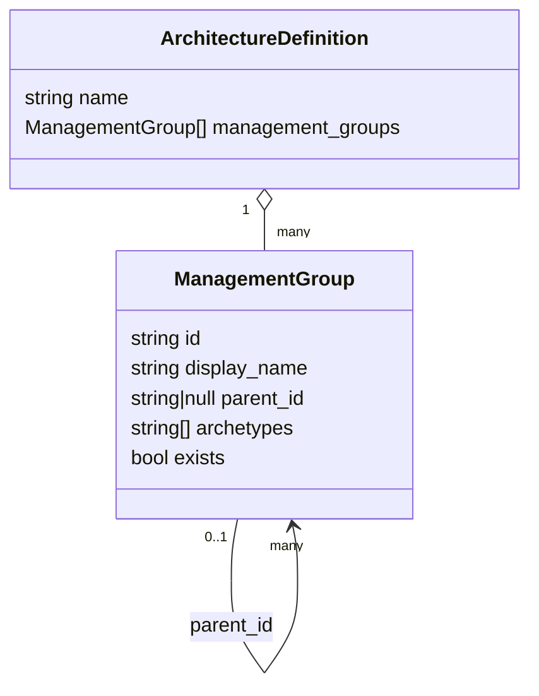

# Module — Data Model & Schema (`schema.json` + `sample.alz_architecture_definition.json`)

| Field | Value |
|-------|-------|
| Path | `schema.json`, `sample.alz_architecture_definition.json` |
| Kind | JSON Schema (draft-07) + sample instance |
| Source-verified | both files (full) |
| Last reviewed | 2026-06-17 |

## Purpose

These two files define and exemplify the **architecture definition** — the only data structure the editor
produces. It is a thin, editor-local schema that mirrors the ALZ Library's `architecture_definition.json`, so the
exported file drops straight into the [ALZ Terraform provider (G3)](../terraform-provider-alz/_overview.md).

## `schema.json` (verified)

JSON Schema **draft-07**. Top level:

| Field | Type | Required | Meaning |
|-------|------|:--------:|---------|
| `name` | string | ✅ | architecture name (also the download file name) |
| `management_groups` | array&lt;object&gt; | ✅ | the flat list of management groups |

Each `management_groups[]` item:

| Field | Type | Required | Meaning |
|-------|------|:--------:|---------|
| `id` | string | ✅ | unique management-group id |
| `display_name` | string | ✅ | human-friendly name |
| `parent_id` | `string` \| `null` | ✅ | parent MG id; **`null` = root** |
| `archetypes` | array&lt;string&gt; | ✅ | archetype names applied to this MG |
| `exists` | boolean | ✅ | **`true` = brownfield** (already in Azure) / **`false` = planned (greenfield)** |

> All five MG fields are in the schema's `required` list — the editor always emits complete objects.



## `sample.alz_architecture_definition.json` (verified)

The sample is the **default ALZ hierarchy** the **Load ALZ** button produces. Its `$schema` points at the
authoritative G1 schema:

```jsonc
{
  "$schema": "https://raw.githubusercontent.com/Azure/Azure-Landing-Zones-Library/main/schemas/architecture_definition.json",
  "name": "alz",
  "management_groups": [
    { "id": "alz",            "parent_id": null,          "archetypes": ["root"],          "display_name": "Azure Landing Zones", "exists": false },
    { "id": "platform",       "parent_id": "alz",         "archetypes": ["platform"],      "display_name": "Platform",            "exists": false },
    { "id": "landingzones",   "parent_id": "alz",         "archetypes": ["landing_zones"], "display_name": "Landing zones",       "exists": false },
    { "id": "corp",           "parent_id": "landingzones","archetypes": ["corp"],          "display_name": "Corp",                "exists": false },
    { "id": "online",         "parent_id": "landingzones","archetypes": ["online"],        "display_name": "Online",              "exists": false },
    { "id": "sandbox",        "parent_id": "alz",         "archetypes": ["sandbox"],       "display_name": "Sandbox",             "exists": false },
    { "id": "management",     "parent_id": "platform",    "archetypes": ["management"],    "display_name": "Management",          "exists": false },
    { "id": "connectivity",   "parent_id": "platform",    "archetypes": ["connectivity"],  "display_name": "Connectivity",        "exists": false },
    { "id": "identity",       "parent_id": "platform",    "archetypes": ["identity"],      "display_name": "Identity",            "exists": false },
    { "id": "decommissioned", "parent_id": "alz",         "archetypes": ["decommissioned"],"display_name": "Decommissioned",      "exists": false }
  ]
}
```

This is the canonical Azure Landing Zones management-group tree — the same hierarchy deployed by the
[ALZ-Bicep (A1)](../ALZ-Bicep/_overview.md) `managementGroups` module and the
[avm-ptn-alz (B1)](../avm-ptn-alz/_overview.md) pattern, expressed as data.

## Business rules encoded in the data

| Rule | Where enforced |
|------|----------------|
| `parent_id: null` marks the root MG(s) | schema (`["null","string"]`) + `buildHierarchy()` |
| A child can be `exists: true` only if its parent `exists: true` | editor (`getEffectiveExistenceStatus`) — not the schema |
| No cycles (a MG can't be its own ancestor) | editor (`wouldCreateCycle`) |
| `id` unique + non-empty | editor (`validateIdOnBlur`) |

> The schema captures **shape**; the **relational invariants** (existence propagation, cycles, uniqueness) are
> enforced by the [editor app](module-editor-app.md), not by JSON Schema.

## Relationship to the ALZ Library (G1)

- **`archetypes`** entries are names that must resolve to archetypes defined in a
  [ALZ Library (G1)](../Azure-Landing-Zones-Library/_overview.md) (e.g. `platform`, `landing_zones`, `corp`); the
  editor treats them as free text and does not validate against a real library.
- The exported file is the **`architecture` construct** consumed by [alzlib (G2)](../alzlib/_overview.md) /
  [terraform-provider-alz (G3)](../terraform-provider-alz/_overview.md) to build the deployment hierarchy.

## Dependencies

- **Upstream of:** G1 schema (`architecture_definition.json`) — the editor's local `schema.json` is a subset/mirror.
- **Consumed by:** G2/G3 (the `alz` provider's `architecture` reference) → downstream MG deployment (B1/A1).

## Open Questions

- [ ] `TODO: verify` how closely the local `schema.json` tracks the live G1 `architecture_definition.json` (the live schema may include additional optional fields not modeled here).
