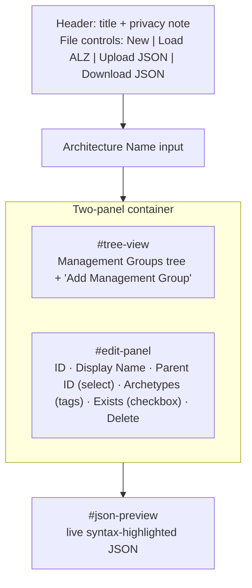
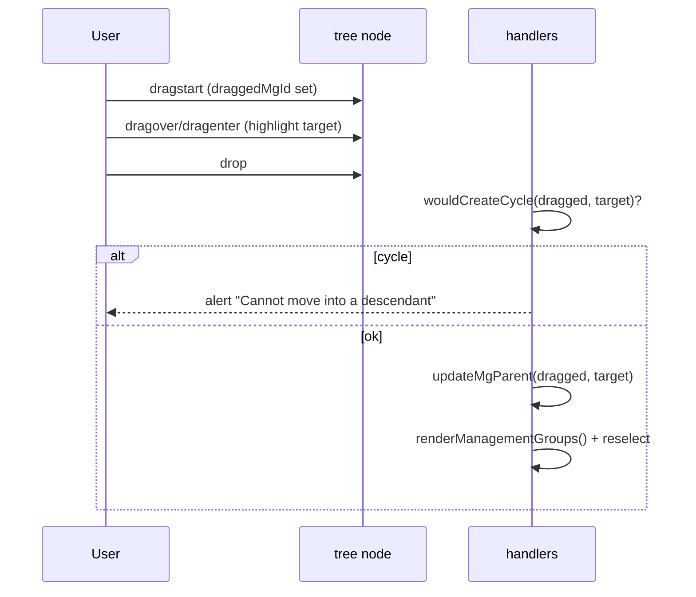

# Module — Editor App (`index.html` + `script.js` + `styles.css`)

| Field | Value |
|-------|-------|
| Path | `index.html`, `script.js`, `styles.css` |
| Kind | Vanilla-JS single-page app (no framework, no build) |
| Source-verified | `index.html` (full), `script.js` (full), `schema.json`, sample JSON |
| Last reviewed | 2026-06-17 |

## Purpose

All the editor behaviour lives in one `script.js` (a single `DOMContentLoaded` closure) driving the static
`index.html`. It maintains one in-memory **architecture definition** (`currentData`) and keeps three views in
sync: the **management-group tree**, the **edit panel**, and the **live JSON preview**.

## UI layout (`index.html`)

- **File controls:** `New`, `Load ALZ`, `Upload JSON`, `Download JSON` (the download button starts `disabled` and
  is enabled once data is loaded).
- **No Save button** — a code comment notes *“Save button removed - changes apply automatically”*; every field
  edit mutates `currentData` and re-renders.

## State (module-level variables)

| Variable | Meaning |
|----------|---------|
| `currentData` | the architecture definition object being edited (`null` until loaded) |
| `selectedMgId` | id of the MG currently shown in the edit panel |
| `draggedMgId` | id of the MG being dragged (reparenting) |
| `dropSuccessful` | flag tracking a valid drop |
| `isUpdating` | re-entrancy guard so programmatic form updates don't re-trigger handlers |

## Functional areas

### 1. Load / create / import / export

| Function | Trigger | Behaviour |
|----------|---------|-----------|
| `loadDefaultAlz()` | **Load ALZ** | sets `currentData` to the hardcoded default ALZ tree (alz → platform/landingzones/sandbox/decommissioned …), all `exists: false` |
| `createNewArchitecture()` | **New** | blank architecture with a single root MG `root-<timestamp>`, archetype `["empty"]`, name `new_architecture` |
| `handleFileUpload(event)` | **Upload JSON** | `FileReader` → `JSON.parse`; validates `management_groups` is an array, else `alert`s and resets `currentData` |
| `downloadJson()` | **Download JSON** | `JSON.stringify(currentData, null, 2)` → Blob → downloads `${name}.alz_architecture_definition.json` |

> Both `loadDefaultAlz` and `createNewArchitecture` stamp the G1 `$schema` URL into `currentData`.

### 2. Tree rendering

```mermaid
flowchart LR
    data["currentData.management_groups (flat list)"] --> bh["buildHierarchy()<br/>idMap + parent_id → nested children"]
    bh --> rmg["renderManagementGroups()"]
    rmg --> legend["addLegend() (Exists / Planned)"]
    rmg --> rn["renderNode() recursive"]
    rmg --> upo["updateParentOptions() (rebuild parent <select>)"]
```

- `buildHierarchy()` turns the flat `management_groups` array into a nested tree via an id→node map, attaching each
  node to `idMap[parent_id].children` (roots = `parent_id === null`).
- `renderNode()` recursively emits each `.tree-item` with a drag handle, a status indicator, and
  `display_name (id)`, then renders children into a `.children` container.

### 3. Management-group CRUD

| Function | Behaviour / guard |
|----------|-------------------|
| `addNewManagementGroup()` | pushes a new root MG `new-mg-<timestamp>` (archetype `["empty"]`) and selects it |
| `deleteManagementGroup()` | **blocked if the MG has children** (`alert` “reassign or delete the children first”) |
| `selectManagementGroup(id)` | highlights the node and populates the edit form (guarded by `isUpdating`) |

### 4. Field editing (auto-apply)

- `handleFieldUpdate()` — updates `display_name`, `parent_id`, `exists` and re-renders. Enforces the existence and
  cycle rules (below).
- `handleIdUpdate()` — **real-time ID rename**: updates the MG's `id` and **cascades** to every child's `parent_id`,
  preserving cursor position; full uniqueness/empty validation runs in `validateIdOnBlur()`.
- `updateArchitectureName()` / `handleArchitectureNameInput()` — keep `currentData.name` in sync;
  `sanitizeFilename()` replaces any char outside `[a-zA-Z0-9_\-.]` with `_`.

### 5. Archetypes (tag input)

`addArchetype()` / `removeArchetype()` / `renderArchetypeTags()` manage the archetype **chips** for the selected MG
(Enter or the **Add** button adds; the × removes). Archetypes are free-text strings appended to the MG's
`archetypes` array; only the JSON preview is refreshed (not the whole tree) to avoid resetting the parent dropdown.

### 6. Drag-and-drop reparenting

- `handleDragStart/Over/Enter/Leave/Drop/End` implement HTML5 drag-drop; `setupDropzone()` swallows drops that
  miss a valid `.tree-item`.
- `updateMgParent(mgId, newParentId)` sets the new `parent_id`.

### 7. Validation & visual feedback

| Rule | Implemented by |
|------|----------------|
| No cycles (can't reparent a MG under its own descendant) | `wouldCreateCycle()` — walks up `parent_id` looking for the dragged id |
| A MG can only `exist` if its parent exists (root always can) | `canExist()` / `getEffectiveExistenceStatus()` + guards in `handleFieldUpdate()` |
| Conflict highlight (marked `exists` but parent is planned) | `mg-exists-conflict` class → red “!” badge (injected `<style>`) |
| Unique, non-empty IDs | `validateIdOnBlur()` |
| Can't mark a parent “planned” while it has existing children | guard in `handleFieldUpdate()` |

### 8. JSON preview

`updateJsonPreview()` re-renders `currentData` as pretty JSON with regex-based syntax highlighting (key / string /
number / boolean / null spans). Called after virtually every mutation.

## Dependencies

- **Inputs:** user actions; an uploaded `*.json`; the hardcoded default ALZ tree.
- **Outputs:** a downloaded `*.alz_architecture_definition.json` (the [data model](module-data-model-and-schema.md)).
- **External:** none at runtime — pure browser DOM APIs (no CDN scripts, no framework).

## Notes & gotchas

- **Effective vs declared existence** — `getEffectiveExistenceStatus()` means a node can be declared `exists: true`
  yet render as a conflict if an ancestor is planned; the data keeps the declared value but the UI warns.
- **ID rename cascades** — renaming an MG id rewrites children's `parent_id` in the same pass, so the tree stays
  connected.
- **Two highlighter functions** — both `updateJsonPreview()` (used) and an older `syntaxHighlight()` exist; only the
  former is wired up.

## Open Questions

- [ ] `TODO: verify` whether `styles.css` defines any behaviour beyond presentation (read at a glance; not line-by-line) — appears purely cosmetic (tree, tags, legend, JSON colors).
