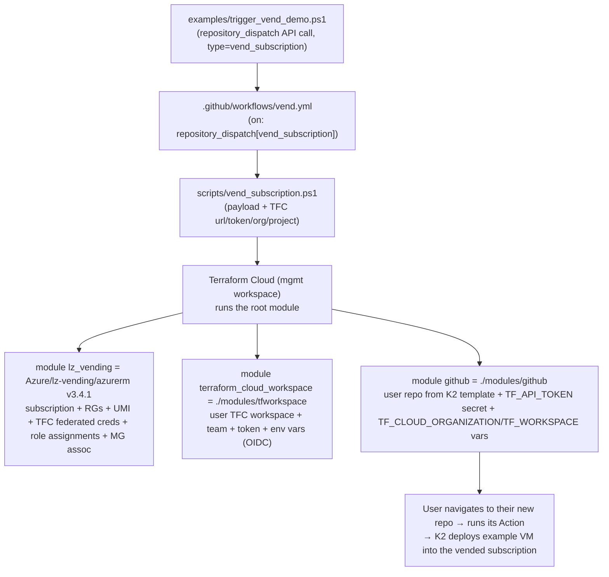
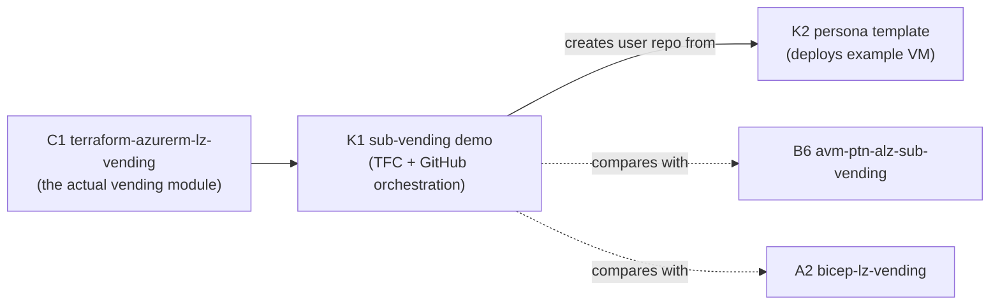

# Azure-Samples/alz-terraform-sub-vending-demo-with-terraform-cloud-and-github (K1) — Overview

| Field | Value |
|-------|-------|
| Repository | `Azure-Samples/alz-terraform-sub-vending-demo-with-terraform-cloud-and-github` |
| Catalog id | K1 |
| Flavor | Terraform + GitHub Actions + PowerShell (sample / demo) |
| Role | End-to-end **self-service subscription vending** demo using the ALZ sub-vending module + **Terraform Cloud** + **GitHub** |
| Status | **Conceptual demo** (uses GitHub PAT + TFC user API tokens — not production auth) |
| Source URL | <https://github.com/Azure-Samples/alz-terraform-sub-vending-demo-with-terraform-cloud-and-github> |
| Mode | deep (source-verified) |
| Last reviewed | 2026-06-17 |

## Purpose

> *“This example shows one approach to self-service subscription vending in Azure. It leverages the ALZ Terraform
> subscription vending module, Terraform Cloud and GitHub to demonstrate an end-to-end process of vending
> subscriptions for different use cases.”* (README)

K1 is a **sample** that wires three things into a self-service flow: the
[`lz-vending` module (C1)](../terraform-azurerm-lz-vending/_overview.md) (creates the subscription + landing-zone
resources), **Terraform Cloud** (per-subscription workspaces), and **GitHub** (a central vending pipeline + a freshly
created *user repository* per vended subscription). The user repo is created from the **[persona template (K2)](../sample-sub-vending-persona-template-01/_overview.md)** and contains the code to deploy an example workload (a VM)
into the new subscription.

> **Demo, not production.** The README is explicit that it's conceptual — it uses GitHub PAT + Terraform Cloud user
> API tokens and an over-permissive `Owner @ /` service principal; production should use alternative auth.

## What a vend produces (verified README + `main.tf`)

A single vend creates:

- A **subscription** (alias) associated to a management group (`sub-vending-demo`).
- **Resource groups** + role assignments (subscription owners get access).
- A **User-Assigned Managed Identity** + **federated credentials for Terraform Cloud** (plan + apply run phases).
- A **Terraform Cloud workspace** (in the *user* project) wired for OIDC to Azure.
- A **GitHub repository** for the user (from the persona template **K2**) with the Terraform Cloud token/org/workspace
  pre-seeded as Actions secret/variables.

## Repository structure (verified git tree)

```
alz-terraform-sub-vending-demo-with-terraform-cloud-and-github/
├── main.tf                       # root: composes lz_vending + tfworkspace + github modules
├── locals.tf  data.tf  outputs.tf  providers.tf  billing_account.tf
├── variables.azure.tf  variables.billing.tf  variables.github.tf  variables.terraform_cloud.tf
├── modules/
│   ├── github/                   # create the user repo from the K2 template + seed TFC secret/vars
│   └── tfworkspace/              # create the TFC workspace + team + token + env vars
├── scripts/
│   ├── vend_subscription.ps1     # run in the GitHub Action; drives Terraform Cloud to vend
│   └── destroy_subscription.ps1  # the teardown counterpart
├── examples/
│   ├── trigger_vend.ps1 / trigger_vend_example.ps1        # repository_dispatch callers (vend)
│   └── trigger_destroy.ps1 / trigger_destroy_example.ps1  # repository_dispatch callers (destroy)
├── .github/workflows/{vend.yml, destroy.yml}              # repository_dispatch-triggered Actions
└── .images/overview.png  .terraform.lock.hcl  README.md
```

## The vending flow (verified)



1. **Trigger** — `trigger_vend_demo.ps1` POSTs a `repository_dispatch` event (`vend_subscription`) with a
   `subscriptionData` payload (name, location, offer, owners, management group, resource groups, the persona template
   org/repo, and the target org for the user repo).
2. **GitHub Action** — `vend.yml` runs `scripts/vend_subscription.ps1` with the Terraform Cloud URL/token/org/project
   (from repo secret/vars).
3. **Terraform Cloud** runs the **root module**, which composes the three modules below.
4. **User self-service** — the user opens their newly created repo (from K2) and runs its pipeline to deploy the
   example VM into the freshly vended subscription.

## The root module's three children (verified `main.tf`)

| Module | Source | Creates |
|--------|--------|---------|
| `lz_vending` | **`Azure/lz-vending/azurerm` v3.4.1** ([C1](../terraform-azurerm-lz-vending/_overview.md)) | subscription alias (+ billing scope), MG association, resource groups, role assignments, **UMI + Terraform Cloud federated credentials** (plan/apply), RP registration |
| `terraform_cloud_workspace` | `./modules/tfworkspace` | `tfe_workspace` (user project) + `tfe_team` + `tfe_team_access` + `tfe_team_token` + env `tfe_variable`s (`ARM_SUBSCRIPTION_ID`, `ARM_TENANT_ID`, `TFC_AZURE_PROVIDER_AUTH=true`, `TFC_AZURE_RUN_CLIENT_ID` from the UMI, `resource_group_name`) |
| `github` | `./modules/github` | `github_repository` from the **K2 template** (private) + `github_actions_secret.TF_API_TOKEN` + `github_actions_variable` `TF_CLOUD_ORGANIZATION` / `TF_WORKSPACE` |

Detailed walkthrough in [module-vend-flow.md](module-vend-flow.md).

## Ecosystem placement



- **Uses C1 directly** — K1 is a *consumer* of [`terraform-azurerm-lz-vending` (C1)](../terraform-azurerm-lz-vending/_overview.md);
  it shows one way to drive that module for self-service.
- **Creates K2** — the GitHub module clones the [persona template (K2)](../sample-sub-vending-persona-template-01/_overview.md)
  into the user's new repo.
- **Compare with** the other vending implementations: [B6 `avm-ptn-alz-sub-vending`](../avm-ptn-alz-sub-vending/_overview.md)
  and [A2 `bicep-lz-vending`](../bicep-lz-vending/_overview.md).
- **vs the Accelerator** — the [Terraform Accelerator (F1)](../alz-terraform-accelerator/_overview.md) also supports a
  Terraform Cloud bootstrap; K1 is a focused *vending* demo rather than a full platform bootstrap.

## Notes & gotchas

- **Conceptual auth** — GitHub PAT (`repo` + `delete_repo`) + TFC **user/team** API tokens + an `Owner @ /` SPN with
  `User.ReadAll`. Fine for a demo, not for production.
- **`ARM_SUBSCRIPTION_ID` is required but unused** — a quirk of the `azurerm` provider; you must supply an existing
  subscription id even though nothing is deployed there.
- **Licensed Terraform Cloud required** — the demo needs Teams + team API tokens, which the **free tier doesn't
  provide**.
- **`repository_dispatch` is the entry point** — both vend and destroy are fired by POSTing a client payload, not by a
  normal push/PR.
- **Two projects** — `sub-vend-demo-mgmt` (the central vending workspace) and `sub-vend-demo-user` (where per-vend user
  workspaces are created).
- **OIDC to Azure** — the user workspace authenticates to Azure via the UMI's Terraform Cloud federated credentials
  (`TFC_AZURE_PROVIDER_AUTH=true`), not a stored secret.

## Open Questions

- [ ] `TODO: verify` the exact logic inside `scripts/vend_subscription.ps1` / `destroy_subscription.ps1` (how they create/poll the Terraform Cloud mgmt workspace run) — read at the orchestration level, not line-by-line.
