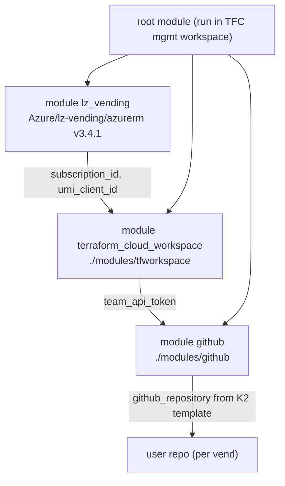

# Module — Vend Flow (root module + `modules/github` + `modules/tfworkspace` + scripts)

| Field | Value |
|-------|-------|
| Path | `main.tf`, `modules/github/`, `modules/tfworkspace/`, `scripts/`, `.github/workflows/vend.yml` |
| Kind | Terraform root module + sub-modules + GitHub Actions + PowerShell |
| Source-verified | `main.tf`, `modules/github/main.tf`, `modules/tfworkspace/main.tf`, `vend.yml` |
| Last reviewed | 2026-06-17 |

## Purpose

The root module is the **vending orchestrator**: given a `subscriptionData` payload, it vends a subscription (via the
ALZ `lz-vending` module), provisions a Terraform Cloud workspace for the new subscription, and creates a GitHub repo
(from the persona template) wired to that workspace. This module group covers exactly how those three pieces fit.

## Trigger → action → script (verified `vend.yml`)

```yaml
on:
  repository_dispatch:
    types: [vend_subscription]
jobs:
  vend_subscription:
    steps:
      - uses: actions/checkout@v2.5.0
      - run: ./scripts/vend_subscription.ps1 -subscriptionData $env:EVENT_PAYLOAD `
              -terraformCloudUrl … -terraformCloudAccessToken … -terraformCloudOrganisation … -terraformCloudProject …
        env:
          EVENT_PAYLOAD: ${{ toJson(github.event.client_payload.subscriptionData) }}
          TERRAFORM_CLOUD_TOKEN: ${{ secrets.TERRAFORM_CLOUD_TOKEN }}
          TERRAFORM_CLOUD_*: ${{ vars.* }}
```

- Fired by a **`repository_dispatch`** event of type `vend_subscription` (from `examples/trigger_vend*.ps1`).
- The Action just runs `scripts/vend_subscription.ps1`, passing the payload + the Terraform Cloud connection details.
- `scripts/vend_subscription.ps1` (≈5.7 KB) drives Terraform Cloud (the `sub-vend-demo-mgmt` workspace) to apply the
  root module. `destroy.yml` + `scripts/destroy_subscription.ps1` are the teardown mirror.

## Root module composition (verified `main.tf`)



> Output threading (verified): `lz_vending` exposes `subscription_id` + `umi_client_id`, consumed by
> `terraform_cloud_workspace`; that module's `team_api_token` is consumed by `github`.

### 1. `module "lz_vending"` — `Azure/lz-vending/azurerm` v3.4.1 (C1)

The actual subscription vending (see [C1](../terraform-azurerm-lz-vending/_overview.md)). Key wiring (verified):

- **Subscription:** `subscription_alias_enabled`, `subscription_billing_scope = local.billing_scope`,
  `subscription_display_name/alias_name = var.subscription_name`, `subscription_workload = var.subscription_offer`.
- **MG association:** `subscription_management_group_association_enabled`, id from `data.azurerm_management_group.vending`.
- **Role assignments:** `role_assignments = local.subscription_user_owners` (the subscription owners).
- **UMI + Terraform Cloud federated credentials:** `umi_enabled`, plus
  `umi_federated_credentials_terraform_cloud = { plan = {...run_phase="plan"}, apply = {...run_phase="apply"} }`
  bound to the user org/project/workspace — this is the OIDC trust that lets the user TFC workspace deploy to Azure.
- **`umi_role_assignments`** — `Contributor` on each resource group.
- **Resource groups:** `resource_group_creation_enabled` + `resource_groups` from `var.resource_groups`.
- **Also:** `network_watcher_resource_group_enabled`, `subscription_register_resource_providers_enabled`.

### 2. `module "terraform_cloud_workspace"` — `./modules/tfworkspace` (verified)

| Resource | Role |
|----------|------|
| `data.tfe_project.users` | look up the user project (`sub-vend-demo-user`) |
| `tfe_workspace.user_workspace` | the per-subscription workspace (`force_delete = true`) |
| `tfe_team.subscription_team` + `tfe_team_access` | a team scoped to that workspace |
| `tfe_team_token.sub_team_token` | the team API token (returned as `team_api_token` → used by the github module) |
| `tfe_variable.*` (env) | `ARM_SUBSCRIPTION_ID`, `ARM_TENANT_ID`, **`TFC_AZURE_PROVIDER_AUTH = "true"`**, `TFC_AZURE_RUN_CLIENT_ID` (the UMI client id) |
| `tfe_variable.resource_group_name` (terraform) | passes the primary RG name to the user workspace |

> `TFC_AZURE_PROVIDER_AUTH = true` + `TFC_AZURE_RUN_CLIENT_ID` configure the workspace to authenticate to Azure via
> **OIDC** (the UMI federated credentials from `lz_vending`), not a stored secret.

### 3. `module "github"` — `./modules/github` (verified)

```hcl
resource "github_repository" "application" {
  name = var.repository_name
  visibility = "private"
  template { owner = var.template_organisation, repository = var.template_repository }  # ← K2
}
resource "github_actions_secret"   "tf_api_token"        { secret_name = "TF_API_TOKEN" … }       # the team token
resource "github_actions_variable" "tf_cloud_organization" { variable_name = "TF_CLOUD_ORGANIZATION" … }
resource "github_actions_variable" "tf_workspace"        { variable_name = "TF_WORKSPACE" … }
provider "github" { owner = var.repository_organisation }
```

- Creates the user's **private repo from the K2 persona template**.
- Seeds it with `TF_API_TOKEN` (the team token from the tfworkspace module) + `TF_CLOUD_ORGANIZATION` + `TF_WORKSPACE`,
  so the persona repo's pipeline can run against the user's Terraform Cloud workspace out of the box.

## Inputs (root, grouped by `variables.*.tf`)

| File | Variables (selected) |
|------|----------------------|
| `variables.azure.tf` | `location`, `subscription_name`, `subscription_offer`, `subscription_owners`, `resource_groups`, `subscription_management_group` |
| `variables.billing.tf` | `billing_account_type` (`ea`/`mca`/`mpa`), `billing_account_name` + EA/MCA/MPA-specific ids (→ `billing_account.tf` builds `local.billing_scope`) |
| `variables.github.tf` | `repository_organisation`, `persona_template_organisation`, `persona_template_repository` (→ K2) |
| `variables.terraform_cloud.tf` | `terraform_cloud_organisation`, `terraform_cloud_user_project` |

## Outputs / Dependencies

- **Outputs (`outputs.tf`):** minimal (the demo's side effects are the vended subscription + TFC workspace + GitHub
  repo, not TF outputs).
- **Upstream:** Terraform Cloud (mgmt workspace + variable set), a GitHub org, the C1 module, billing-account access.
- **Downstream:** the created **user repo (K2)** + user TFC workspace, used by the persona to deploy the example VM.

## Notes & gotchas

- **The team token is the bridge** — `tfworkspace` mints a team API token and hands it to the `github` module so the
  persona repo can talk to its own TFC workspace; treat it as a secret.
- **`force_delete = true`** on the user workspace makes the destroy path clean (the `destroy.yml` flow can remove it).
- **Billing scope is computed** — `billing_account.tf` assembles `local.billing_scope` from the EA/MCA/MPA inputs;
  supply the matching set for your account type.

## Open Questions

- [ ] `TODO: verify` `scripts/vend_subscription.ps1` internals (TFC run creation/polling, payload→tfvars mapping) — documented from the workflow + module wiring, not line-by-line.
- [ ] `TODO: verify` `locals.tf` exact derivations (`subscription_user_owners`, `terraform_cloud_workspace_name`, `github_repository_name`).
