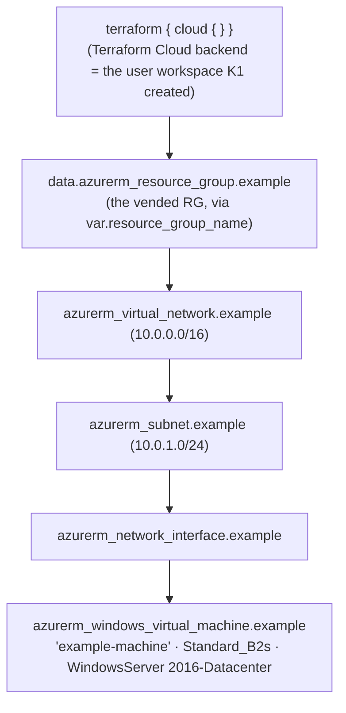
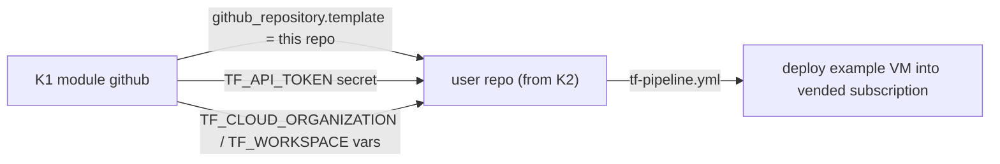

# Azure-Samples/…-persona-template-01 (K2) — Overview

| Field | Value |
|-------|-------|
| Repository | `Azure-Samples/alz-terraform-sub-vending-demo-with-terraform-cloud-and-github-persona-template-01` |
| Catalog id | K2 |
| Flavor | GitHub **template repository** (Terraform + GitHub Actions) |
| Role | The **persona template** that [K1](../sample-sub-vending-tfc-github/_overview.md) clones into each vended subscription's user repo — deploys an example workload (a VM) |
| Source URL | <https://github.com/Azure-Samples/alz-terraform-sub-vending-demo-with-terraform-cloud-and-github-persona-template-01> |
| Mode | deep (source-verified) |
| Last reviewed | 2026-06-17 |

## Purpose

K2 is the **"persona template"** referenced by the [K1 sub-vending demo](../sample-sub-vending-tfc-github/_overview.md).
When K1 vends a subscription, its `github` module creates a new **private user repository from this template** and
seeds it with the Terraform Cloud token/org/workspace. The user then runs the repo's pipeline to deploy the example
workload — an Azure **Windows VM** — into their freshly vended subscription.

In other words: **K1 produces the landing zone; K2 is the per-persona "starter app" that lands in it.** The `01` suffix
implies it is one of potentially several persona templates (different workloads per persona).

> The repo's `README.md` is the **generic Azure-Samples placeholder** (“# Project Name … Feature 1 / Feature 2”), so
> the *intent* is inferred from K1's wiring + the actual Terraform/workflow content (which is real and source-verified).

## Repository structure (verified git tree)

```
…-persona-template-01/
├── main.tf                       # the example workload: VNet + subnet + NIC + Windows VM
├── variables.tf                  # resource_group_name (the vended RG)
├── outputs.tf                    # empty (1 byte)
├── .github/workflows/tf-pipeline.yml   # the pipeline the user runs to deploy the workload
├── README.md                     # generic Azure-Samples template placeholder
└── CHANGELOG/CONTRIBUTING/LICENSE + .github templates
```

## What it deploys (verified `main.tf`)



| Resource | Notes |
|----------|-------|
| `terraform { cloud {} }` | uses the **Terraform Cloud** workspace (provisioned by K1) as backend |
| `provider "azurerm"` | `skip_provider_registration = true` (RPs already registered by the vend) |
| `data.azurerm_resource_group.example` | the vended resource group (input `resource_group_name`) |
| `azurerm_virtual_network.example` | `example-network`, `10.0.0.0/16` |
| `azurerm_subnet.example` | `internal`, `10.0.1.0/24` |
| `azurerm_network_interface.example` | dynamic private IP |
| `azurerm_windows_virtual_machine.example` | `example-machine`, `Standard_B2s`, WindowsServer `2016-Datacenter` |

## Inputs / Outputs

- **Input:** `resource_group_name` (the primary RG of the vended subscription; K1 sets this as a Terraform variable on
  the user workspace).
- **Authentication:** Azure via **OIDC** — the workspace's `TFC_AZURE_PROVIDER_AUTH=true` + `TFC_AZURE_RUN_CLIENT_ID`
  (the UMI K1 created), so no Azure secret lives in the repo.
- **Outputs:** none (`outputs.tf` is empty).

## How K1 wires it (verified)



- K1's `github_repository.application` sets `template { owner, repository }` to **this repo** (via
  `persona_template_organisation` / `persona_template_repository`).
- K1 seeds the new repo with `TF_API_TOKEN` (the TFC team token) + `TF_CLOUD_ORGANIZATION` + `TF_WORKSPACE`, so
  `tf-pipeline.yml` can run against the user's Terraform Cloud workspace immediately.

## Notes & gotchas

- **Demo workload only** — the VM is a placeholder “persona” app to prove the vended subscription works end-to-end; it
  is not a hardened deployment.
- **Hard-coded credentials in the sample** — `main.tf` sets a literal `admin_password` for the example VM. This is a
  **demo anti-pattern**; never copy it into real code (use Key Vault / generated secrets). Flagged here as a factual
  security note about the sample.
- **Template repo** — meant to be consumed via GitHub's create-from-template (which K1 does programmatically), not
  cloned/deployed directly.
- **`-01` suggests a family** — additional persona templates (`-02`, …) could provide different workloads; only `-01`
  is in the catalog.

## Open Questions

- [ ] `TODO: verify` `tf-pipeline.yml` exact steps (plan/apply against Terraform Cloud) — present and ~2.4 KB, summarized from the OIDC + TFC wiring, not transcribed line-by-line.
